# 7.Transformer

트랜스포머 모델의 주요 기능 중 하나는 기존의 순환 신경망과 같은 순차적 방식이 아닌 병렬로 입력 시퀀스를 처리하는 기능입니다.

긴 시퀀스의 경우 트랜스포머 모델을 순환 신경망 모델보다 훨씬 더 빠르고 효율적으로 처리합니다.

트랜스포머 모델의 구조가 기존의 순차 처리(Sequential Processing)나 반복 연결(Recurrent Connections)에 의존하지 않고 입력 토큰 간의 관계를 직접 처리하고 이해할 수 있도록 하는 셀프 어텐션(Self-Attention)을 기반으로 하기 때문입니다.

이로 인해 모델이 재귀나 합성곱 연산 없이 입력 토큰간의 관계를 직접 모델링 할 수 있습니다.

트랜스포머 모델의 학습은 대용량 데이터세트에서 매우 효율적이며 데이터의 양이 많은 기계 번역과 같은 작업에 적합합니다.

언어 모델링 및 텍스트 분류와 같은 작업에서 매우 효과적인 것으로 나타나며 광범위한 자연어 처리 작업에서 높은 효율을 보입니다.

기계 번역, 언어 모델링, 텍스트 요약과 같은 장기적인 종속성을 포함하는 작업에 주로 사용됐습니다.

자연어 처리 분야에서 널리 사용되고 영향력이 큰 모델이 됐습니다.

뒤에 소개될 트랜스포머 기반 모델들은 오토 인코딩(Auto-Encoding), 자기 회귀(Auto Regressive) 방식 또는 두 개의 조합으로 학습됩니다.

오토 인코딩 방식은 랜덤하게 문장의 일부를 빈칸 토큰으로 만들고 해당 빈칸에 어떤 단어가 적절할지 예측하는 작업(Task)를 수행합니다.

예측되는 토큰의 양옆에 있는 토큰을 참조하기 때문에 양방향 구조를 가지며 이를 인코더(Encoder)라고 합니다.

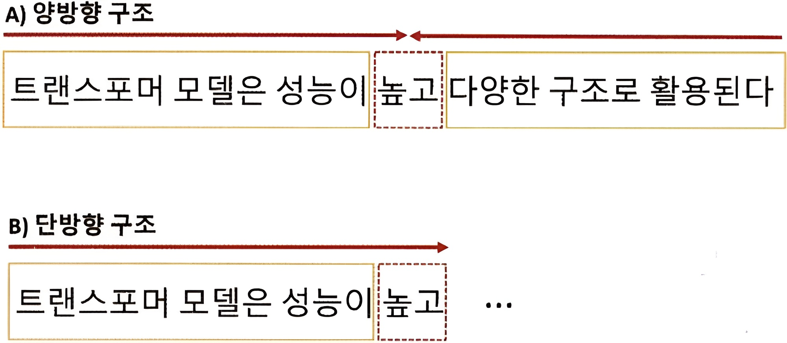

위 이미지는 트랜스포머 구조입니다.

A는 ‘트랜스포머 모델은 성능이’, ‘다양한 구조로 활용된다’를 입력으로 ‘높고’를 출력으로 학습하는 양방향 구조를 보여줍니다.

반면에 자기 회귀 방식은 이전 단어들이 주어졌을 때 다음 단어가 무엇인지 맞히는 작업을 수행합니다.

B는 ‘트랜스포머 모델은 성능이’를 입력으로 ‘높고’를 출력으로 학습하는 단방향 구조를 보여줍니다.

예측되는 토큰의 왼쪽에 있는 토큰들만 참조하기 때문에 단방향 구조를 가지며 이를 디코더(Decoder)라고 합니다.

뒤에 소개할 트랜스포머 모델들은 양방향성 구조인 인코더(오토 인코딩) 또는 단방향성 디코더(자기 회귀)를 사용하는 공통적 특징을 가지고 있습니다.

모델들의 특징들은 다음 표에 정리되어 있습니다.

| 모델 | 학습구조 | 학습방법 | 학습 방향성 |
| --- | --- | --- | --- |
| BERT | 인코더 | 오토 인코딩 | 양방향 |
| GPT | 디코더 | 자기 회귀 | 단방향 |
| BART | 인코더 + 디코더 | 오토 인코딩 + 자기 회귀 | 양방향 + 단방향 |
| ELECTRA | 인코더 + 판별기 | 오토 인코딩 + 대체 토큰 탐지 | 양방향 |
| T5 | 인코더 + 디코더 | 오토 인코딩 + 자기 회귀 + 다양한 자연어 처리 작업을 학습 | 양방향 |

ELECTRA는 인코더에 생성적 적대 신경망의 판별기를 활용한 모델입니다.

T5와 BART는 다양한 자연어 처리 작업에 대해 학습을 수행합니다.

## Transformer

트랜스포머(Transformer)는 딥러닝 모델 중 하나로, 기계 번역, 챗봇, 음성 인식 등 다양한 자연어 처리 분야에서 많은 성과를 내는 모델입니다.

이 모델은 순환 신경망이나 합성곱 신경망과 달리 어텐션 메커니즘(Attention Mechanism)만을 사용하여 시퀀스 임베딩을 표현합니다.

트랜스포머의 어텐션 메커니즘은 인코더와 디코더 간의 상호작용으로 입력 시퀀스의 중요한 부분에 초점을 맞추어 문맥을 이해하고 적절한 출력을 생성합니다.

인코더는 입력 시퀀스를 임베딩하여 고차원 벡터로 변환하고, 디코더는 인코더의 출력을 입력으로 받아 출력 시퀀스를 생성합니다.

이때 어텐션 메커니즘은 인코더와 디코더 단어 사이의 상관관계를 계산하여 중요한 정보에 집중합니다.

이를 통해 입력 시퀀스의 각 단어가 출력 시퀀스의 어떤 단어와 관련이 있는지를 파악하여 번역이나 요약문 생성과 관련된 작업등을 수행할 수 있게 됩니다.

트랜스포머 모델은 기존의 순환 신경망 기반 모델보다 학습 속도가 빠르고, 병렬 처리가 가능해 대규모 데이터세트에서 높은 성능을 보입니다.

임베딩 과정에서 문장의 전체 정보를 고려하기 때문에 문장의 길이가 길어지더라도 성능이 유지됩니다.

이러한 장점으로 인해 자연어 처리 분야에서 가장 인기있는 모델입니다.

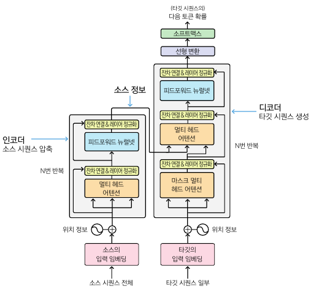

트랜스포머의 인코더와 디코더는 두 부분으로 구성돼 있습니다.

각각 N개의 트랜스포머 블록(Transformer Block)으로 구성됩니다.

이 블록은 멀티 헤드 어텐션(Multi-Head Attention)과 순방향 신경망으로 이루어져 있습니다.

멀티 헤드 어텐션은 입력 시퀀스에서 쿼리(Query), 키(Key), 값(Value) 벡터를 정의해 입력 시퀀스들의 관계를 셀프 어텐션(Self-Attention)하는 벡터 표현 방법입니다.

이 과정에서 쿼리와 각 키의 유사도를 계산하고 해당 유사도를 가중치로 사용하여 값 벡터를 합산합니다.

이렇게 계산된 어텐션 행렬은 입력 시퀀스 각 단어의 임베딩 벡터를 대체 합니다.

결국 입력 시퀀스의 단어 사이의 상호작용을 고려해 임베딩 벡터를 갱신합니다.

순방향 신경망은 이 과정에서 산출된 임베딩 벡터를 더욱 고도화하기 위해 사용됩니다.

이 신경망은 여러 개의 선형 계층으로 구성돼 있습니다.

앞선 순방향 신경망의 구조와 동일하게 입력 벡터에 가중치를 곱하고, 편향을 더하며, 활성화 함수를 적용합니다.

이 과정에서 학습된 가중치를 입력 시퀀스의 각 단어의 의미를 잘 파악할 수 있는 방식으로 갱신됩니다.

트랜스포머에서는 입력 시퀀스 데이터를 소스(Source)와 타깃(Target) 데이터로 나눠 처리합니다.

    eg) 영어를 한글로 번역하는 경우, 생성하는 언어인 한글을 타깃 데이터로 정의하고 참조하는 언어인 영어를 소스 데이터로 정의합니다.

인코더는 소스 시퀀스 데이터를 위치 인코딩(Positional Encoding)된 입력 임베딩으로 표현해 트랜스포머 블록의 출력 벡터를 생성합니다.

이 출력 벡터는 입력 시퀀스 데이터의 관계를 잘 표현할 수 있게 구성되어있습니다.

디코더도 인코더와 유사하게 트랜스포머 블록으로 구성되어 있지만, 마스크 멀티 헤드 여텐션(Masked Multi-Head Attention)을 사용해 타깃 시퀀스 데이터를 순차적으로 생성시킵니다.

이때 디코더 입력 시퀀스들의 관계를 고도화하기 위해 인코더의 출력 벡터 정보를 참조합니다.

최정적으로 생성된 디코더 출력 벡터는 선형 임베딩으로 재표현되어 이미지나 자연어 모델에 활용됩니다.

이러한 과정을 통해 트랜스포머는 챗봇, 기계 번역, 음성 인식 등 다양한 자연어 처리 작업에서 좋은 성능을 보입니다.

### 임력 임베딩과 위치 인코딩

트랜스포머 모델에서 입력 시퀀스의 각 단어는 임베딩 처리되어 벡터 형태로 변환됩니다.

트랜스포머 모델은 순환 신경망과 달리 입력 시퀀스를 병렬 구조로 처리하기 때문에 단어의 순서 정보를 제공하지 않습니다.

그러므로 위치 정보를 임베딩 벡터에 추가해 단어의 순서 정보를 모델에 반영해야 합니다.

이러한 이유로 트랜스포머는 위치 인코딩 방식을 사용합니다.

위치 인코딩은 입력 시퀀스의 순서 정보를 모델에 전달하는 방법입니다.

각 단어의 위치 정보를 나타내는 벡터를 더하여 임베딩 벡터에 위치 정보를 반영합니다.

위치 인코딩 벡터는 $sin$함수와 $cos$함수를 사용해 생성합니다.

이를 통해 임베딩 벡터와 위치 정보가 결합된 입력 벡터를 생성합니다.

위치 인코딩 벡터를 추가함으로써 모델은 단어의 순서 정보를 학습할 수 있게 됩니다.

위치 인코딩은 각 토큰의 위치를 각도로 표현해 $sin$함수와 $cos$함수로 위치 인코딩 벡터를 계산합니다.

이러한 계산 방법은 토큰의 위치마다 동일한 임베딩 벡터를 사용하지 않기 때문에 각 토큰의 위치정보를 모델이 학습할 수 있습니다.

위치 인코딩은 트랜스포머 모델에서 입력 시퀀스의 순서 정보를 보존하기 위한 중요한 방법 중 하나입니다.

다음 코드는 위치 인코딩 계산 과정을 보여줍니다.

```python
import math
import torch
from torch import nn
from matplotlib import pyplot as plt

class PositionalEncoding(nn.Module):
    def __init__(self, d_model, max_len, dropout = 0.1):
        super().__init__()
        self.dropout = nn.Dropout(p = dropout)

        position = torch.arange(max_len).unsqueeze(1)
        div_term = torch.exp(torch.arange(0, d_model, 2) * (-math.log(100000.0) / d_model))

        pe = torch.zeros(max_len, 1, d_model)
        pe[:, 0, 0::2] = torch.sin(position * div_term)
        pe[:, 0, 1::2] = torch.cos(position * div_term)
        self.register_buffer("pe", pe)

encoding = PositionalEncoding(d_model = 128, max_len = 50)

plt.pcolormesh(encoding.pe.numpy().squeeze(), cmap = "RdBu")
plt.xlabel("Embedding Dimension")
plt.xlim((0, 128))
plt.ylabel("Position")
plt.colorbar()
plt.show()
```

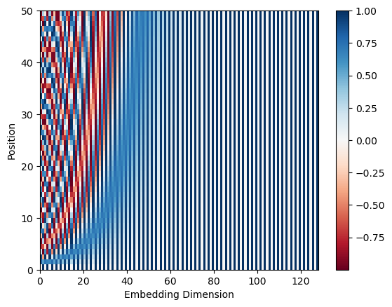

PositionalEncoding 클래스는 입력 임베딩 차원(d_model)과 최대 시퀀스(max_len)를 입력받습니다.

입력 시퀀스의 위치마다 $sin$과 $cos$함수로 위치 인코딩을 계산합니다.

다음 수식은 위치 인코딩 수식입니다.

$$
PE(pos, 2i) = sin(pos/10000^{2i/d_{model}}) \\
PE(pos, 2i + 1) = cos(pos/10000^{2i/d_{model}})
$$

$pos$는 입력 시퀀스에서 해당 단어의 위치를 나타내며, $i$는 임베딩 벡터의 차원 인덱스를 의미합니다.

차원의 인덱스가 짝수라면 첫 번째 $sin$함수 수식을 적용하며, 홀수라면 두 번째 $cos$함수 수식을 적용합니다.

위치 인코딩에 사용되는 $1/10000^{2i/d_{model}}$는 각도 정보로 변환하기 위한 스케일링 인자로 각 위치에 대한 주기적인 신호를 생성합니다.

pe 변수의 텐서 차원은 [50, 1, 128]이 되며 [최대 시퀀스, 1, 입력 임베딩의 차원]을 의미합니다.

출력 결과를 확인해 보면 위치별 임베딩 차원이 주기적인 값으로 구성되는 것을 확인할 수 있습니다.

산출된 위치 인코딩은 입력 임베딩과 더해진 후 드롭아웃이 적용됩니다.

예제에 적용한 register_buffer 메서드는 모델이 매개변수를 갱신하지 않도록 설정합니다.

### 특수 토큰

트랜스포머는 단어 토큰 이외의 특수 토큰을 활용하여 문장을 표현합니다.

이 특수 토큰은 입력 시퀀스의 시작과 끝을 나타내거나 마스킹(Masking) 영역으로 사용됩니다.

특수 토큰으로 모델이 입력 시퀀스의 시작과 끝을 인식할 수 있게 하며, 마스킹을 통해 일부 입력을 무시할 수 있습니다.

    eg) 번역 모델에서는 디코더의 입력시퀀스에서 현재 위치 이후의 토큰을 마스크해 이전 토큰만을 참조합니다.

다음 그림은 ‘ChatGPT는 트랜스포머 모델로 이뤄져 있다’라는 문장에 특수 토큰을 적용한 문장 토큰 배열입니다.

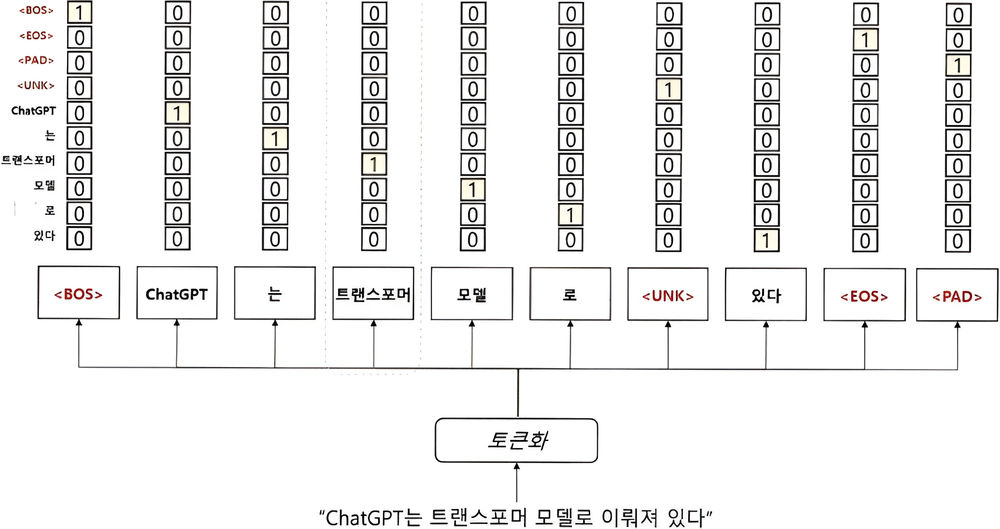

BOS(Beginning of Sentence), EOS(End of Sentence), UNK(Unkown) 및 PAD(Padding) 토큰은 모두 특수 토큰으로 자연어 처리에서 일반적으로 사용됩니다.

BOS 토큰은 문장의 시작을 나타내며, EOS 토큰은 문장의 종료를 나타냅니다.

이 토큰들은 문장의 시작과 끝을 명확히 하기 위해 사용됩니다.

UNK 토큰은 어휘 사전에 없는 단어로, 모르는 단어를 의미합니다.

이 토큰은 모델이 이전에 본 적이 없는 단어를 처리하는데 사용됩니다.

PAD 토큰은 모든 문장을 일정한 길이로 맞추기 위해 사용됩니다.

짧은 문장의 빈 공간을 채울 때 사용됩니다.

이렇게 생성된 문자 토큰 배열을 어휘 사전에 등장하는 위치에 원-핫 인코딩으로 표현합니다.

다음 그림이 문장토큰 배열 중 ‘트랜스포머’라는 원-핫 벡터가 입력 임베딩으로 변환되는 과정을 보여줍니다.


입력 임베딩으로 변환되는 과정은 Word2Vec 방볍과 동일합니다.

어휘 사전의 크기를 V, 입력 임베딩 차원을 d라고 했을 때 ‘트랜스포머’의 원-핫 벡터는 [1, V] 크기를 갖습니다.

이 원-핫 벡터는 임베딩 행렬 [V, d]에 의해 [1, d]크기의 벡터로 변환됩니다.

이러한 방식을 일반화하면, N개의 문장이 최대 S개의 토큰 길이를 가질 때 [N, S, V] 크기의 원-핫 벡터 텐서는 [N, S, d] 크기의 임베딩 텐서로 변환됩다.

이 임베딩 텐서는 입력으로 사용되며, 트랜스포머의 모든 계층에서 공유되는 텐서로 사용됩니다.

### 트랜스포머 인코더

트랜스포머 인코더는 입력 시퀀스를 받아 여러 개의 계층으로 구성된 인코더 계층을 거쳐 연산을 수행합니다.

각 인코더 계층은 멀티 해드 어텐션과 순방향 신경망으로 구성되어있습니다.

입력 데이터에 대한 정보를 추출하고 다음 계층으로 전달됩니다.

인코더 계층에서 위치 정보를 반영하기 위해 위치 임베딩 벡터를 입력 벡터에 더해줍니다.

산출된 인코더 계층의 출력은 디코더 계층으로 전달됩니다.

다음 그림은 인코더 블록 연산과정입니다.

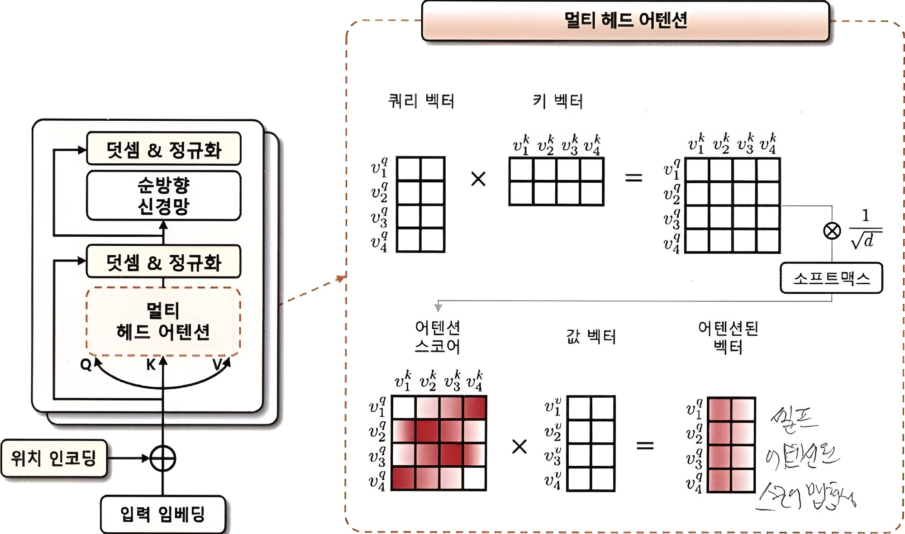

트랜포머 인코더 위치 인코딩이 적용된 소스 데이터의 입력 임베딩을 입력받습니다.

멀티 헤드 어텐션 단계에서 입력 텐서 차원이 [N, S, d]라고 한다면 입력 임베딩은 선형 변환을 통해 3개의 임베딩 벡터를 생성합니다.

생성된 3개의 벡터는 각각 쿼리(Q), 키(K), 값(V) 벡터라고 정의합니다.

쿼리 벡터($v^q$)는 현재 시점에서 참고하고자 하는 정보의 위치를 나타내는 벡터로 인코더의 각 시점마다 생성됩니다.

현재 시점에서 질문이 되는 벡터를 의미하며 이 벡터를 기준으로 다른 시점의 정보를 참조합니다.

키 벡터($v^k$)는 쿼리 벡터와 비교되는 대상으로 쿼리 벡터를 제외한 입력 시퀀스에서 탐색되는 벡터가 됩니다.

키 벡터는 인코더의 각 시점에서 생성됩니다.

값 벡터($v^v$)는 쿼리 벡터와 키 벡터로 생성된 어텐션 스코어를 얼마나 반영할지 설정하는 가중치 역하을 합니다.

이러한 쿼리, 키, 값 벡터는 초기에 비슷한 값을 가지지만, 모델 학습을 통해 각 벡터는 의도한 의미값을 갖게 됩니다.

쿼리와 키 벡터의 연산과정으 내적 연산으로 [N, S, S] 어텐션 스코어 맵을 사용합니다.

다음 수식은 어텐션 스코어 계산 수식입니다.

$$
score(v^q, v^k) =  softmax \left (\frac{(v^q)^T \cdot v^k}{\sqrt{d}}\right) 
$$

셀프 어텐션 과정에서는 쿼리, 키, 값 벡터를 내적해 어텐션 스코어를 구하고 이 스코어값에 $\sqrt{d}$(벡터 차원의 제곱근)만큼 나눠 보정합니다.

이 보정값은 벡터 차원이 커질 때 스코어값이 같이 커지는 문제를 완화하기 위해 적용합니다.

그리고 보정된 어텐션 스코어를 소프트맥스 함수를 이용하여 확률적으로 재표현하고, 이를 값 벡터와 내적하여 셀프 어텐션된 벡터를 생성합니다.

이러한 과정을 반복해 셀프 어텐션된 스코어 맵을 생성합니다.

멀티 해드(Multi-Head)는 이러한 셀프 어텐션을 여러 번 수행해 여러 개의 헤드를 만듭니다.

각각의 헤드가 독립적으로 어텐션을 수행하고 그 결과를 합칩니다.

입력받는 [N, S, d] 텐서에서 k개의 셀프 어텐션 벡터를 생성하고자 한다면 헤드에 대한 차원 축을 생성해 [N, k, S, d/k] 텐서 형태를 구성합니다.

이 텐서는 k개의 셀프 어텐션된 [N, S, d/k]텐서를 의미합니다.

이렇게 생성된 k개의 셀프 어텐션 벡터는 임베딩 차원 축으로 다시 병합(concatenation)되어 [N, S, d]의 형태로 출력됩니다.

덧셈 & 정규화는 멀티 헤드 어텐션을 통과하기 이전의 입력값 [N, S, d] 텐서와 통과한 이후의 출력값 [N, S, d] 텐서를 더함으로써 학습 시 발생하는 기울기 소실을 완화합니다.

그리고 이 값에 임베딩 차원 축으로 정규화는 계층 정규화를 적용합니다.

순방향 신경망은 두 가지 방법을 적용할 수 있습니다.

선형 임베딩과 ReLU로 이뤄진 인공 신경망이나 1차원 합성곱이 사용됩니다.

이어서 다시 덧셈 & 정규화 과정이 수행됩니다.

트랜스포머 인코더는 여러 개의 트랜스포머 인코더 블록으로 구성됩니다.

이전 블록에서 출력된 벡터는 다음 블록의 입력으로 전달되어 인코더 블록을 통과하면서 점차 입력 시퀀스의 정보가 추상화됩니다.

마지막 인코더 블록에서 출력된 벡터는 디코더에서 사용되며, 디코더의 멀티 헤드 어텐션 모듈에서 참조되는 키, 값 벡터로 활용됩니다.

이러한 방식으로 인코더와 디코더가 서로 정보를 공유 합니다.

### 트랜스포머 디코더

트랜스포머 디코더는 위치 인코딩이 적용된 타깃 데이터의 입력 임베딩을 입력받습니다.

위치 인코딩은 입력 시퀀스 내에서 각 단어의 상대적인 위치 정보를 전달하는 기법이므로 디코더의 입력 임베딩에 위치 정보를 추가함으로써 디코더가 입력 시퀀스의 순서 정보를 학습할 수 있게 됩니다.

트랜스포머 모델에서 인코더의 멀티헤드 어텐션 모듈은 인과성(Casuality)을 반영한 마스크 멀티 헤드 어텐션 모듈로 대체 됩니다.

인코더의 멀티 헤드 어텐션모듈과 유사하지만 마스크 멀티 헤드 어텐션 모듈은 어텐션 스코어 맵을 계산할 때 첫 번째 쿼리 벡터가 첫 번째 키 벡터만을 바라볼 수 있게 마스크를 씌웁니다.

두 번째 쿼리 벡터는 첫 번째와 두 번째 키벡터를 바라보게 마스클 씌웁니다.

마스크를 적용하면 셀프 어텐션에서 현재 위치 이전의 단어들만 참조할 수 있게 되며, 인과성이 보장됩니다.

마스크 멀티 헤드 어텐션 모듈에서는 마스크 영역에서 수치적으로 굉장히 작은 값인 -inf 마스크를 더해줌으로써 해당 영역의 어텐션 스코어 값이 0에 가까워집니다.

이러한 방식으로 마스크 멀티 헤드 어텐션 모듈은 인코더의 멀티 헤드 어텐션 모듈과 유사하지만 인과성을 보장하면서 셀프 어텐션을 수행할 수 있게 됩니다.

다음이미지는 디코더 블록 연산 과정입니다.

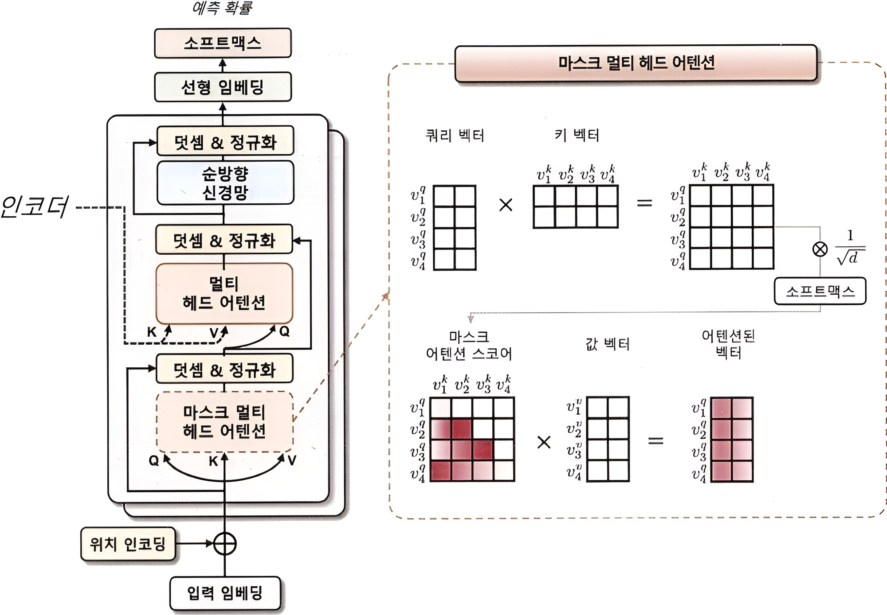

디코더의 멀티 헤드 어텐션에서는 타깃 데이터가 쿼리 벡터로 사용되며, 인코더의 소스 데이터가 키와 값 벡터로 사용됩니다.

쿼리 벡터는 타깃 데이터의 위치 정보를 포함한 입력 임베딩과 위치 인코딩을 더한 벡터가 됩니다.

이후 쿼리 벡터, 키 벡터, 값 벡터를 이용해 어텐션 스코어 맵을 계산하고, 소프트맥스 함수를 적용하여 어텐션 가중치를 구합니다.

최종으로 어텐션 가중치와 값 벡터를 가중합하여 멀티 헤드 어텐션의 출력 벡터를 얻을 수 있습니다.

디코더의 멀티 헤드 어텐션은 인코더의 멀티 헤드 어텐션과 거의 동일하지만, 디코더에서는 셀프 어텐션을 방지하기 위해 마스킹이 적용됩니다.

트랜스포머의 디코더도 인코더처럼 여러 개의 트랜스포머 디코더 블록으로 구성되어있습니다.

이전 트랜스포머 디코더 블록의 산출물은 다음 트랜스포머 디코더 블록의 입력으로 전달됩니다.

디코더는 이전시점에서의 정보를 현재 시점에서 활용할 수 있게 됩니다.

마지막 디코더 블록의 출력 텐서 [N, S, d]에 선형 변환 및 소프트맥스 함수를 적용해 각 타깃 시퀀스 위치마다 예측 확률을 계산할 수 있게 됩니다.

디코더는 타깃 데이터를 추론할 때 토큰 또는 단어를 순차적으로 생성시키는 모델입니다.

입력 토큰을 순차적으로 나타내는 방버은 빈 값을 의미하는 PAD 토큰을 사용하는 것입니다.

다음 표는 ‘ChatGPT는 트랜스포머 모델로 이뤄져 있다’라는 문장을 추론할 때 디코더의 입력과 출력 예시를 보여줍니다.

| 추론 순서 | 디코더 입력 | 디코더 출력 |
| --- | --- | --- |
| 1 | [BOS], [PAD], [PAD], [PAD], [PAD], [PAD], [PAD], [PAD], [PAD] | [BOS], ‘ChatGPT’, [PAD], [PAD], [PAD], [PAD], [PAD], [PAD], [PAD] |
| 2 | [BOS], ‘ChatGPT’, [PAD], [PAD], [PAD], [PAD], [PAD], [PAD], [PAD] | [BOS], ‘ChatGPT’, ‘는’, [PAD], [PAD], [PAD], [PAD], [PAD], [PAD] |
| 3 | [BOS], ‘ChatGPT’, ‘는’, [PAD], [PAD], [PAD], [PAD], [PAD], [PAD] | [BOS], ‘ChatGPT’, ‘는’, ‘트랜스포머’, [PAD], [PAD], [PAD], [PAD], [PAD] |
| 4 | [BOS], ‘ChatGPT’, ‘는’, ‘트랜스포머’, [PAD], [PAD], [PAD], [PAD], [PAD] | [BOS], ‘ChatGPT’, ‘는’, ‘트랜스포머’, ‘모델로’, [PAD], [PAD], [PAD], [PAD] |
| 5 | [BOS], ‘ChatGPT’, ‘는’, ‘트랜스포머’, ‘모델로’, [PAD], [PAD], [PAD], [PAD] | [BOS], ‘ChatGPT’, ‘는’, ‘트랜스포머’, ‘모델로’, ‘이뤄져’, [PAD], [PAD], [PAD] |
| 6 | [BOS], ‘ChatGPT’, ‘는’, ‘트랜스포머’, ‘모델로’, ‘이뤄져’, [PAD], [PAD], [PAD] | [BOS], ‘ChatGPT’, ‘는’, ‘트랜스포머’, ‘모델로’, ‘이뤄져’, ‘있다’, [PAD], [PAD] |
| 7 | [BOS], ‘ChatGPT’, ‘는’, ‘트랜스포머’, ‘모델로’, ‘이뤄져’, ‘있다’, [PAD], [PAD] | [BOS], ‘ChatGPT’, ‘는’, ‘트랜스포머’, ‘모델로’, ‘이뤄져’, ‘있다’, [EOS], [PAD] |

### 모델 실습

실습으로는 파이토치에서 제공하는 트랜스포머 모델을 활용해 영어-독일 번역 모델을 구성해 보겠습니다.

학습에 사용되는 데이터세트는 자연어 처리를 위한 대규모 다국어 데이터세트 중 하나인 Multi30k 데이터세트를 사용합니다.

Multi30k 데이터세트는 영어-독일어 병렬 말뭉치(Parallel corpus)로 약 30000개의 데이터를 제공하며 토치 데이터(torchdata)와 토치 텍스트(torchtext) 라이브러리로 해당 데이터세트를 쉽게 다운로드할 수 있습니다.

토치 데이터 라이브러리는 대규모 데이터세트르 다루기 쉽게 데이터를 불러오고 변환 및 배치하는 간단하고 유연한 API를 제공합니다.

이 라이브러리를 활용하면 데이터 세트를 효율적으로 불러오고 배치할 수 있습니다.

토치 텍스트 라이브러리는 파이토치를 위한 텍스트 처리 라이브러리입니다.

이 라이브러리는 다양한 언어 모델링 작업에 대해 사전 처리 및 데이터세트 관리를 단순화하기 위한 다양한 도구와 기능을 제공합니다.

포르타락커(portalocker) 라이브러리는 파이썬에서 파일 락을 관리하기 위한 라이브러리로, 파일 락을 사용해 여러 프로세스 간에 동시에 파일을 수정하거나 읽는 것을 방지합니다.

프르타락커는 Mulit30k 데이터세트를 다운로드하고 압축을 해제하는 과정에서 내부적으로 사용됩니다.

토치 데이터와 토치 텍스트 라이브러리가 설치 됐다면 토치 텍스트 라이브러리로 Multi39k 데이터세트를 다운로드합니다.

다음 코드는 데이터세트 다운로드 및 전처리 과정을 보여줍니다.

```python
from torchtext.datasets import Multi30k
from torchtext.data.utils import get_tokenizer
from torchtext.vocab import build_vocab_from_iterator

def generate_tokens(text_iter, language):
    language_index = {SRC_LANGUAGE: 0, TGT_LANGUAGE: 1}

    for text in text_iter:
        yield token_transform[language](text[language_index[language]])

SRC_LANGUAGE = "de"
TGT_LANGUAGE = "en"
UNK_IDX, PAD_IDX, BOS_IDX, EOS_IDX = 0, 1, 2, 3
special_symbols = ["<unk>", "<pad>", "<bos>", "<eos>"]

token_transform = {
    SRC_LANGUAGE: get_tokenizer("spacy", language = "de_core_news_sm"),
    TGT_LANGUAGE: get_tokenizer("spacy", language = "en_core_web_sm")
}

print("Token Transform: ")
print(token_transform)

vocab_transform = {}
for language in [SRC_LANGUAGE, TGT_LANGUAGE]:
    train_iter = Multi30k(split = "train", language_pair = (SRC_LANGUAGE, TGT_LANGUAGE))
    vocab_transform[language] = build_vocab_from_iterator(
        generate_tokens(train_iter, language),
        min_freq = 1,
        specials = special_symbols,
        special_first = True
    )

for language in [SRC_LANGUAGE, TGT_LANGUAGE]:
    vocab_transform[language].set_default_index(UNK_IDX)

print("Vocab Transform: ")
print(vocab_transform)
```

```python
# 결과

Token Transform: 
{'de': functools.partial(<function _spacy_tokenize at 0x000002B20E74E040>, spacy=<spacy.lang.de.German object at 0x000002B20E907700>), 'en': functools.partial(<function _spacy_tokenize at 0x000002B20E74E040>, spacy=<spacy.lang.en.English object at 0x000002B21B0BAC70>)}
c:\Users\user\anaconda3\envs\testing_torch\lib\site-packages\tqdm\auto.py:21: TqdmWarning: IProgress not found. Please update jupyter and ipywidgets. See https://ipywidgets.readthedocs.io/en/stable/user_install.html
  from .autonotebook import tqdm as notebook_tqdm
c:\Users\user\anaconda3\envs\testing_torch\lib\site-packages\torchdata\datapipes\__init__.py:18: UserWarning: 
################################################################################
WARNING!
The 'datapipes', 'dataloader2' modules are deprecated and will be removed in a
future torchdata release! Please see https://github.com/pytorch/data/issues/1196
to learn more and leave feedback.
################################################################################

  deprecation_warning()
Vocab Transform: 
{'de': Vocab(), 'en': Vocab()}
```

독일어 말뭉치(de_core_news_sm)와 영어 말뭉치(en_coer_web_sm)에 대해 각각 토크나이저와 어휘 사전을 생성합니다.

get_tokenizer 함수는 사용자가 지정한 토크나이저를 가져오는 유틸리티 함수로 spaCy 라이브러리로 사전 학습된 모델을 가져옵니다.

이 값을 token_transform 변수에 저장합니다.

vocab_transform 변수는 토큰을 인덱스로 변환시키는 함수를 저장합니다.

Multi30k 데이터세트를 활용해 (독일어, 영어)의 튜플 형식으로 데이터를 불러옵니다.

데이터를 불러왔으면 build_vocab_from_iterator 함수와 generate_tokens 함수로 언어별 어휘 사전을 생성합니다.

build_vocab_from_iterator 함수는 생성된 토큰을 이용해 단어 집합을 생성합니다.

최소 빈도(min_freq)는 토큰화된 단어들의 최소 빈도수를 지정합니다.

특수 토큰(specials)은 트랜스포머에 활용하는 특수 토큰을 지정하며, special_first 매개변수가 참인 경우 특수 토큰을 단어 집합의 맨앞에 추가합니다.

set_default_index 메서드는 인텍스의 기본값을 설정하므로 어휘 사전에 없는 토큰인 <unk>의 인덱스를 할당합니다.

다음 코드는 트랜스포머 구축하는 코드입니다.

```python
import math
import torch
from torch import nn

class PositionalEncoding(nn.Module):
    def __init__(self, d_model, max_len, dropout = 0.1):
        super().__init__()
        self.dropout = nn.Dropout(p = dropout)

        position = torch.arange(max_len).unsqueeze(1)
        div_term = torch.exp(torch.arange(0, d_model, 2) * (-math.log(10000.0 / d_model)))

        pe = torch.zeros(max_len, 1, d_model)
        pe[:, 0, 0::2] = torch.sin(position * div_term)
        pe[:, 0, 1::2] = torch.cos(position * div_term)
        self.register_buffer("pe", pe)

    def forward(self, x):
        x = x + self.pe[: x.size(0)]
        return self.dropout(x)

class TokenEmbedding(nn.Module):
    def __init__(self, vocab_size, emb_size):
        super().__init__()
        self.embedding = nn.Embedding(vocab_size, emb_size)
        self.emb_size = emb_size

    def forward(self, tokens):
        return self.embedding(tokens.long()) * math.sqrt(self.emb_size)

class Seq2SeqTransformer(nn.Module):
    def __init__(self, num_encoder_layers, num_decoder_layers, emb_size, max_len, nhead, src_vocab_size, tgt_vocab_size, dim_feedforward, dropout = 0.1,):
        super().__init__()
        self.src_tok_emb = TokenEmbedding(src_vocab_size, emb_size)
        self.tgt_tok_emb = TokenEmbedding(tgt_vocab_size, emb_size)
        self.positional_encoding = PositionalEncoding(d_model = emb_size, max_len = max_len, dropout = dropout)
        self.transformer = nn.Transformer(d_model = emb_size, nhead = nhead, num_encoder_layers = num_encoder_layers, num_decoder_layers = num_decoder_layers, dim_feedforward = dim_feedforward, dropout = dropout,)
        self.generator = nn.Linear(emb_size, tgt_vocab_size)

    def forward(self, src, trg, src_mask, tgt_mask, src_padding_mask, tgt_padding_mask, memory_key_padding_mask):

        src_emb = self.positional_encoding(self.src_tok_emb(src))
        tgt_emb = self.positional_encoding(self.tgt_tok_emb(trg))
        outs = self.transformer(src = src_emb, tgt = tgt_emb, src_mask = src_mask, tgt_mask = tgt_mask, memory_mask = None, src_key_padding_mask = src_padding_mask, tgt_key_padding_mask = tgt_padding_mask, memory_key_padding_mask = memory_key_padding_mask)
        return self.generator(outs)

    def encode(self, src, src_mask):
        return self.transformer.encoder(self.positional_encoding(self.src_tok_emb(src)), src_mask)

    def decode(self, tgt, memory, tgt_mask):
        return self.transformer.decoder(self.positional_encoding(self.tgt_tok_emb(tgt)), memory, tgt_mask)
```

Seq2SeqTransformer 클래스는 TokenEmbedding 클래스로 소스 데이터와 입력 데이터를 입력 임베딩으로 변환하여 src_tok_emb와 tgt_tok_emb를 생성합니다.

소스와 타깃 데이터의 어휘 사전 크기를 입력 받아 트랜스포머 임베딩 키기로 변환합니다.

이 입력 임베딩에 위 예제에서 적용한 PositionalEncoding을 적용해 트랜스 포머 블록에 입력합니다.

트랜스포머 블록(self.transformer)은 파이토치에서 제공하는 트랜스포머(Transformer) 클래스를 적용합니다.

트랜스포머의 인코더와 디코더는 encoder_layers 변수의 값으로 구서됩니다.

순방향 메서드 마지막에 적용되는 generator는 마지막 트랜스포머 디코더 블록에서 산출되는 벡터를 선형 변환해 어휘 사전에 대한 로짓(logit)을 생성합니다.

파이토치에서 제공하는 트랜스포머 클래스를 활용하면 트랜스포머 구조의 모델을 쉽게 구현할 수 있습니다.

트랜스포머의 클래스 설명입니다.

```python
transformer = torch.nn.Transformer(
	d_model = 512,
	nhead = 8,
	num_encoder_layers = 6,
	num_decoder_layers = 6,
	dim_feedforward = 2048,
	dropout = 0.1,
	activation = torch.nn.functional.relu,
	layer_norm_eps = 1e-05
)
```

임베딩 차원(d_model)은 트랜스포머 모델의 입력과 출력 차원의 크기를 정의합니다.

이 값은 임베딩 차원 크기와 동일합니다.

헤드(nhead)는 멀티 헤드 어텐션의 헤드의 개수를 정의합니다.

헤드의 개수는 모델이 어텐션을 수행하는 방법을 결정하며, 헤드의 개수가 많을수록 모델의 병렬처리 능력이 증가합니다.

해드의 개수가 증가할수록 모델 매개변수의 수도 증가합니다.

인코더 계층 개수(num_encoder_layers)와 디코더 계층 개수(num_decoder_layers)는 인코더와 디코더의 계층 수를 의미하며, 모델의 복잡도와 성능에 영향을 미칩니다.

계층 개수가 많을수록 더 복잡한 문제를 해결할 수 있지만 너무 많을 경우 과대 적합될 수 있습니다.

순방향 신경망 크기(dim_feedforward)는 순방향 신경망의 은닉층 크기를 정의합니다.

순방향 신경망 계층은 트랜스포머 계층의 각 입력 위치에 독립적으로 적용됩니다.

인코더/디코더 계층과 마찬가지로 모델의 복잡도와 성능에 영향을 미칩니다.

드롭아웃(dorpout)은 인코더와 디코더 계층에 적용되는 드롭아웃 비율을 적용하며, 활성화 함수(activation)는 순방향 신경망에 적용되는 활성화 함수를 의미합니다.

활성화 함수는 파이토치 함수 형태로 입력할 수 있습니다.

계층 정규화 입실론(layer_norm_eps)은 계층 정규화를 수행할 때 분모에 더해지는 입실론 값을 정의합니다.

이러한 매개변수를 통해 트랜스포머 모델을 정의할 수 있습니다.

다음으로는 트랜스포머 순방향 메서드 설명입니다.

```python
output = transformer.forward(
	src,
	tgt,
	src_mask = None,
	tgt_mask = None,
	memory_mask = None,
	src_key_padding_mask = None,
	tgt_key_padding_mask = None,
	memory_key_padding_maks = None
)
```

소스(src)와 타깃(tgt)은 인코더와 디코더에 대한 시퀀스로 [소스(타깃) 시퀀스 길이, 배치 크기, 임베딩 차원] 형태의 데이터를 입력받습니다.

소스 마스크(src_mask)와 타깃 마스크(tgt_mask)는 소스와 타깃 시퀀스의 마스크로[소스(타깃) 시퀀스 길이, 시퀀스 길이] 형태의 데이터를 입력받습니다.

마스크의 값이 0이라면 해당 위치에서는 모든 입력 단어가 동일한 가중치를 갖고 어텐션이 수행되며, 1이라면 모든 입력 단어의 가중치가 0으로 설정돼 어텐션 연산이 수행되지 않습니다.

마스크의 값이 -inf라면 해당 위치에서는 어텐션 연산 결과에 0으로 가중치가 부여돼 마스킹된 위치의 정보를 모델이 무시하게 만듭니다.

반대로 +inf로 입력하면 모든 입력 단어에 무한대의 가중치가 부여 돼 어텐션 연산 결과가 해당 위치에 대한 정보만으로 구성되어있습니다.

일반적으로 +inf는 적용하지 않으며 어떤 특정 단어나 위치에 대해 모델이 특별한 관심을 가지도록 할 때만 사용됩니다.

메모리 마스크(memory_mask)는 인코더 출력의 마스크로 [타깃 시퀀스 길이, 소스 시퀀스 길이]의 형태를 가지며 메모리 마스크의 값이 0인 위치에서는 어텐션 연산이 수행되지 않습니다.

소스, 타깃, 메모리 키 패딩 마스크(key_padding_mask)는 소스, 타깃, 메모리 시퀀스에 대한 패딩 마스크를 의미합니다.

[배치 크기, 소스(타깃) 시퀀스 길이] 형태의 데이터를 입력받으며, 메모리 키 패딩 마스크는 소스 키 패딩 마스크와 동일한 형태의 데이터를 입력받습니다.

키 패딩 마스크는 입력 시퀀스에 패딩 토큰이 위치한 부분을 가르키는 이진 마스크로, 패딩 토큰이 실제 의미를 가지지 않는 것으로 간주되어 해당 위치의 어텐션 연산 결과에 대한 가중치를 0으로 만듭니다.

순방향 메서드는 인스턴스의 설정과 입력 시퀀스를 통해 타깃 시퀀스의 임베딩 텐서를 반환하며 [타깃 시퀀스 길이, 배치 크기, 임베딩 차원]을 반환합니다.

현재 클래스에서는 어휘 사전에 대한 로짓을 생성하므로 임베딩 차원이 타깃 데이터의 어휘 사전 크기로 변경 됩니다.

다음 코드는 트랜스포머 모델 구조 입니다.

```python
from torch import optim

BATCH_SIZE = 128
DEVICE = "cuda" if torch.cuda.is_available() else "cpu"

model = Seq2SeqTransformer(num_encoder_layers = 3, num_decoder_layers = 3, emb_size = 512, max_len = 512, nhead = 8, src_vocab_size = len(vocab_transform[SRC_LANGUAGE]), tgt_vocab_size = len(vocab_transform[TGT_LANGUAGE]), dim_feedforward = 512,).to(DEVICE)

criterion = nn.CrossEntropyLoss(ignore_index = PAD_IDX).to(DEVICE)
optimizer = optim.Adam(model.parameters())

for main_name, main_module in model.named_children():
    print(main_name)

    for sub_name, sub_modeule in main_module.named_children():
        print("└", sub_name)

        for ssub_name, ssub_module in sub_modeule.named_children():
            print("|    └", ssub_name)

            for sssub_name, sssub_module in ssub_module.named_children():
                print("|    |   └", sssub_name)
```

```python
# 결과

src_tok_emb
└ embedding
tgt_tok_emb
└ embedding
positional_encoding
└ dropout
transformer
└ encoder
|    └ layers
|    |   └ 0
|    |   └ 1
|    |   └ 2
|    └ norm
└ decoder
|    └ layers
|    |   └ 0
|    |   └ 1
|    |   └ 2
|    └ norm
generator
```

Seq2eqTransformer 클래스는 크게 입력 임베딩(src_tok_emb, tgt_tok_emb), 위치 인코딩(positional_encoding), 트랜스포머 블록(transformer), 로짓 생성(generator)으로 구성됩니다.

출력 결과에서 확인할 수 있듯이 인코더와 디코더가 각각 세개(0, 1, 2)의 계층으로 구성되어있습니다.

이구조는  다음 이미지의 구조에서 인코더와 디코더가 세번 반복되고, 로짓 생성이 추가된 구조로 볼 수 있습니다.


실습에 사용되는 손실 함수는 교차 엔트로피 함수를 적용합니다.

무시되는 색인(ignore_index) 값을 패딩 토큰(PAD_IDX)을 할당해 모델이 학습하는 동안 무시해야 할 클래스 레이블을 지정합니다.

패딩 토큰은 모델 학습에 사용되지 않으므로 해당 토큰에 대한 레이블을 무시하고 모델이 해당 클래스를 학습하지 않게 합니다.

이 클래스에 대한 손실은 계산되지 않으며 모델이 해당 클래스를 예측하더라도 올바른 예측으로 간주되이 않습니다.

모델을 선언하고 구조를 확인했다면 학습에 사용하려는 배치 데이터를 생성합니다.

다음 코드는 배치 데이터 생성 코드 입니다.

```python
from torch.utils.data import DataLoader
from torch.nn.utils.rnn import pad_sequence

def sequential_transforms(*transforms):
    def func(txt_input):
        for transform in transforms:
            txt_input = transform(txt_input)
        return txt_input
    return func

def input_transform(token_ids):
    return torch.cat((torch.tensor([BOS_IDX]), torch.tensor(token_ids), torch.tensor([EOS_IDX])))

def collator(batch):
    src_batch, tgt_batch = [], []

    for src_sample, tgt_sample in batch:
        src_batch.append(text_transform[SRC_LANGUAGE](src_sample.rstrip("\n")))
        tgt_batch.append(text_transform[TGT_LANGUAGE](tgt_sample.rstrip("\n")))

    src_batch = pad_sequence(src_batch, padding_value = PAD_IDX)
    tgt_batch = pad_sequence(tgt_batch, padding_value = PAD_IDX)
    
    return src_batch, tgt_batch

text_transform = {}
for language in [SRC_LANGUAGE, TGT_LANGUAGE]:
    text_transform[language] = sequential_transforms(token_transform[language], vocab_transform[language], input_transform)

data_iter = Multi30k(split = "valid", language_pair = (SRC_LANGUAGE, TGT_LANGUAGE))
dataloader = DataLoader(data_iter, batch_size = BATCH_SIZE, collate_fn = collator)
source_tensor, target_tensor = next(iter(dataloader))

print("(source, target): ")
print(next(iter(data_iter)))

print("source_batch: ", source_tensor.shape)
print(source_tensor)

print("target_batch: ", target_tensor.shape)
print(target_tensor)
```

```python
# 코드

(source, target): 
('Eine Gruppe von Männern lädt Baumwolle auf einen Lastwagen', 'A group of men are loading cotton onto a truck')
source_batch:  torch.Size([35, 128])
tensor([[   2,    2,    2,  ...,    2,    2,    2],
        [  14,    5,    5,  ...,    5,   21,    5],
        [  38,   12,   35,  ...,   12, 1750,   69],
        ...,
        [   1,    1,    1,  ...,    1,    1,    1],
        [   1,    1,    1,  ...,    1,    1,    1],
        [   1,    1,    1,  ...,    1,    1,    1]])
target_batch:  torch.Size([30, 128])
tensor([[   2,    2,    2,  ...,    2,    2,    2],
        [   6,    6,    6,  ...,  250,   19,    6],
        [  39,   12,   35,  ...,   12, 3254,   61],
        ...,
        [   1,    1,    1,  ...,    1,    1,    1],
        [   1,    1,    1,  ...,    1,    1,    1],
        [   1,    1,    1,  ...,    1,    1,    1]])
```

sequential_transforms 함수는 여러개의 전처리 함수를 인자로 받아 이를 차례대로 적용하는 함수를 반환하는 함수입니다.

예제에서는 세 종류의 전처리를 수행합니다.

첫 번째 매개변수는 token_transform을 적용해 문장을 토큰화 하며, 두 번째로 vocab_transform을 적용해 각 토큰을 인덱스화합니다.

마지막으로 적용되는 input_transform 함수는 인덱스화된 토큰에 문장의 시작 BOS_IDX(2)와 끝 EOS_IDX(3)을 알리는 특수 토큰을 할당합니다.

전처리 방식을 설정했다면 data_iter 변수에 (독일어, 영어) 형태로 구성된 Multi30k 텍스트 데이터세트를 불러옵니다.

이 데이터세트를 데이터로더에 적용하며, 집합 함수는 collator함수를 적용합니다.

collator함수는 배치 단위로 데이터를 전처리합니다.

rstrip(”\n”) 함수로 문자열의 끝에 있는 개행 문자(\n)를 제거하고, text_transform 변수에 저장된 sequential_transforms 함수를 적용합니다.

이후 패딩 시퀀스(pad_sequence) 함수를 사용해 소스와 타깃 시퀀스를 패딩합니다.

패딩 시퀀함수는 동일한 길이를 가지도록 시퀀스의 뒤쪽에 PAD_IDX(1)로 채워진 토큰을 추가합니다.

이 데이터로더는 (패딩이 적용된 소스, 패딩이 적용된 타깃) 튜플을 반환합니다.

출력되는 배치 데이터 차원은 [35, 128]과 [30, 128]로 [소스(타깃) 시퀀스 길이, 배치 크기]를 의미합니다.

데이터로더까지 구현했다면 어텐션 마스크를 생성해야합니다.

다음 코드는 어텐션 마스크 생성코드 입니다.

```python
def generate_square_subsequent_mask(s):
    mask = (torch.triu(torch.ones((s, s), device = DEVICE)) == 1).transpose(0, 1)
    mask = (mask.float().masked_fill(mask == 0, float("-inf")).masked_fill(mask == 1, float(0.0)))
    return mask

def create_mask(src, tgt):
    src_seq_len = src.shape[0]
    tgt_seq_len = tgt.shape[0]

    tgt_mask = generate_square_subsequent_mask(tgt_seq_len)
    src_mask = torch.zeros((src_seq_len, src_seq_len), device = DEVICE).type(torch.bool)

    src_padding_mask = (src == PAD_IDX).transpose(0, 1)
    tgt_padding_mask = (tgt == PAD_IDX).transpose(0, 1)
    return src_mask, tgt_mask, src_padding_mask, tgt_padding_mask

target_input = target_tensor[: -1, :]
target_out = target_tensor[1 :, :]

source_mask, target_mask, source_padding_mask, target_padding_maks = create_mask(source_tensor, target_input)

print("source_mask: ", source_mask.shape)
print(source_mask)

print("target_mask: ", target_mask.shape)
print(target_mask)

print("source_padding_mask: ", source_padding_mask.shape)
print(source_padding_mask)

print("target_padding_mask: ", target_padding_maks.shape)
print(target_padding_maks)
```

```python
# 결과

source_mask:  torch.Size([35, 35])
tensor([[False, False, False,  ..., False, False, False],
        [False, False, False,  ..., False, False, False],
        [False, False, False,  ..., False, False, False],
        ...,
        [False, False, False,  ..., False, False, False],
        [False, False, False,  ..., False, False, False],
        [False, False, False,  ..., False, False, False]], device='cuda:0')
target_mask:  torch.Size([29, 29])
tensor([[0., -inf, -inf, -inf, -inf, -inf, -inf, -inf, -inf, -inf, -inf, -inf, -inf, -inf, -inf, -inf, -inf, -inf, -inf, -inf, -inf, -inf, -inf, -inf,
         -inf, -inf, -inf, -inf, -inf],
        [0., 0., -inf, -inf, -inf, -inf, -inf, -inf, -inf, -inf, -inf, -inf, -inf, -inf, -inf, -inf, -inf, -inf, -inf, -inf, -inf, -inf, -inf, -inf,
         -inf, -inf, -inf, -inf, -inf],
        [0., 0., 0., -inf, -inf, -inf, -inf, -inf, -inf, -inf, -inf, -inf, -inf, -inf, -inf, -inf, -inf, -inf, -inf, -inf, -inf, -inf, -inf, -inf,
         -inf, -inf, -inf, -inf, -inf],
        [0., 0., 0., 0., -inf, -inf, -inf, -inf, -inf, -inf, -inf, -inf, -inf, -inf, -inf, -inf, -inf, -inf, -inf, -inf, -inf, -inf, -inf, -inf,
         -inf, -inf, -inf, -inf, -inf],
        [0., 0., 0., 0., 0., -inf, -inf, -inf, -inf, -inf, -inf, -inf, -inf, -inf, -inf, -inf, -inf, -inf, -inf, -inf, -inf, -inf, -inf, -inf,
         -inf, -inf, -inf, -inf, -inf],
        [0., 0., 0., 0., 0., 0., -inf, -inf, -inf, -inf, -inf, -inf, -inf, -inf, -inf, -inf, -inf, -inf, -inf, -inf, -inf, -inf, -inf, -inf,
         -inf, -inf, -inf, -inf, -inf],
        [0., 0., 0., 0., 0., 0., 0., -inf, -inf, -inf, -inf, -inf, -inf, -inf, -inf, -inf, -inf, -inf, -inf, -inf, -inf, -inf, -inf, -inf,
         -inf, -inf, -inf, -inf, -inf],
        [0., 0., 0., 0., 0., 0., 0., 0., -inf, -inf, -inf, -inf, -inf, -inf, -inf, -inf, -inf, -inf, -inf, -inf, -inf, -inf, -inf, -inf,
         -inf, -inf, -inf, -inf, -inf],
...
        ...,
        [False, False, False,  ...,  True,  True,  True],
        [False, False, False,  ...,  True,  True,  True],
        [False, False, False,  ...,  True,  True,  True]])
```

위 예제는 트랜스포머 모델에서 사용되는 마스크를 생성하는 함수와 두 시퀀스의 패딩마스크를 생성하는 함수로 구성되어 있습니다.

마스크를 생성하는 함수인 generate_square_subsequent_mask는 입력으로 정수 s를 받아 s$\times$s 크기의 마스크를 생성합니다.

이 함수에서는 torch.ones 함수를 사용해 1로 채워진 행렬을 만든 후 torch.triu 함수를 적용하여 상감각행렬(Upper triangular matrix)을 생성합니다.

마지막으로 transpose 함수를 사용하여 행렬을 전치 시킵니다.

이 마스크는 텐서에서 0인 값은 -inf로 , 1인값은 0.0으로 채워 어텐션 연산에 적용합니다.

0.0으로 설정된 값은 셀프 어텐션에 참조되는 시퀀스를 가리키며, -inf 값은 셀프 어텐션 계산 과정에서 어텐션 스코어가 0에 수렴하기 때문에 해당 타깃 입력 시퀀스를 제외시키는 역학을 합니다.

패딩 마스크를 생성하는 함수인 create_mask는 시퀀스를 입력받아 길이를 계산하고 마스크 생성 함수로 타깃 시퀀스의 마스크를 생성합니다.

소스 마스크는 소스 시퀀스 길이의 크기로 채워진 행렬을 생성하며, 패딩 마스크는 각 시퀀스에 대해 패딩 토큰의 위치를 찾고 transpose 함수로 전치시킵니다.

패딩 마스크를 생성하기 전에, 타깃 데이터의 입력값(target_input)과 타깃 시퀀스 입력값(target_input)을 전달해 4개의 텐서를 생성시킵니다.

패딩 마스크 생성 함수로 소스 시퀀스 입력값(sourec_tensor)과 타깃 시퀀스 입력값(target_input)을 전달해 4개의 텐서를 생성시킵니다.

source_mask는 셀프 어텐션 과정에서 참조되는 소스 데이터의 시퀀스 범위를 나타냅니다.

False인 위치는 셀프 어텐션에 참조되는 토큰이 되며 True인 위치는 어텐션에서 제외되는 토큰이 됩니다.

출력 겨로가를 확인해 보면 소스 데이터는 모든 시퀀스를 대상으로 셀프 어텐션이 수행됩니다.

target_maks는 [쿼리 시퀀스 길이, 키 시퀀스 길이]의 형태로 구성됩니다.

i번째 쿼리 벡터는 i + 1이상의 키 벡터에 대해 어텐션 연산을 수행할 수 없게 됩니다.

모델이 현재 예측하고자 하는 위치 이전의 토큰들만 참고하게 제한함으로써, 모델이 미래 시점의 정보를 사용하지 않게 해 현재 시점에 영향을 미치지 않게 합니다.

source_padding_maks와 target_padding_mask는 소스(타깃) 배치 데이터에서 텍스트 토큰이 존재하는지 여부를 나타내는 값이입니다.

그러므로 False인 경우 해당 토큰 인덱스가 존재하고 True인 경우 해당 토큰 인덱스가 패딩 토큰으로 채워져 있음을 나타냅니다.

다음 코드는 모델 학습 및 평가 코드입니다.

```python
def run(model, optimizer, criterion, split):
    model.train() if split == "train" else model.eval()
    data_iter = Multi30k(split = split, language_pair = (SRC_LANGUAGE, TGT_LANGUAGE))
    dataloader = DataLoader(data_iter, batch_size = BATCH_SIZE, collate_fn = collator)

    losses = 0

    for source_batch, target_batch in dataloader:
        source_batch = source_batch.to(DEVICE)
        target_batch = target_batch.to(DEVICE)

        target_input = target_batch[: -1, :]
        target_output = target_batch[1 :, :]

        src_mask, tgt_mask, src_padding_mask, tgt_padding_mask = create_mask(source_batch, target_input)

        logits = model(src = source_batch, trg = target_input, src_mask = src_mask, tgt_mask = tgt_mask, src_padding_mask = src_padding_mask, tgt_padding_mask = tgt_padding_mask, memory_key_padding_mask = src_padding_mask)

        optimizer.zero_grad()
        loss = criterion(logits.reshape(-1, logits.shape[-1]), target_output.reshape(-1))
        if split == "train":
            loss.backward()
            optimizer.step()
        losses += loss.item()

    return losses / len(list(dataloader))

for epoch in range(5):
    train_loss = run(model, optimizer, criterion, "train")
    val_loss = run(model, optimizer, criterion, "valid")

    print(f"Epoch: {epoch + 1}, Train loss: {train_loss: .3f}, Val loss: {val_loss: .3f}")
```

```python
# 결과

Epoch: 1, Train loss:  4.710, Val loss:  4.020
Epoch: 2, Train loss:  3.802, Val loss:  3.683
Epoch: 3, Train loss:  3.527, Val loss:  3.595
Epoch: 4, Train loss:  3.366, Val loss:  3.597
Epoch: 5, Train loss:  3.259, Val loss:  3.548
```

run함수는 모델 학습 및 평가를 위한 함수로 소스와 타깃 데이터를 입력받아 collator로 문장들을 토큰화하고 인덱스로 변환합니다.

create_mask 함수는 트랜스포머 모델에 필요한 입력 패딩 마스크(src_padding_mask, tgt_padding_mask)와 어텐션 마스크(src_mask, tgt_mask)를 생성합니다.

이 결과값들은 타깃 시퀀스의 i번째까지 토큰이 주어졌을 때 i + 1번째 토큰을 예측하는데 활용됩니다.

출력 결과를 보면 5에폭까지 모델을 학습했을때 학습 손실(Train loss)과 검증 손실(Val loss) 모두 감소해 모델이 학습된 것을 확인할 수 있습니다.

다음 코드는 트랜스포머 모델의 번역 결과 입니다.

```python
def greedy_decode(model, source_tensor, source_mask, max_len, start_symbol):
    source_tensor = source_tensor.to(DEVICE)
    source_mask = source_mask.to(DEVICE)

    memory = model.encode(source_tensor, source_mask)
    ys = torch.ones(1, 1).fill_(start_symbol).type(torch.long).to(DEVICE)
    for i in range(max_len - 1):
        memory = memory.to(DEVICE)
        target_mask = generate_square_subsequent_mask(ys.size(0))
        target_mask = target_mask.type(torch.bool).to(DEVICE)

        out = model.decode(ys, memory, target_mask)
        out = out.transpose(0, 1)
        prob = model.generator(out[:, -1])
        _, next_word = torch.max(prob, dim = 1)
        next_word = next_word.item()

        ys = torch.cat([ys, torch.ones(1, 1).type_as(source_tensor.data).fill_(next_word)], dim = 0)
        if next_word == EOS_IDX:
            break

    return ys

def translate(model, source_sentence):
    model.eval()
    source_tensor = text_transform[SRC_LANGUAGE](source_sentence).view(-1, 1)
    num_tokens = source_tensor.shape[0]
    src_mask = (torch.zeros(num_tokens, num_tokens)).type(torch.bool)
    tgt_tokens = greedy_decode(model, source_tensor, src_mask, max_len = num_tokens + 5, start_symbol = BOS_IDX).flatten()
    output = vocab_transform[TGT_LANGUAGE].lookup_tokens(list(tgt_tokens.cpu().numpy()))[1 : -1]
    return " ".join(output)

output_oov = translate(model, "Eine Gruppe von Menschen steht vor einem Iglu.")
output = translate(model, "Eine Gruppe von Menschen steht vor einem Gebäude .")
print(output_oov)
print(output)
```

```python
# 결과

A group of people are standing around a table .
A group of people are standing around a table .
```

모델 번역 방식은 그리드 디코딩(Greedy decoding) 방식으로 번역 결과를 출력합니다.

그리드 디코딩은 디코더 네트워크가 생성한 확률 분포에서 가장 높은 확률을 가지는 단어를 선택하는 방법으로, 현재 시점에서 가장 확률이 높은 단어를 선택하여 디코딩을 진행합니다.

모델을 추론 방식은 디코더에 참조되는 마지막 인코더 트랜스포머 블록의 벡터(memory), 타깃 데이터의 입력 텐서(ys), 타깃 마스크(target_mask)를 사용합니다.

memory 텐서를 생성하려면 소스 문장을 토큰 인덱스로 표현한 source_tensor를 성하고 source_mask는 소스 문장에서 모든 토큰이 어텐션 될 수 있게 0값으로 설정합니다.

model.encode 메서드에 source_tensor와  source_maks를 입력으로 넣어 소스 문장에 대한 인코딩을 수행해 마지막 인코더 트랜스포머 블록의 벡터를 추출합니다.

model.decode 메서드에서 생성된 out은 [토큰 개수, 배치 크기, 확률]의 형태를 가집니다.

이 값을 transpose 함수를 이용하여 [배치 크기, 토큰 개수, 확률] 형태로 변환한 후, 텐서를 술라이싱해 [배치 크기, 확률] 형태로 만듭니다.

이후 어휘 사전에서 가장 확률이 높은 토큰 인덱스를 찾습니다.

이과정을 max_len 이전이나 EOS_IDX를 예측할 때까지 반복하며, 최종적으로 예측된 토큰 시퀀스를 반환합니다.

max_len은 num_tokens + 5로 구성되어있습니다.

num_tokens는 소스 문장의 토큰 개수를 의미합니다.

일반적으로 생성된 문장의 길이가 소스 문장 길이보다 약간 더 길어지는 경우가 많기 때문에 5를 더합니다.

greedy_decode 함수는 현재까지 예측된 토큰들을 이용해 다음 토큰을 예측합니다.

예측할때 가장 높은 확률을 가지는 단어를 선택하여 다음 토큰으로 예측합니다.

마지막으로 예측된 토큰 인덱스를 어휘 사전의 lookup_tokens 함수를 통해 텍스트로 변환합니다.

후처리로 <bos>와 <eos> 토큰을 슬라이싱([1 : -1])으로 제거합니다.

이렇게 처리된 텍스트를 공백으로 구분해 하나의 문장으로 만든 후 반환합니다.

번역 텍스트에 사용된 독일어 ‘Eine Gruppe von Menschen steht vor einem Iglu.’는 ‘한 그룹의 사람들이 이글루 앞에 서있습니다.’라는 의미입니다.

번역 결과를 보면 모델이 입력 문장의 의미를 정확하게 파악하지 못 하고 잘 못 된 번역 결과를 도출했습니다.

이글루(Iglu)는 OOV 데이터로 학습하지 않았기 때문에 번역 결과가 부정확할 수 있습니다.

이글루 대신 건물(Gebäude)을 입력해 번역하면 모델이 입력 문장의 의미를 올바르게 파악해 자연스러운 번역 결과가 나옵니다.

하지만 출력 결과를 보면 OOV인 Iglu 도 ‘building’으로 번역했기 때문에 ‘Gebäude’라는 단어를 인식해 ‘building’으로 번역한 것이 아니라 ‘large’다음에는 자연스럽게 ‘building’이 따라올 것이라는 것을 학습해 자연수러운 번역 결과가 나왔을 가능성이 있습니다.

더 정확한 번역을 하기 위해서는 더 많은 학습 데이터를 사용하거나 모델의 구조 또는 하이퍼파라미터등을 변경해 모델의 성능을 지속적으로 모니터링하고 개선해야 합니다.

## GPT

GPT(Generative Pre-trained Transformer)는 2018년 OpenAI에서 발표한 트랜스포머 기반 언어 모델로 가장 널리 알려진 언어 모델입니다.

이 모델은 ELMo(Embeddings form Language Model)와 같이 대규모 말뭉치로 사전 학습된 모델로 다양한 다운스트림 작업에서 수우한 성능을 보입니다.

GPT모델은 트랜스포머의 디코더를 여러 층 쌓아 만든 언어 모델입니다.

트랜스포머의 인코더는 입력 문장의 특징을 추출하는데 초첨을 두고 있다면, 디코더는 입력 문장과 출력 문장간의 관계를 이해하고 출력 문장을 생성하는데 초점을 두고 있습니다.

이러한 특성 때문에 디코더를 쌓아 모델을 구성하는 것이 자연어 생성과  같은 언어 모델링 작업에서 더높은 성능을 발휘합니다.

GPT 모델은 대규모 텍스트 데이터세트로 사전 학습해 초기화되며, 특정 자연어 처리 작업에 맞게 미세 조정해 사용합니다.

GPT는 일반적으로 자연어 생성, 기게 번역, 질의응답, 요약 등 다양한 자연어 처리 작어베 활용 됩니다.

예측 성능이 뛰어나고 적은 데이터로도 높은 성능을 보입니다.

이러한 GPT 모델은 다양한 시리즈가 존재합니다.

발표 순서대로 GPT-1(2018년), GPT-2(2019년), GPT-3(2020년)라는 이름으로 알려져있습니다.

이 모델들은 거의 동일한 트랜스포머 구조를 사용합니다.

버전이 갱신될수록 더 많은 트랜스포머 계층과 데이터를 활용해 학습됩니다.

GPT-1은 첫 번째 GPT 모델로 약 1억 2천만개의 매개변수가 존재하니다.

GPT-2는 두 번째로 발표된 모델로 GPT의 성능을 크게 능가하며 약 15억 개의 매개변수가 존재합니다.

GPT-3는 GPT-2모다 훨신 더 큰 1750억 개의 매개변수를 갖는 초거대 모델로서 매우 뛰어난 문장 생성 성능을 보여줍니다.

하지만 GPT-3는 막대한 양의 매개변수를 가진 모델이기 때문에 문장을 생성하는데 많은 자원을 필요로 합니다.

많은 양의 매개변수를 줄이기 위해 Open AI는 RLHF(Reinforcement Learning from Human Feedback)방법을 도입해 GPT-3.5(Instruct GPT) 모델을 학습했습니다.

RLHF란 인간의 피드백을 이용하는 강화 학습 방법입니다.

이 방법은 인간이 모델이 생성한 결과물을 평가하고 모델이 좋은 결과물을 새엇ㅇ하면 보상을 주어서 모델을 학습시킵니다.

이렇게 인간의 지도를 통해 모델을 학습시키는 방법은 기존의 학습 데이터만 사용하는 것보다 더욱 정확하고 효율적인 모델 학습이 가능해 약 60억 개의 가중치로도 뛰어난 성능을 낼 수 있습니다.

2022년 10월에 대화형 질의응답 시스템으로 사용할 수 있는 ChatGPT 서비스가 공개됐습니다.

이 서비스는 GPT-3.5를 기반으로 하여 자연스러운 대화를 생성하며, 사용자와의 대화를 통해 지속적으로 학습해 발전합니다.

2023년 3월에는 이미지 데이터도 함께 학습하는 GPT-4 모델이 발표 됐습니다.

이 모델은 텍스트 데이터에 국한되지 않고 이미지 데이터도 처리할 수 있게 개선돼 더 복잡한 작업을 수행할 수 있게 발전됐습니다.

이 외에도 GPT계열 모델은 GPT-Neo나 GPT-J등 다양한 시리즈에 모델들이 개발되고 활용되고 있습니다.

### GPT-1

GPT-1은 트랜스포머 구조를 바탕으로 한 단방향(Unidirectional) 언어 모델입니다.

단방향 언어 모델은 텍스트를 생성할 때 현재 위치에서 이전 단어들에 대한 정보만을 참고해 다음 단어를 예측하는 모델입니다.

이전 단어들을 차례대로 입력하면서 다음 단어를 예측하는 방식으로 동작합니다.

이러한 방식은 모델의 계산량이 줄어들기 때문에 학습 속도가 빠르고 모델의 크기가 작아질 수 있다는 장점이 있습니다.

GPT-1은 이전 단어들에 대한 정보로 다음 단어를 예측할 때 트랜스포머 구조를 활용합니다.

트랜스포머 구조 중 디코더 부분만 사용합니다.

인코더-디코더 간 어텐션 연산을 제외합니다.

디코더 부분만 사용하는 방식으로 매개변수 수를 줄이면서도 높은 성능을 보일 수 있습니다.

다음 그림은 GPT-1의 트랜스포머 모델에서 GPT에 횔용되는 모듈을 보여줍니다.

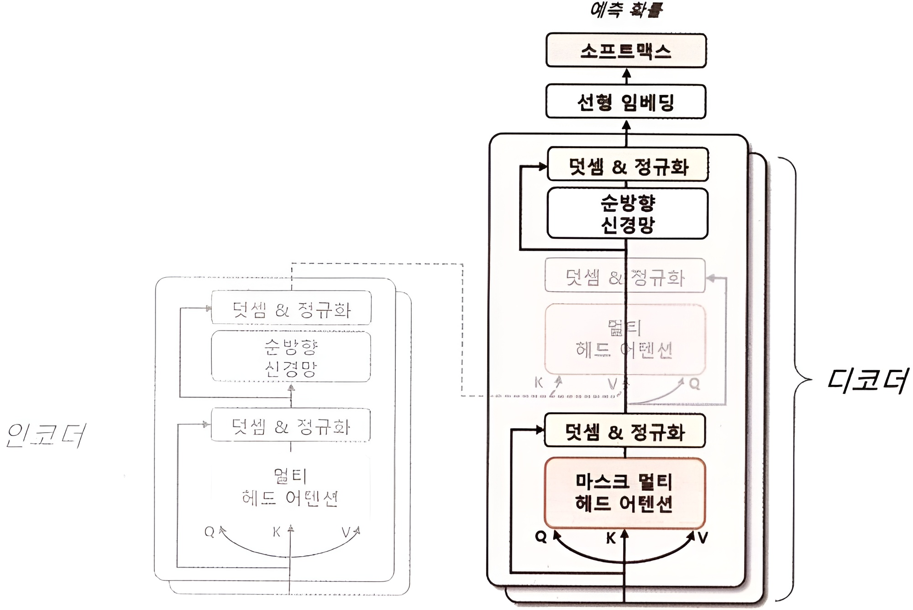

GPT-1 모델은 인코더를 사용하지 않고 디코더 부분만 사용하여 모델을 구성합니다.

디코더의 두 번째 다중헤드 어텐션은 사용하지 않습니다.

12개의 헤드를 가진 트랜스포머의 디코더를 12층 쌓아 모델을 구성하며 약 1억 2천만 개의 매개변수로 학습됩니다.

GPT-1 모델은 약 4.5GB의 BookCorpus 데이터세트를 사용해 언어 모델을 사전 학습합니다.

이떄 입력 문장을 임의의 위치까지 보여주고 뒤에 이어지는 문장을 모델이 자동으로 예측하게 합니다.

이 과정에서 별도의 레이블이 필요하지 않기 때문에 비지도 학습으로 학습이 이뤄집니다.

별도의 레이블이 없는 비지도 학습이므로 컴퓨팅 자원만 충분하다면 제약 없이 학습할 수 있다는 장점이 있습니다.

다음 그림은 GPT-1의 사전 학습 작업 구조입니다.

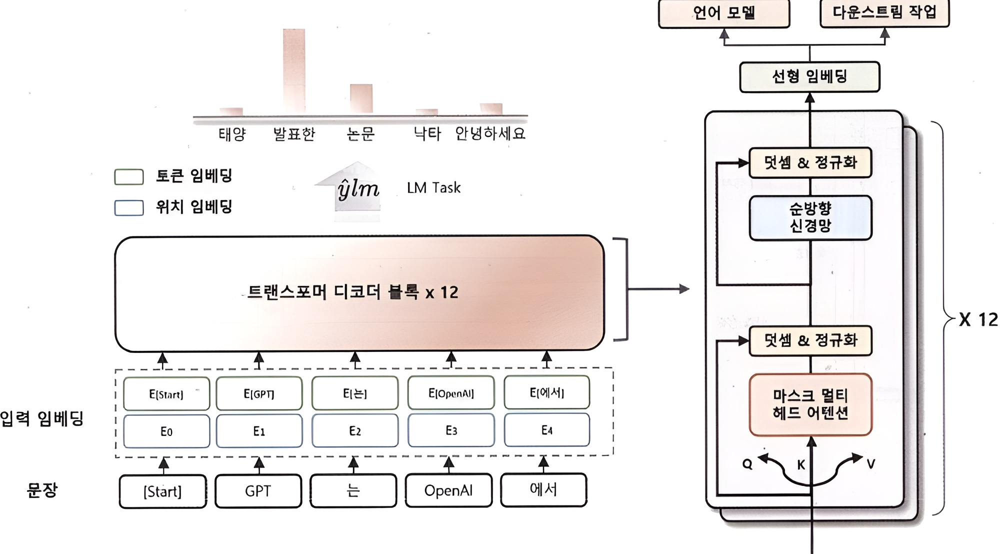

GPT-1은 입력 문장의 일부분만 보고 다음 토큰을 예측하도록 하는 언어 모델을 통해 사전 학습합니다.

입력 문장을 일정한 길이의 블록으로 나누어 처리합니다.

각 블록에서는 블록 내의 첫 번째 토큰부터 순서대로 다음 토큰을 예측하게 합니다.

이러한 방식으로 나누어 처리하는 방법은 모델이 장기적인 문맥을 이해할 수 있게 합니다.

GPT-1의 입력 임베딩은 토큰 임베딩과 위치 임베딩을 이용해 계산됩니다.

토큰 임베딩은 각 토큰을 고정된 차원의 벡터로 매핑하며, 위치 임베딩은 입력 문장에서 각 토큰의 위치 정보를 나타내는 벡터를 매핑합니다.

미세 조정을 위한 다운스트림 작업에도 GPT-1은 각 작업에 따라 입출력 구조를 바꾸지 않고 언어 모델을 보조 학습(Auxiliary Learning)해 사용합니다.

보조 학습이란 모델이 주어진 주요 학습 작업 외에도 다른 작은 부가적인 학습 작업을 동시에 수행하는 것을 의미합니다.

보조 작업에 학습한 정보를 주요 작업에 전달하여 성능을 향상시킬 수 있습니다.

다음 그림은 GPT-1의 모델 구조와 다운스트림 작업별 입출력 구조를 보여줍니다.

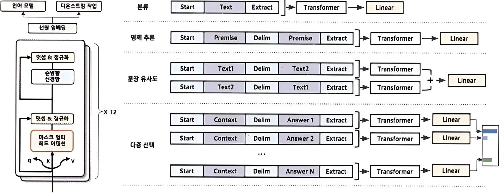

다운스트림 작업에서는 원하는 목표에 맞게 모델을 세밀하게 조정해야 해서 일반적인 언어 모델 학습 시 사용되는 손실 함수 외에 다운스트림 작업에서 필요한 추가 손실 함수가 필요합니다.

두 개의 손실 함수를 사용해 최적화하면 보조 학습을 통해 언어 모델을 개선과 다운스트림 작업의 목표를 달성하기 위해 필요한 정보를 학습할 수 있습니다.

GPT-1 다운스트림작업에서도 특수 토큰이 사용됩니다.

GPT-1은 문장의 시작을 의미하는 <start> 토큰, 두 문장의 경계를 의미하는 <delim> 토큰, 문장의 마지막을 의미하는 <extract> 토큰을 사용합니다.

### GPT-2

GPT-1은 입력 문장을 최대 512의 길이만큼 받아들여 다음 토큰을 예측했습니다.

하지만 GPT-2에서는 1024의 길이까지 입력을 처리할 수 있습니다.

이외에도 12개의 디코더 층을 사용한 GPT-1과는 달리, 48개의 디코더 계층을 사용해 이전 모델인 GPT-1보다 더욱 복잡한 패턴을 학습할 수 있게 됐습니다.

이전 모델인 GPT-1은 1200만 개의 매개변수를 사용해 언어 모델링 작업을 수행했습니다.

GPT-2에서는 15억 개의 매개변수를 갖게 됐습니다.

다음 그림은 GPT-2의 모델 구조를 보여줍니다.

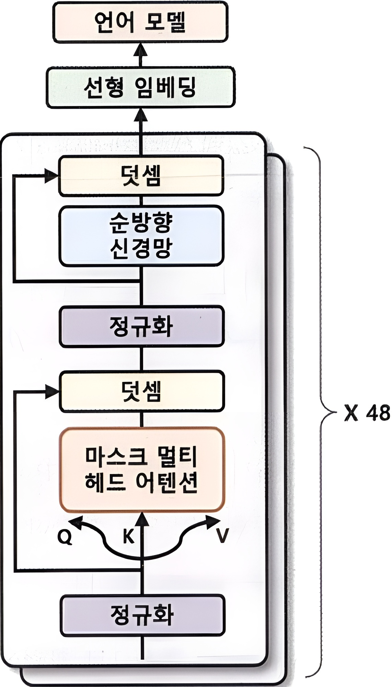

GPT-2는 GPT-1보다 훨씬 더 많은 양의 데이터를 이용하여 사전 학습됩니다.

GPT-2는 미국의 웹사이트 에서 스크래핑한 약 8백만 개의 문서를 사용해 40GB 데이터로 사전 학습을 수행했습니다.

더 많은 데이터로 학습된 GPT-2는 더욱 자연스러운 문장 생성 능력을 지니고 있으며, 더 다양한 분야에서 활용될 수 있습니다.

또한 GPT-2는 제로-샷 학습이 가능합니다.

GPT-2는 별도의 미세 조정 없이 다운스트림 작업에서도 사용할 수 있게 사전 학습 과정에서 특정한 형식의 데이터를 입력합니다.

    eg) ‘GPT는 놀라워요 = ‘GPT is amazing’과 같은 형식의 문장을 학습시킨 후 ‘번역 한글 문장 =’을 입력하면 번역된 영문이 출력되는 형식으로 작동합니다.

이러한 방식으로 학습 과정으로 배우지 않은 작업에도 사용할 수 있습니다.

### GPT-3

GPT-1과 GPT-2의 모델 구조가 큰 차이 없었듯이 GPT-3도 GPT-2와 거의 동일한 모델 구조를 가지고 있습니다.

그러니 GPT-3는 몇몇 모델 매개변수의 변화를 통해 GPT-2보다 약 116배 많은 매개변수를 가진 모델입니다.

GPT-3는 매우 규모가 큰 모델로 06개의 헤드를 가진 멀티 헤드 어텐션을 사용합니다.

트랜스포머 디코더 층도 96개의 층을 사용합니다.

멀티 헤드 어텐션 과정에서 연산량을 줄이기 위해 희소 어텐션(Sparese Attention)과 일반 어텐션을 섞어 사용합니다.

토큰 임베딩의 크기도 1600에서 12888로 대폭 증가했습니다.

GPT-2가 최대 1024개의 토큰까지 입력할 수 있었다면, GPT-3는 2048개까지 입력할 수 있어 더욱 긴 문장에 대한 처리 능력이 향상됐습니다.

GPT-3는 웹 크롤링, 위키백과, 서적 등에서 수집한 약 45TB에 달하는 방대한 양의 데이터세트를 이용하여 모델을 학습합니다.

이 모델은 다운스트림 작업으로 학습하지 않았지만, 질의응답, 번역, 요약, 문서 생성등 다양한 다운스트림 작업에서도 높은 성능을 보여줍니다.

GPT-3도 GPT-2와 같은 프롬프트(prompt)형식으로 작업을 수행합니다.

다음 그림은 GPT-3가 다운스트림 작업을 수행하는 것을 보여줍니다.

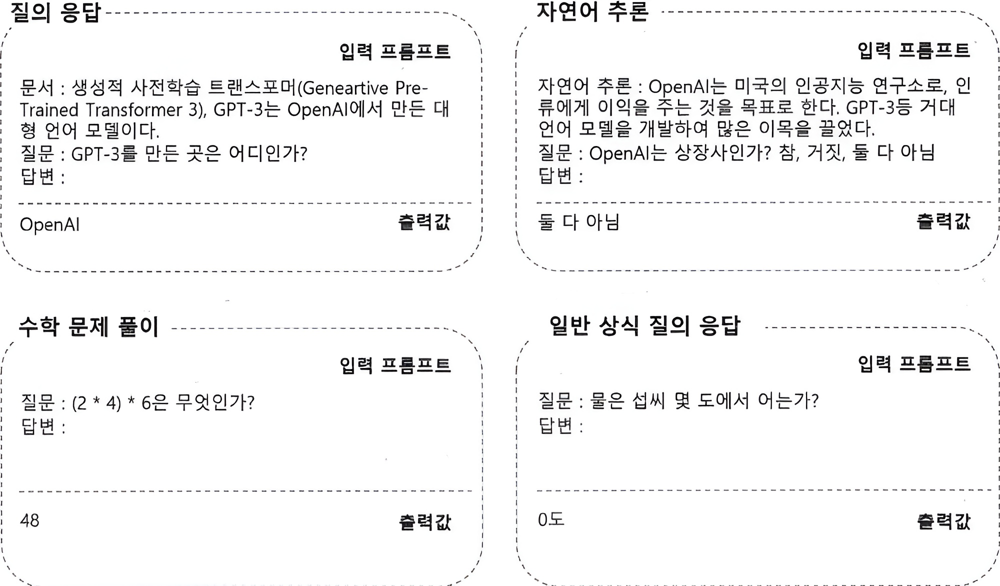

GPT-3는 새로운 도메인에서 작업에 대해서도 높은 일반화 능력을 보이며, 질의응답, 수학 문제 풀이, 자연어 추론 등과 같은 기존 자연어 처리 분야에서는 이전의 기술적 한계를 극복하는 성과를 보여줍니다.

하지만 GPT-3는 큰 모델이기 때문에 느리고 비용이 많이 들어 일반 사용자나 소규모 기업에서 활용하기 어렵고 사전 학습된 데이터에 기반하여 작동하기 때문에 데이터가 많이 편향돼있거나 정확하지 않을 경우 오류가 발생할 수 있습니다.

GPT-3는 자연어 처리 작업에 대한 일반화 능력이 높지만, 사람과 비교할 때 인간적인 이해력과 상식적인 추론 능력이 부족합니다.

모델이 생성한 텍스트는 항상 사실일 필요가 없고 편견이나 혐오 표현 등이 포함될 수도 있습니다.

이러한 결과물을 사용할 때는 항상 검토하고 검증하는 과정이 필요합니다.

생성된 텍스트의 저작권은 모델을 학습시킨 데이터와 모델을 만든 회사에 있으므로 저작권 문제에 주의해야 합니다.

### GPT 3.5

InstructGPT라고도 불리는 GPT-3.5는 GPT-3의 모델 구조를 그대로 따르면서도, 새로운 학습 방법인 RLHF를 도입해 모델의 매개변수 수를 줄이고 모델의 자연수러움을 높인 것이 특징입니다.

다음 그림은 OpenAI에서 공개한 RLHF 방법입니다.

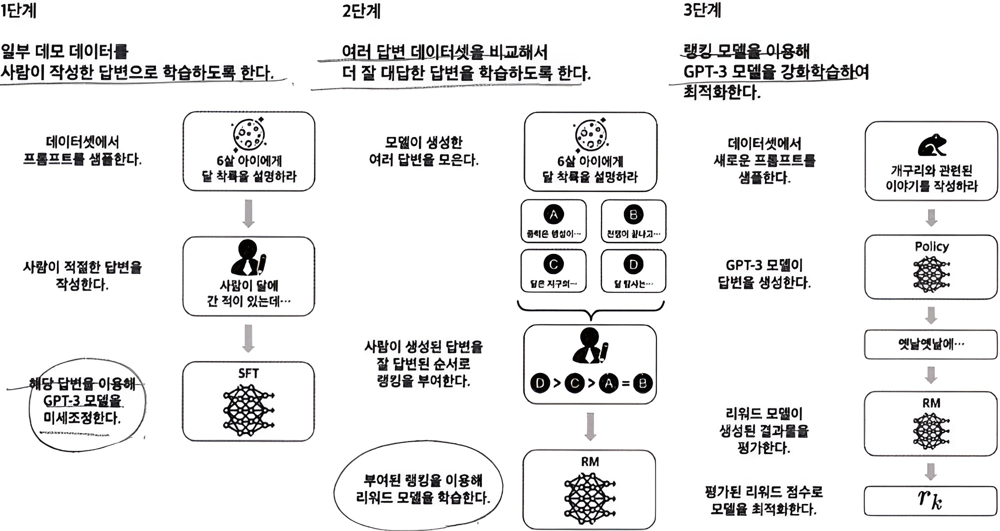

RLHF의 학습 방법은 데이터세트에서 임의의 프롬프트를 가져옵니다.

그리고 이 프롬프트에 대해 사람이 직접 적절한 답을 작성하게 합니다.

이때 작성된 답변은 모델이 생성한 문장과 함께 평가해 모델이 생성한 문장이 자연스러우면 보상받고, 그렇지 않으면 보상받지 못 합니다.

이러한 보상을 바탕으로 강화 학습을 통해 모델을 학습합니다.

이러한 과정을 지도 미세 조정(Supervised Fine-Tuning, SFT)이라 합니다.

RLHF를 통해 학습한 모델은 GPT-3 모델보다 더 자연스러운 문장을 생성할 수 있습니다.

하지만 학습데이터양을 고려하면 전체 프롬프트에 사람이 답변을 다는 것은 현실적으로 어렵습니다.

그러므로 GPT 모델이 얼마나 잘 답변했는지 평가하는 보상(Reward) 모델을 학습합니다.

GPT 모델은 시드(seed)에 따라 다른 답변을 생성하므로 내용이 서로 다른 여러 개의 답변이 생성될 수 있습니다.

보상 모델로 사람이 평가하고 그에 따른 랭킹을 부여합니다.

사람이 부여한 랭킹은 생성된 답변의 우수성을 평가한 결과입니다.

결과를 보상 모델의 입력으로 사용합니다.

보상 모델은 이렇게 생성된 답변과 랭킹 정보를 활용하여 학습합니다.

이를 통해 모델은 더 자연스러운 문장을 생성할 수 있게 됩니다.

RLHF에서는 주어진 프롬프트(State)에 대해 GPT-3 언어 모델(Policy)이 답변을 생성(Action)합니다.

이를 이용해 사람의 피드백을 기반으로 한 학습된 보상 모델을 평가(Reward)합니다.

이 과정에서 생성된 답변과 랭킹 정보를 활용하여 리워드 모델이 학습됩니다.

이를 통해 더욱 자연스러운 문장 생성이 가능해지는 GPT-3.5(InstructGPT)가 학습됩니다.

이 과정을 반복함으로써 더욱 정교한 답변 생성 모델을 학습할 수 있습니다.

GPT-4는 이전 모델과 비교했을 때 높은 성능 향상을 보였지만 언어 모델이 일부 입력에 대해 현실적이지 않은 결과를 생성하는 환각(Hallucination) 현상이 아직 존재합니다.

환각 현상이란 모델이 인간과 같은 추론과 판단 능력을 갖추지 못 하고 부적절하거나 오류가 많은 답변을 제시하는 현상을 말합니다.

### GPT-4

GPT-4는 이전의 GPT 모델과는 달리 텍스트 데이터 뿐만 아니라 이미지 데이터도 인식 가능한 멀티모달(Multimodal) 모델입니다.

GPT-3.5가 입력으로 최대 4096개의 토큰을 처리할 수 있었던 반면, GPT-4는 최대 여덟 배인 32768개의 토큰을 입력받을 수 있습니다.

GPT-3.5에서 3000개의 단어를 처리할 수 있었다면 GPT-4는 25000개의 단어를 처리할 수 있게 됐습니다.

대규모 다중 작업 언어 이해(Massive Multitask Language Understanding, MMLU) 벤치마크 테스트 결과로 GPT-3.5에서는 약 70%의 성능을 보였습니다.

GPT-4는 약 85%까지 성능이 향상됐습니다.

한국어로 번역한 MMLU 벤치마크에서 77%를 기록하며 GPT-3.5의 영어 성능보다 높은 성능을 내는것으로 알려져있습니다.

GPT-3.5는 미국 변호사 시험에서 213점을 받았지만 GPT-4는 298점으로 상위 10%의 점수를 받았습니다.

SAT 읽기와 쓰기 시험에서는 GPT 3.5가 받는 670점 보다 40점 높은 710점을 받아 상위 7%의 점수를 받았습니다.

GPT-4는 모델의 매개변수 수나 학습 데이터 및 방법은 공개되지 않았지만 ChatGPT Plus나 마이크로소프트 Bing을 통해 모델을 사용할 수 있습니다.

### 모델 실습

허깅페이스 트랜스포머 라이브러리의 GPT-2 모델로 문장을 생성해 보겠습니다.

```python
from transformers import GPT2LMHeadModel

model = GPT2LMHeadModel.from_pretrained(pretrained_model_name_or_path = "gpt2")

for main_name, main_module in model.named_children():
    print(main_name)

    for sub_name, sub_modeule in main_module.named_children():
        print("└", sub_name)

        for ssub_name, ssub_module in sub_modeule.named_children():
            print("|    └", ssub_name)

            for sssub_name, sssub_module in ssub_module.named_children():
                print("|    |   └", sssub_name)
```

```python
# 결과

transformer
└ wte
└ wpe
└ drop
└ h
|    └ 0
|    |   └ ln_1
|    |   └ attn
|    |   └ ln_2
|    |   └ mlp
|    └ 1
|    |   └ ln_1
|    |   └ attn
|    |   └ ln_2
|    |   └ mlp
|    └ 2
|    |   └ ln_1
|    |   └ attn
|    |   └ ln_2
|    |   └ mlp
|    └ 3
|    |   └ ln_1
|    |   └ attn
|    |   └ ln_2
|    |   └ mlp
...
|    |   └ ln_2
|    |   └ mlp
└ ln_f
lm_head
```

트랜스포머 라이브러리의 GPT2LMHeadModel 클래스의 from_pretrained 메서드로 사전 학습된 GPT-2 모델을 불러올 수 있습니다.

pretrained_model_name_or_path 매개변수는 불러오려는 사전 학습된 모델을 의미합니다.

실습 모델은 48개의 디코더 계층을 사용하는 모델이 아니라 12개의 디코더 계층을 사용하는 간소화 모델인 gpt2를 사용합니다.

48개의 이도커 계층을 사용하는 모델을 사용한다면 gpt-2xl로 불러올 수 있습니다.

간소화된 GPT-2 모델의 구조를 보면 단어 토큰 임베딩(wte), 단어 위치 임베딩(wpe), 드롭아웃(drop), 트랜스포머 디코더 계층(h), 선형 임베딩 및 언어 모델(lm_head) 로 구성돼 있습니다.

트랜스포머 라이브러리는 문장 분류, 문장 생성, 토큰 분류 등 다양한 작업에 대한 전처리, 모델 아키텍처, 후처리를 각각 처리할 수 있는 파이프라인(pipeline)함수를 제공합니다.

다음 예제는 GPT-2 모델을 사용한 문장 생성 구성 방법을 보여줍니다.

```python
from transformers import pipeline

generator = pipeline(task = "text-generation", model = "gpt2")

outputs = generator(text_inputs = "Machine learning is", max_length = 20, num_return_sequences = 3, pad_token_id = generator.tokenizer.eos_token_id)

print(outputs)
```

```python
# 결과

Hardware accelerator e.g. GPU is available in the environment, but no `device` argument is passed to the `Pipeline` object. Model will be on CPU.
Truncation was not explicitly activated but `max_length` is provided a specific value, please use `truncation=True` to explicitly truncate examples to max length. Defaulting to 'longest_first' truncation strategy. If you encode pairs of sequences (GLUE-style) with the tokenizer you can select this strategy more precisely by providing a specific strategy to `truncation`.
[{'generated_text': 'Machine learning is based on real-world data about your location (such as how far to the road'}, {'generated_text': 'Machine learning is a multi-layered system that enables us to design the best algorithms in order to'}, {'generated_text': "Machine learning is, in essence, a matter of design and implementation, and there's no way that"}]
```

파이프라인 클래스는 입력된 작업(task)에 모델(model)로 적합한 파이프라인을 구축합니다.

작업 매개변수는 수행하려는 작업을 의미합니다.

이번 예제에서는 GPT-2 모델로 문장 생성 작업을 수행하므로 text-generation과 gpt2를 입력합니다.

파이프라인 함수는 설정한 작업을 수행하는 파이프라인 클래스의 인스턴스를 반환합니다.

텍스트 생성 작업을 의미하는 “text-generation”작업을 입력하면 TextGenerationPipeline 클래스의 인스턴스가 생성됩니다.

이력 텍스트(text_input)는 생성하려는 문장의 입력 문맥을 전달하며, 최대 길이(max_length)는 생성될 문장의 최대 토큰 수를 제한합니다.

반환 시퀀스 개수(num_return_sequences)는 생성할 텍스트 시퀀스의 수를 의미합니다.

패딩토큰 ID(pad_token_id)는 모델의 자유 생성(Open-end generation)여부를 설정합니다.

해당 매개변수를 사용하면 모델이 입력된 문장의 문맥을 기반으로 자유롭게 다음 단어나 문장을 생성합니다.

위 예제는 ‘Machine learning is’라는 문장을 문맥으로 입력했을 때, 다음에 이어지는 내용을 제한없이 생성합니다.

GPT-2 모델은 선형 임베딩 층을 이용해 텍스트 분류 등 다양한 다운스크림 작업에 활용할 수 있습니다.

이번에는 CoLA(The Corpus of Linguistic Acceptability) 데이터세트를 이용해 모델을 학습하겠습다.

다음 코드는 CoLA 데이터세트를 불러오는 방법을 보여줍니다

```python
import torch
from torchtext.datasets import CoLA
from transformers import AutoTokenizer
from torch.utils.data import DataLoader

def collator(batch, tokenizer, device):
    source, labels, texts = zip(*batch)

    tokenized = tokenizer(texts, padding = "longest", truncation = True, return_tensors = "pt")

    input_ids = tokenized["input_ids"].to(device)
    attention_mask = tokenized["attention_mask"].to(device)
    labels = torch.tensor(labels, dtype = torch.long).to(device)

    return input_ids, attention_mask, labels

train_data = list(CoLA(split = "train"))
valid_data = list(CoLA(split = "dev"))
test_data = list(CoLA(split = "test"))

tokenizer = AutoTokenizer.from_pretrained("gpt2")
tokenizer.pad_token = tokenizer.eos_token

epoch = 3
batch_size = 16
device = "cuda" if torch.cuda.is_available() else "cpu"

train_dataloader = DataLoader(train_data, batch_size = batch_size, collate_fn = lambda x: collator(x, tokenizer, device), shuffle = True)
valid_dataloader = DataLoader(valid_data, batch_size = batch_size, collate_fn = lambda x: collator(x, tokenizer, device))
test_dataloader = DataLoader(test_data, batch_size = batch_size, collate_fn = lambda x: collator(x, tokenizer, device))

print("Train Dataset Length: ", len(train_data))
print("Valid Dataset Length: ", len(valid_data))
print("Test Dataset Length: ", len(test_data))
```

```python
# 결과

Train Dataset Length:  8550
Valid Dataset Length:  526
Test Dataset Length:  515
```

CoLA 데이터세트는 train, dev, test로 구성되어있습니다.

train 데이터세트는 모델 학습에, dev 데이터세트는 모델 검증에, test 데이터세트는 학습된 모델의 성능 평가에 사용됩니다.

GPT-2는 사전 학습시 패딩 기법을 사용하지 않기 때문에 토크나이저의 특수 토큰 중 패딩 토큰이 따로 포함되어 있지 않습니다.

따라서 문장 분류 모델을 학습하기 위해 문장의 끝을 의미하는 eos 토큰으로 패딩 토큰을 대체 합니다.

collator 함수는 배치 토크나이저로 토큰화합니다.

패딩(padding), 절사(truncation), 반환 형식 설정(return_tensors) 작업을 수행합니다.

패딩 인자를 longest로 설정하면 가장 긴 시퀀스에 대해 패딩을 적용하고 절사에 인자를 True로 설정하면 입력 시퀀스 길이가 최대 길이를 초과하는 경우 해당 시퀀스를 자릅니다.

반환 형식 설정에 pt를 입력 하면파이토치 텐서 형태로 결과를 반환합니다.

토크나이저는 토큰 ID(input_ids)와 어텐션 마스크(attention_maks)를 반환합니다.

GPT 모델은 어텐션 마스크를 이용해 입력 문장에서 패딩 부분을 무시하고 실제 단어에 대해 처리합니다.

토큰ID는 토크나이저가 각 토큰에 대해 부여한 숫자 ID를 담고 있으며, 어텐션 마스크는 입력 문장의 실제 단어에 대응하는 부분은 1로, 패딩에 대응하는 부분은 0으로 채웁니다.

다음 코드는 문장 분류를 위한 GPT-2 모델의 설정방법입니다.

```python
from torch import optim
from transformers import GPT2ForSequenceClassification

model = GPT2ForSequenceClassification.from_pretrained(pretrained_model_name_or_path = "gpt2", num_labels = 2).to(device)
model.config.pad_token_id = model.config.eos_token_id
optimizer = optim.Adam(model.parameters(), lr = 5e-5)
```

```python
# 결과

Some weights of GPT2ForSequenceClassification were not initialized from the model checkpoint at gpt2 and are newly initialized: ['score.weight']
You should probably TRAIN this model on a down-stream task to be able to use it for predictions and inference.
```

GPT-2 문장 분류 모델(GPT2ForSequenceClassification) 클래스는 GPT-2 모델을 기반으로 하는 시퀀스 분류 모델입니다.

이 모델은 기본 GPT-2 모델과 유가하게 작동하지만, 최종 출력 계층이 분류를 위해 미세 조정되어있습니다.

CoLA 데이터세트는 올바른 문장과 올바르지 않는 문장이 태깅돼 있으므로 분류 레이블 수(num_labels)를 2로 설정합니다.

GTP-2는 사전 학습 시 토큰의 패딩 기법을 사용하지 않습니다.

따라서 GPT-2의 토크나이저에는 패딩 토큰이 포함 돼 있지 않습니다.

하지만 문장 분류 모델을 학습하기 위해서는 모델이 고정된 길이의 입력을 필요로 하므로 문장의 끝을 나타내는 eos 토큰을 사용해 패딩 토큰으로 대체 합니다.

이렇게 설정한 문장 분류 모델에서 필요로 하는 고정된 길이의 입력을 제공할 수 있습니다.

다음 코드는 모델 학습 및 검증 방법을 보여줍니다.

```python
import numpy as np
from torch import nn

def calc_accuracy(preds, labels):
    pred_flat = np.argmax(preds, axis = 1).flatten()
    labels_flat = labels.flatten()
    return np.sum(pred_flat == labels_flat) / len(labels_flat)

def train(model, optimizer, dataloader):
    model.train()
    train_loss = 0.0

    for input_ids, attention_mask, labels in dataloader:
        outputs = model(input_ids = input_ids, attention_mask = attention_mask, labels = labels)

        loss = outputs.loss
        train_loss += loss.item()

        optimizer.zero_grad()
        loss.backward()
        optimizer.step()

    train_loss = train_loss / len(dataloader)

    return train_loss

def evaluation(model, dataloader):
    with torch.no_grad():
        model.eval()
        criterion = nn.CrossEntropyLoss()
        val_loss, val_accuracy = 0.0, 0.0

        for input_ids, attention_mask, labels in dataloader:
            outputs = model(input_ids = input_ids, attention_mask = attention_mask, labels = labels)
            logits = outputs.logits

            loss = criterion(logits, labels)
            logits = logits.detach().cpu().numpy()
            label_ids = labels.to("cpu").numpy()
            accuracy = calc_accuracy(logits, label_ids)

            val_loss += loss
            val_accuracy += accuracy

        val_loss = val_loss / len(dataloader)
        val_accuracy = val_accuracy / len(dataloader)

        return val_loss, val_accuracy

best_loss = 10000
for epoch in range(epoch):
    train_loss = train(model, optimizer, train_dataloader)
    val_loss, val_accuracy = evaluation(model, valid_dataloader)

    print(f"Epoch {epoch + 1}: Train loss: {train_loss: .4f} Val loss: {val_loss: .4f} Val Accuracy {val_accuracy: .4f}")

    if val_loss < best_loss:
        torch.save(model.state_dict(), "models/GPT2ForSequenceClassification.pt")
        print("Save the modle weights")
```

```python
# 결과

Epoch 1: Train loss:  0.6433 Val loss:  0.5996 Val Accuracy  0.6894
Save the modle weights
Epoch 2: Train loss:  0.5355 Val loss:  0.4913 Val Accuracy  0.7708
Save the modle weights
Epoch 3: Train loss:  0.4038 Val loss:  0.5270 Val Accuracy  0.7462
Save the modle weights

```

GPT-2 문장 분류 모델 클래스로 학습하면 내부적으로 손실을 계산해 반환합니다.

그러므로 train 함수로 모델 학습시 손실은 모델 출력값(outputs)의 loss 속성으로 가져옵니다.

모델 평가 시 교차 엔트로피 함수로 모델을 평가해 봅니다.

모델에서 반환하는 손실값이 아닌 로짓(logits)값과 레이블로 손실을 계산합니다.

추가로 calc_accuracy 함수로 모델의 정확도를 계산합니다.

이 함수는 모델의 예측 결과와 실제 레이블을 비교하여 정확도를 계산하고 반환합니다.

각 에폭에서 학습 손실, 검증 손실, 검증 정확도를 계산하고, 검증 손실값이 가장 낮은 값을 갖는 체크포인트를 저장합니다.

모델 선택 방법은 초기 best_loss를 큰 값으로 설정한 후 각 에폭마다 검증 손실값이 그 값보다 작으면 모델이 개선됐다고 판단해 해당 시점의 모델 가중치를 저장힙니다.

다음 코드는 학습된 모델을 평가하는 과정을 보여줍니다.

```python
model = GPT2ForSequenceClassification.from_pretrained(pretrained_model_name_or_path = "gpt2", num_labels = 2).to(device)
model.config.pad_token_id = model.config.eos_token_id
model.load_state_dict(torch.load("models/GPT2ForSequenceClassification.pt"))

test_loss, test_accuracy = evaluation(model, test_dataloader)

print(f"Test Loss: {test_loss: .4f}")
print(f"Test Accuracy: {test_accuracy: .4f}")
```

```python
# 결과

Some weights of GPT2ForSequenceClassification were not initialized from the model checkpoint at gpt2 and are newly initialized: ['score.weight']
You should probably TRAIN this model on a down-stream task to be able to use it for predictions and inference.
Test Loss:  0.6452
Test Accuracy:  0.7342
```

해당 모델의 평가 겨과를 보면 테스트 데이터세트에 대한 손실 값은 0.6452 이며, 정확도는 0.7342입니다.

손실 및 정확도가 중간 정도의 수치를 보이고 있습니다.

모델이 대체로 예측을 잘 하지만 개선이 필요하다는 것을 확인할 수 있습니다.

이번에 사용한 학습 데이터세트는 8550개로 모델 규모에 비해 매우 작은 데이터세트를 사용했음에도 불구하고 모델이 높은 성능을 발휘하는 것으로 볼 수 있습니다.

모델이 작은 데이터세트에서도 일반화 능력을 자고 있음을 의미합니다.

## BERT

BERT(Bidirectional Encoder Representations form Transformers)는 2018년 구글에서 발표한 언어 모델로 트랜스포머 기반 양방향 인코더를 사용하는 자연어 처리 모델 입니다.

양방향(Bidirectional) 인코더는 입력 시퀀스를 양쪽 방향에서 처리하여 이전과 이후의 단어를 모두 참조하면서 단어의 의미와 문맥을 파악합니다.

기존의 언어 모델은 문장을 좌에서 우로 순차적으로 학습해 단어의 의미와 문맥을 파악할 때 이전 단어만 고려할 수 밖에 없습니다.

하지만 BERT는 양방향으로 문장을 학습하므로 이전과 이후의 단어를 모두 참조해 단어의 의미와 문맥을 파악할 수 있습니다.

이를 통해 BERT는 기존 모델보다 더 정확하게 문맥을 파악하고, 다양한 자연어 처리 작업에서 높은 성능을 보입니다.

BERT는 대규모 데이터를 사용해 사전 학습되어 있으므로 전이 학습에 주로 활용합니다.

BERT는 일부 또는 전체를 다른 작업에서 재사용해 적은 양의 데이터로도 높은 정확도를 달성할 수 있으며, 모델 학습 시간을 크게 단축할 수 있습니다.

BERT 모델은 트랜스포머의 인코더를 기반으로 합니다.

이를 효과적으로 재활용함으로써 학습 데이터의 양과 다양성을 고려한 높은 성능을 보입니다.

다음 그림은 BERT에서 사용되는 트랜스포머 모듈을 보여줍니다.

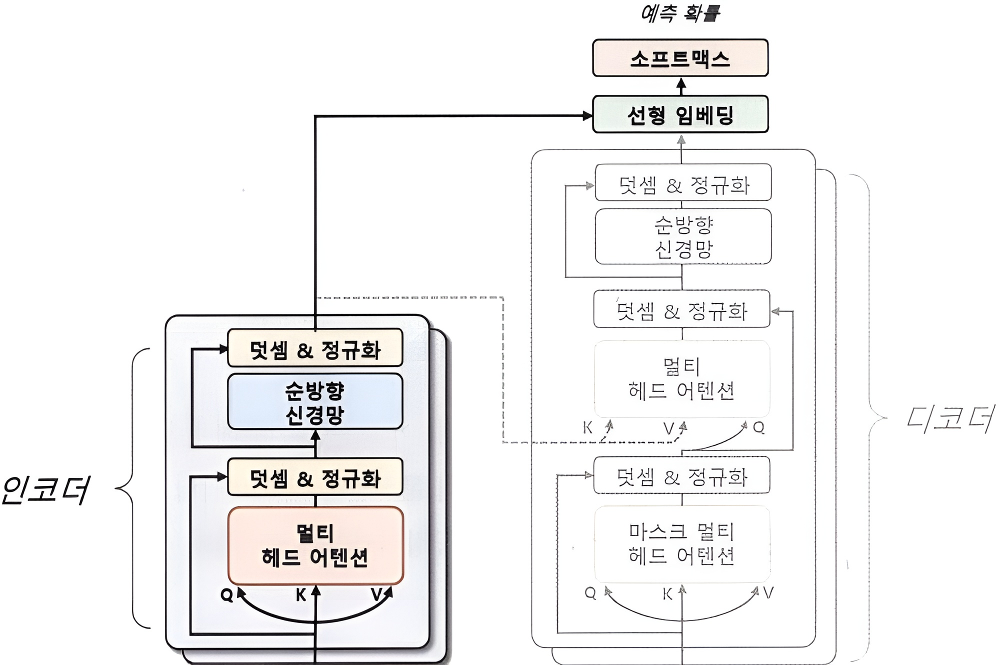

BERT는 입력 문장의 의미와 구조를 학습하고 다양한 자연어 처리 작업에 적용할 수 있는 사전 학습된 언어 모델입니다.

BERT는 트랜스포머의 인코더 모듈만을 사용해 입력 문장을 처리합니다.

인코더는 입력 문장의 단어들을 임베딩해 각 단어의 의미를 벡터화합니다.

그 후 순차적으로 처리하여 문장 전체를 의미를 추출합니다.

BERT는 입력 문장의 단어를 좌우 양방향으로 처리해 문맥 정보를 모델링하므로 인코더 계층만을 사용해 학습합니다.

BERT는 사전 학습을 위해 마스킹된 언어 모델링(MLM)과 다음 문장 예측 방법(NSP)을 사용하빈다.

### 사전 학습 방법

마스킹된 언어 모델링(Masked Language Modeling, MLM)은 입력 문장에서 임의로 일부 단어를 마스킹하고 해당 단어를 예측하는 방식입니다.

    eg) ‘I`m learning PyTorch’라는 문장에서 ‘learning’을 마스킹하면, ‘I`m [MASK] PyTorch’가 되어 BERT는 [MASK]에 들어갈 단어를 예측합니다.

이 과정에서 양방향 문맥 정보를 참고합니다.

BERT는 양방향으로 문장을 학습해 문맥 정보를 모델링하므로 입력 문장에서 누락된 단어를 추론하는 능력을 갖게 됩니다.

이를 통해 BERT는 문장 전체 의미를 이해하는 능력이 향상됩니다.

다음 문장 예측(Next Sentence Prediction, NSP)은 두 개의 문장이 주어졌을 때, 두 번째 문장이 첫 번째 문장이 다음에 오는 문장인지 여부를 판단하는 작업입니다.

    eg)  ‘I`m learning PyTorch’와 ‘PyTorch is a machine learning library’라는 두 문장이 주어지면 BERT는 이 문장이 연속적인 관계인지 아닌지를 예측하빈다.

이 과정에서 BERT는 두 문장 간의 관계를 학습하고, 문장 간의 의미적인 유사성을 파악합니다.

BERT 모델은 입력 문장에 특수한 토큰들을 추가해 모델이 학습하고 추론하는 과정에서 필요한 정보를 제공합니다.’

BERT에서는 [CLS] 토큰, [SEP] 토큰, [MASK] 토큰이 사용됩니다.

[CLS] 토큰은 입력 문장의 시작 부분에 추가되는 토큰입니다.

이 토큰을 이용해 문장 분류 작업을 위한 정보를 제공합니다.

이를 통해 모델은 입력 문장이 어떤 유형의 문장인지 미리 파악할 수 있게 됩니다.

    eg) 이전의 문장 분류 작업에서는 이 토큰이 입력 문장이 긍정적인지 부정적인지, 혹은 문장 내에서 어떤 객체가 언급되는지 등을 분류하는 데 사용됩니다.

[SEP] 토큰은 입력 문장 내에서 두 개 이상의 문장을 구분하기 위해 사용되는 토큰입니다.

    eg) 문장 분류 작엽에서 두 개의 문장을 입력으로 받을 때 [SEP] 토큰을 사용하여 두 문장을 구분합니다.

이를 통해 모델은 입력 문장을 두 개의 독립적인 문장으로 인식하고 각각의 문장에 대한 정보를 정확하게 파악할 수 있게 됩니다.

[MASK] 토큰은 입력 문장 내에서 임의로 선택된 단어를 가르키는 특별한 토큰입니다.

이 토큰은 주어진 문장에서 일부 단어를 가린 후 모델의 학습과 예측에 활용합니다.

    eg) 언어 모델링 작업에서 [MASK] 토큰은 마스킹된 실제 단어를 예측하는데 사용됩니다.

BERT 모델의 입력 시퀀스 [CLS] 문장-1 [SEP] 문장-2 [MASK] [SEP] 등의 구조를 가질 수 있습니다.

다음 그림은 BERT 모델의 입력 임베딩의 구조와 MLM과 NSP 손실 함수를 보여줍니다.

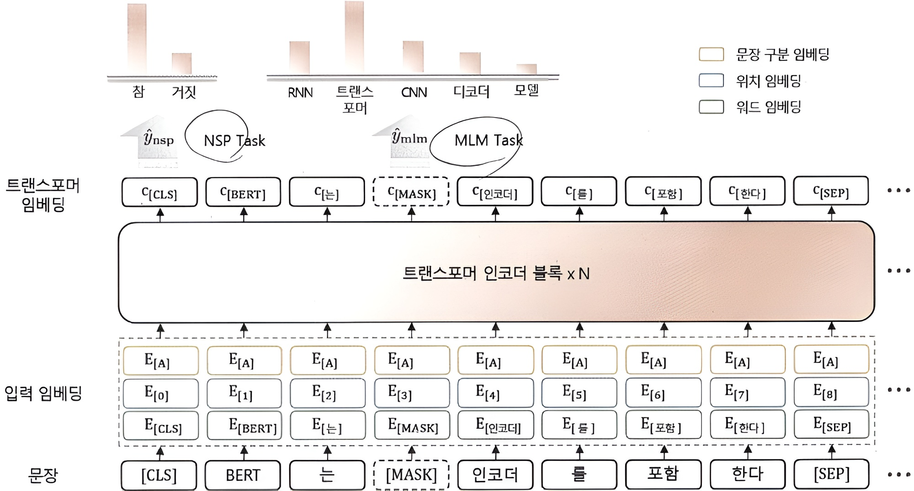

위 그림에서 임력 문장은 ‘BERT는 트랜스포머 인코더를 포함한다’입니다.

그러므로 BERT 모델에서 해당 문장을 처리하기 위해 문장 앞에 삽이보디는 [CLS] 토큰과 문장 마지막에 삽입되는 [SEP] 토큰을 추가해 ‘[CLS] BERT는 트랜스포머 인코더를 포함한다 [SEP]’과 같은 형태로 변환해야 합니다.

[MASK] 토큰 적용 방법은 텍스트 토큰 중 15%에 해당하는 단어를 대상으로 마스킹을 수행합니다.

    eg) 100개의 토큰 중에서 약 15%에 해당하는 15개의 단어를 마스킹합니다.

이 중 80%는 [MASK] 토큰으로 대체하고 10%는 어휘 사전에 존재하는 무작위 단어로 변경합니다.

그리고 나머지 10%는 실제 토큰을 그대로 사용합니다.

입력 문장을 토큰 단위로 분리했다면 각 토큰에 대한 임베딩을 생성해 모델의 입력으로 사용합니다.

각 토큰에 대한 임베딩은 토큰(Token), 위치(Position), 문장 구분(Token Type) 임베딩의 합으로 이뤄집니다.

토크 임베딩(Token Embedding)은 각 토큰에 대해 토큰 임베딩 벡터를 생성하빈다.

이 과정에서 토큰 임베딩 테이블을 사용해 각 토큰 인덱스에 해당하느 임베딩 벡터를 선택합니다.

이 과정은 ‘Transformer’의 입력 임베딩 과정과 동일합니다.

위치 임베딩(Position Embedding)은 입력 토큰의 위치 정보를 나타내는 임베딩으로 각 입력 토큰의 위치 인덱스 정보를 입력받아 해당 위치의 임베딩 벡터를 출력합니다.

BERT 모델에서는 입력 토큰들의 상대적인 위치 정보를 고려하여 모델이 문장의 전체적인 의미를 파악할 수 있게 돕습니다.

위치 인덱스는 0부터 최대 입력 가능한 토큰 수만큼 학습할 수 있습니다.

문장 구분 임베딩(Token Type Embedding)은 입력 문장이 두 개 이상의 문장으로 이루어진 경우 각 문장을 구분하는 임베딩을 생성합니다.

    eg) 이전 문장의 모든 토큰에 세그먼트 인덱스 A를 부여하고 다음 문장의 토큰들에는 세그먼트 인덱스 B를 부여하고 가정합니다.

BERT 모델은 문장 구분 임베딩으로 문장 단위의 정보를 학습할 수 있게 됩니다.

입력 임베딩 이후 트랜스포머 인코더 블록을 통과해 MLM 작업 또는 NSP 작업을 수행합니다.

MLM 손실 함수는 입력 문장에서 일부 단어를 무작위로 마스킹한 뒤 해당 단어를 예측하는 방식을 사용합니다.

위 그림과 같이 마지막 트랜스포머 인코더 블록에서 산출된 [MASK] 토큰 벡터 실제 단어(트랜스포머)를 예측합니다.

이를 통해 모델은 문맥 정보를 기반으로 누락된 단어를 추론하게 되며 이는 문장 전체의 의미를 이해하는 능력을 향상시킵니다.

NSP 손실함수는 두 개의 문자잉 주어졌을 때 두 문장이 연속적으로 이어지는지 아니면 무관한 문장인지 참 또는 거짓으로 예측하는 방식을 사용합니다.

위 그림에서 마지막 트랜스포머 인코더 블록에서 산출된 [CLS] 벡터로 문장 순서가 참인지 거짓인지 예측하는 예시를 확인할 수 있습니다.

이를 통해 모델은 문장 사이의 관계를 파악하고 문맥 정보를 더욱 잘 이해할 수 있게 됩니다.

NSP 작업을 위한 데이터 생성 방법은 텍스트 문단에서 왼쪽과 오른쪽 문장을 연속해서 붙인 데이터는 참 문장으로 오른쪽 문장을 랜덤하게 샘플링해 이어 붙인 데이터는 거짓 문장으로 처리합니다.

BERT는 사전 학습을 수행한 후 미세 조정 기법을 통해 다양한 자연어 처리 작업에 적용할 수 있습니다.

    eg) 문장 분류, 감성 분석, 질문 응답, 기계 번역 등 다양한 작업이 가능합니다.

미세 조정 과정에서는 해당 작업에 맞는 계층을 추가하고 손실 함수를 정의 학습합니다.

분류 문제에서는 일반적으로 [CLS] 토큰 벡터를 사용하고, 각 토큰마다 예측이 필요한 경우에는 모든 토큰 벡터를 사용합니다.

### 모델 실습

허깅 페이스 트랜스포머 라이브러리의 BERT 모델과 네이버 영화 리뷰 감정 분석 데이터세트를 활용해 분류 모델을 학습합니다.

다음 코드는 네이버 영화 리뷰 데이터세트를 불러오는 방법을 보여줍니다.

```python
import numpy as np
import pandas as pd
from Korpora import Korpora

corpus = Korpora.load("nsmc")
df = pd.DataFrame(corpus.test).sample(20000, random_state = 42)
train, valid, test = np.split(df.sample(frac = 1, random_state = 42), [int(0.6 * len(df)), int(0.8 * len(df))])

print(train.head(5).to_markdown())
print(f"Training Data Size: {len(train)}")
print(f"Validation Data Size: {len(valid)}")
print(f"Testing Data Size: {len(test)}")
```

```python
 # 결과
 
 Korpora 는 다른 분들이 연구 목적으로 공유해주신 말뭉치들을
    손쉽게 다운로드, 사용할 수 있는 기능만을 제공합니다.

    말뭉치들을 공유해 주신 분들에게 감사드리며, 각 말뭉치 별 설명과 라이센스를 공유 드립니다.
    해당 말뭉치에 대해 자세히 알고 싶으신 분은 아래의 description 을 참고,
    해당 말뭉치를 연구/상용의 목적으로 이용하실 때에는 아래의 라이센스를 참고해 주시기 바랍니다.

    # Description
    Author : e9t@github
    Repository : https://github.com/e9t/nsmc
    References : www.lucypark.kr/docs/2015-pyconkr/#39

    Naver sentiment movie corpus v1.0
    This is a movie review dataset in the Korean language.
    Reviews were scraped from Naver Movies.

    The dataset construction is based on the method noted in
    [Large movie review dataset][^1] from Maas et al., 2011.

    [^1]: http://ai.stanford.edu/~amaas/data/sentiment/

    # License
    CC0 1.0 Universal (CC0 1.0) Public Domain Dedication
    Details in https://creativecommons.org/publicdomain/zero/1.0/
...
| 18010 | 징키스칸이란 소재를 가지고 이것밖에 못만드냐             |       0 |
Training Data Size: 12000
Validation Data Size: 4000
Testing Data Size: 4000
```

‘Word2Vec’에서 같이 데이터세트의 크기가 작은 테스트 데이터세트를 활용해 학습을 진행합니다.

이 중 20000개의 데이터세트를 6:2:2로 분리해 학습 데이터, 검증 데이터, 데스트 데이터로 활용합니다.

코포라 라이브러리로 데이터를 불러왔다면 BERT 토크나이저(BertTokenizer) 클래스로 데이터를 전처리합니다.

다음 코드는 BERT 토크나이저 클래스로 데이터 전처리하고 데이터로더에 적용하는 방법을 보여줍니다.

```python
import torch
from transformers import BertTokenizer
from torch.utils.data import TensorDataset, DataLoader
from torch.utils.data import RandomSampler, SequentialSampler

def make_dataset(data, tokenizer, device):
    tokenized = tokenizer(text = data.text.tolist(), padding = "longest", truncation = True, return_tensors = "pt")

    input_ids = tokenized["input_ids"].to(device)
    attention_mask = tokenized["attention_mask"].to(device)
    labels = torch.tensor(data.label.values, dtype = torch.long).to(device)

    return TensorDataset(input_ids, attention_mask, labels)

def get_dataloader(dataset, sampler, batch_size):
    data_sampler = sampler(dataset)
    dataloader = DataLoader(dataset, sampler = data_sampler, batch_size = batch_size)

    return dataloader

epochs = 5
batch_size = 32
device = "cuda" if torch.cuda.is_available() else "cpu"
tokenizer = BertTokenizer.from_pretrained(pretrained_model_name_or_path = "bert-base-multilingual-cased", do_lower_case = False)

train_dataset = make_dataset(train, tokenizer, device)
train_dataloader = get_dataloader(train_dataset, RandomSampler, batch_size)

valid_dataset = make_dataset(valid, tokenizer, device)
valid_dataloader = get_dataloader(valid_dataset, SequentialSampler, batch_size)

test_dataset = make_dataset(test, tokenizer, device)
test_dataloader = get_dataloader(test_dataset, SequentialSampler, batch_size)

print(train_dataset[0])
```

```python
# 결과

(tensor([   101,  58466,   9812, 118956, 119122,  59095,  10892,   9434, 118888,
           117,   9992,  40032,  30005,    117,   9612,  37824,   9410,  12030,
         42337,  10739,  83491,  12508,    106,    106,    102,      0,      0,
             0,      0,      0,      0,      0,      0,      0,      0,      0,
             0,      0,      0,      0,      0,      0,      0,      0,      0,
             0,      0,      0,      0,      0,      0,      0,      0,      0,
             0,      0,      0,      0,      0,      0,      0,      0,      0,
             0,      0,      0,      0,      0,      0,      0,      0,      0,
             0,      0,      0,      0,      0,      0,      0,      0,      0,
             0,      0,      0,      0,      0,      0,      0,      0,      0,
             0,      0,      0,      0,      0,      0,      0,      0,      0,
             0,      0,      0,      0,      0,      0,      0,      0,      0,
             0,      0,      0,      0,      0,      0,      0,      0,      0,
             0,      0,      0,      0,      0,      0,      0],
       device='cuda:0'), tensor([1, 1, 1, 1, 1, 1, 1, 1, 1, 1, 1, 1, 1, 1, 1, 1, 1, 1, 1, 1, 1, 1, 1, 1,
        1, 0, 0, 0, 0, 0, 0, 0, 0, 0, 0, 0, 0, 0, 0, 0, 0, 0, 0, 0, 0, 0, 0, 0,
        0, 0, 0, 0, 0, 0, 0, 0, 0, 0, 0, 0, 0, 0, 0, 0, 0, 0, 0, 0, 0, 0, 0, 0,
        0, 0, 0, 0, 0, 0, 0, 0, 0, 0, 0, 0, 0, 0, 0, 0, 0, 0, 0, 0, 0, 0, 0, 0,
        0, 0, 0, 0, 0, 0, 0, 0, 0, 0, 0, 0, 0, 0, 0, 0, 0, 0, 0, 0, 0, 0, 0, 0,
        0, 0, 0, 0], device='cuda:0'), tensor(1, device='cuda:0'))
```

BERT 토크나이저 클래스는 사적 학습된 토크나이저를 불러와 전처리를 수행합니다.

사전 학습된 모델은 bert-base-multilingual-cased로 다중 언어를 지원하며 대소문자를 유지하는 사전 학습된 BERT 모델을 의미합니다.

소문자 유지(do_lower_case) 매개변수를 False로 할당해 소문자 변환하지 않게 합니다.

소문자 유지 매개변수를 True으로 설정하면 ‘Apple’과 ‘apple’을 다른 단어로 인식하는 방법으로 학습됩니다.

이 모델은 104개의 언어를 지원하며 모든 언어의 데이터를 한 번에 학습해 다국어 자연어 처리 작업에 대해 높은 성능을 기대할 수 있습니다.

이 토크나이저를 make_dataset 함수에 전달해 텐서 데이터세트를 반환합니다.

토크나이저 인스턴스는 위 GPT 예제와 동일합니다.

출력 결과를 확인해 보면 텍스트 숫자 ID와 어텐션 마스크로 변경되며 레이블이 텐서 형식으로 변환된 것을 확인할 수 있습니다.

데이터를 토큰화하고 데이터세트로 변경했다면 데이터로더를 적용합니다.

get_datalodader 함수는 샘플러 클래스를 활용해 데이터를 목적에 따라 샘플링 합니다.

무작위 샘플로(RandomSampler) 클래스는 데이터를 무작위로 샘플링하므로 학습에 적용하며, 시퀀셜 샘플러(SequentialSampler) 클래스는 데이터를 고정된 순서대로 반환하므로 검증 및 평가 배치에 적용합니다.

데이터로더까지 적용했다면 모델과 최적화 함수를 선언합니다.

다음 코드는 BERT 모델을 설정하는 방법을 보여줍니다.

```python
from torch import optim
from transformers import BertForSequenceClassification

model = BertForSequenceClassification.from_pretrained(pretrained_model_name_or_path = "bert-base-multilingual-cased", num_labels = 2).to(device)
optimizer = optim.AdamW(model.parameters(), lr = 1e-5, eps = 1e-8)
```

```python
# 결과

A parameter name that contains `beta` will be renamed internally to `bias`. Please use a different name to suppress this warning.
A parameter name that contains `gamma` will be renamed internally to `weight`. Please use a different name to suppress this warning.
A parameter name that contains `beta` will be renamed internally to `bias`. Please use a different name to suppress this warning.
A parameter name that contains `gamma` will be renamed internally to `weight`. Please use a different name to suppress this warning.
A parameter name that contains `beta` will be renamed internally to `bias`. Please use a different name to suppress this warning.
A parameter name that contains `gamma` will be renamed internally to `weight`. Please use a different name to suppress this warning.
A parameter name that contains `beta` will be renamed internally to `bias`. Please use a different name to suppress this warning.
A parameter name that contains `gamma` will be renamed internally to `weight`. Please use a different name to suppress this warning.
A parameter name that contains `beta` will be renamed internally to `bias`. Please use a different name to suppress this warning.
A parameter name that contains `gamma` will be renamed internally to `weight`. Please use a different name to suppress this warning.
A parameter name that contains `beta` will be renamed internally to `bias`. Please use a different name to suppress this warning.
A parameter name that contains `gamma` will be renamed internally to `weight`. Please use a different name to suppress this warning.
A parameter name that contains `beta` will be renamed internally to `bias`. Please use a different name to suppress this warning.
A parameter name that contains `gamma` will be renamed internally to `weight`. Please use a different name to suppress this warning.
A parameter name that contains `beta` will be renamed internally to `bias`. Please use a different name to suppress this warning.
A parameter name that contains `gamma` will be renamed internally to `weight`. Please use a different name to suppress this warning.
A parameter name that contains `beta` will be renamed internally to `bias`. Please use a different name to suppress this warning.
A parameter name that contains `gamma` will be renamed internally to `weight`. Please use a different name to suppress this warning.
A parameter name that contains `beta` will be renamed internally to `bias`. Please use a different name to suppress this warning.
A parameter name that contains `gamma` will be renamed internally to `weight`. Please use a different name to suppress this warning.
A parameter name that contains `beta` will be renamed internally to `bias`. Please use a different name to suppress this warning.
A parameter name that contains `gamma` will be renamed internally to `weight`. Please use a different name to suppress this warning.
A parameter name that contains `beta` will be renamed internally to `bias`. Please use a different name to suppress this warning.
A parameter name that contains `gamma` will be renamed internally to `weight`. Please use a different name to suppress this warning.
A parameter name that contains `beta` will be renamed internally to `bias`. Please use a different name to suppress this warning.
...
A parameter name that contains `beta` will be renamed internally to `bias`. Please use a different name to suppress this warning.
A parameter name that contains `gamma` will be renamed internally to `weight`. Please use a different name to suppress this warning.
Some weights of BertForSequenceClassification were not initialized from the model checkpoint at bert-base-multilingual-cased and are newly initialized: ['classifier.bias', 'classifier.weight']
You should probably TRAIN this model on a down-stream task to be able to use it for predictions and inference.
```

BERT 모델로 GPT-2 문장 분류 모델처럼 BERT 문장 분류 모델(BertForSequenceClassification) 클래스로 불러올  수 있습니다.

BERT 모델은 패딩 기법을 사용하므로 모델 설정을 변경하지 않습니다.

활성화 함수는 AdamW로 Adam 최적화 함수에 가중치 감쇠를 추가한 변형된 경사 하강법 알고리즘입니다.

AdamW 클래서의 엠실론(eps) 매개변수는 학습률을 0으로 나누는 것을 방지하기 위해 분모에 더하는 작은 값입니다.

BERT 모델은 대규모의 매개변수를 가진 딥러닝 모델이므로 안정적인 기울기 생긴이 필수적입니다.

AdamW는 갱신되는 모든 개배견수의 학습률을 조절하는 적응형 활성화 함수이므로 모델이 빠르게 수렴하고 안정적으로 학습할 수 있습니다.

다음 코드는 학급에 필요한 설정을 완료했다면 모델 구조를 확인할 수 있습니다.

```python
for main_name, main_module in model.named_children():
    print(main_name)
    for sub_name, sub_module in main_module.named_children():
        print("└", sub_name)
        for ssub_name, ssub_module in sub_module.named_children():
            print("│  └", ssub_name)
            for sssub_name, sssub_module in ssub_module.named_children():
                print("│  │  └", sssub_name)
```

```python
# 결과

bert
└ embeddings
│  └ word_embeddings
│  └ position_embeddings
│  └ token_type_embeddings
│  └ LayerNorm
│  └ dropout
└ encoder
│  └ layer
│  │  └ 0
│  │  └ 1
│  │  └ 2
│  │  └ 3
│  │  └ 4
│  │  └ 5
│  │  └ 6
│  │  └ 7
│  │  └ 8
│  │  └ 9
│  │  └ 10
│  │  └ 11
└ pooler
│  └ dense
│  └ activation
dropout
classifier
```

BERT 모델의 입력 임베딩은 토큰 임베딩(word_embeddings), 위치 임베딩(position_embedding), 문장 구분 임베딩(token_type_embedding)으로 구성됩니다.

이러한 임베딩들은 서로 다른 정보를 담고 있습니다.

이를 결합해 입력 시퀀스에 대한 임베딩 벡터를 생성합니다.

이후 생성된 임베딩 벡터는 계층 정규화와 드롭아웃을 수행합니다.

트랜스포머 인코더 블록은 총 12개를 사용하며 각각의 블록은 입력 시퀀스를 순차적으로 처리해 새로운 임베딩을 생성합니다.

이 과정에서 각 블록은 셀프 어텐션 및 순방향 신경망을 사용해 입력 시퀀스의 다양한 관계를 학습합니다.

풀러(pooler)는 [CLS] 토큰 벡터를 한 번 더 비선형 변환을 수행하기 위해 선형 변환과 비선형 변환인 Tanh 함수를 사용합니다.

이후 드롭아웃이 적용 돼 모델의 과대적합을 방지합니다.

마지막에 적용되는 분류기(classifier)는 BERT 모델에서 수행해야 하는 작업으로 [CLS] 토큰 벡터를 활용해 결과를 예측합니다.

모델 구조를 확인했다면 BERT 모델을 학습하고 평가해 봅니다.

모델 학습 평가 방법은 ‘GPT-2’ 에사용한 코드와 동일합니다.

학습 코드

```python
import numpy as np
from torch import nn

def calc_accuracy(preds, labels):
    pred_flat = np.argmax(preds, axis = 1).flatten()
    labels_flat = labels.flatten()

    return np.sum(pred_flat == labels_flat) / len(labels_flat)

def train(model, optimizer, dataloader):
    model.train()
    train_loss = 0.0

    for input_ids, attention_mask, labels in dataloader:
        outputs = model(input_ids = input_ids, attention_mask = attention_mask, labels = labels)

        loss = outputs.loss
        train_loss += loss.item()

        optimizer.zero_grad()
        loss.backward()
        optimizer.step()

    train_loss = train_loss / len(dataloader)

    return train_loss

def evaluation(model, dataloader):
    with torch.no_grad():
        model.eval()
        criterion = nn.CrossEntropyLoss()
        val_loss, val_accuracy = 0.0, 0.0

        for input_ids, attention_mask, labels in dataloader:
            outputs = model(input_ids = input_ids, attention_mask = attention_mask, labels = labels)
            logits = outputs.logits

            loss = criterion(logits, labels)
            logits = logits.detach().cpu().numpy()
            label_ids = labels.to("cpu").numpy()
            accuracy = calc_accuracy(logits, label_ids)

            val_loss += loss
            val_accuracy += accuracy

    val_loss = val_loss / len(dataloader)
    val_accuracy = val_accuracy / len(dataloader)

    return val_loss, val_accuracy

best_loss = 10000

for epoch in range(epochs):
    train_loss = train(model, optimizer, train_dataloader)
    val_loss, val_accuracy = evaluation(model, valid_dataloader)

    print(f"Epoch {epoch + 1}: Train Loss: {train_loss: .4f} Val Loss: {val_loss: .4f} Val Accuracy {val_accuracy: .4f}")

    if val_loss < best_loss:
        best_loss = val_loss
        torch.save(model.state_dict(), "models/BertForSequenceClassification.pt")
        print("Saved the model weights")
```

```python
# 코드

Epoch 1: Train Loss:  0.5461 Val Loss:  0.4534 Val Accuracy  0.7907
Saved the model weights
Epoch 2: Train Loss:  0.4029 Val Loss:  0.4184 Val Accuracy  0.8163
Saved the model weights
Epoch 3: Train Loss:  0.3137 Val Loss:  0.4786 Val Accuracy  0.8183
Epoch 4: Train Loss:  0.2463 Val Loss:  0.4598 Val Accuracy  0.8115
Epoch 5: Train Loss:  0.1893 Val Loss:  0.5046 Val Accuracy  0.8103
```

평가 결과

```python
model = BertForSequenceClassification.from_pretrained(pretrained_model_name_or_path = "bert-base-multilingual-cased", num_labels = 2).to(device)
model.load_state_dict(torch.load("models/BertForSequenceClassification.pt"))

test_loss, test_accuracy = evaluation(model, test_dataloader)
print(f"Test Loss : {test_loss:.4f}")
print(f"Test Accuracy : {test_accuracy:.4f}")
```

```python
# 결과

Test Loss : 0.4145
Test Accuracy : 0.8135
```

모델 학습 결과, 학습을 거듭할수록 학습 손실이 지속적으로 감소하며, 검증 손실 및 검증 정확도가 점진적으로 개선되고 있음을 확인할 수 있습니다.

이는 모델이 과대적합되지 않고 적절하게 학습되고 있음을 의미합니다.

최종적으로 테스트 손실은 0.4183이며 테스트 정확도는 0.8085입니다.

이는 모델이 새로운 데이터에 대해 어느 정도 일반화된 성능을 보이고 있음을 보여줍니다.

## BART

BART(Bidirectional Auto-Regressive Transformer)는 2019년 메타의 FAIR 연구소에서 발표한 트랜스포머 기반의 모델입니다.

BART는 BERT의 인코더와 GPT의 디코더를 결합한 시퀀스-시퀀스(Sequence-to-Sequence, Seq2Seq) 구조로 노이즈 제거 오토인코더(Denoising Autoencoder)로 사전학습됩니다.

오토인코더 사전 학습 방법은 입력 데이터에 잡음을 추가하고 잡읍이 없는 원본 데이터를 복원하돌고 학습하는 방식으로 수행됩니다.

BERT의 인코더는 입력 문장에서 일부 단어를 무작위로 마스킹해 처리하고, 마스킹된 단어를 맞추도록 학습합니다.

BERT의 딘코더는 문장 전체의 맥락을 이해하고 문맥 내 단어 간 상호작용을 파악할 수 있습니다.

반면에 GPT는 언어 모델을 이용해 문장의 이전 토큰들을 입력으로 받고 다음에 올 토큰을 맞추도록 학습합니다.

이를 통해 GPT는 문장 내 단어들의 순서와 문맥을 파악하며 다음에 올 단어를 예측하는 능력을 갖게 됩니다.

BART는 사전 학습 시 BERT의 인코더와 GPT의 디코더가 학습하는 방법을 일반화해 학습합니다.

다음 그림은 BART 사전 학습 방법을 보여줍니다.

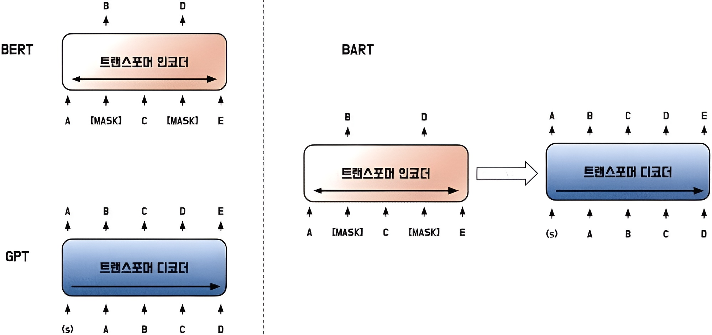

BART는 사전 학습 시 노이즈 제고 오토인코더를 사용하므로 입력 문장에 임의로 노이즈를 추가하고 원래 문장을 복원하도록 학습합니다.

노이즈가 추가된 텍스트를 인코더에 입력하고 원본 텍스트를 생성할 수 있게 학습하는 방식입니다.

이는 BERT가 인코더에 학습시 텍스트에 마스킹을 추가해 노이즈를 주는 방법과 GPT가 디코더 학습 시 다음에 등장할 단어를 예측하는 방법으로 간주할 수 있습니다.

이를 통해 BART는 문장 구조와 의미를 보존하면서 다양한 변형을 학습할 수 있스빈다.

이 구조는 입력 문장에 큰 제약 없이 노이즈 기법을 적용할 수 있으므로 더 풍부한 언어적 지식을 습득살 수 있게 합니다.

인코더를 사용함으로써 순방향 정보만 인식할 수 있는 GPT의 단점을 개선해 양방향 문맥 정보를 반역할 수 있습니다.

그리고 디코더를 사용함으로써 문장 생성 분야에서 뛰어나지 않았던 BERT의 단점을 개선했습니다.

BERT와 BART의 차이점은 BERT는 인코더만 사용하고 BART는 인코더와 디코더를 모두 사용합니다.

BART가 문장을 생성하거나 번역하는 작업에 적합하며, 문장 독해, 문서 요약, 질의응답 등에 있어 높은 성능을 보입니다.

다음 이미지는 BART 모델의 구조를 보여줍니다.

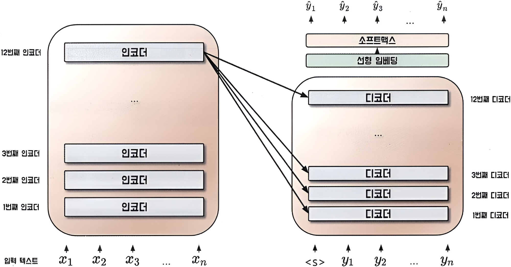

BART는 인코더와 디코더를 모두 사용하므로 트랜스포머와 유사한 구조를 가지고 있습니다.

하지만 차이점이 존재합니다.

트랜스포머에서는 인코더의 모든 계층과 디코더의 모든 계층 사이의 어텐션 연산을 수행했다면 BART는 인코더의 마지막 계층과 디코더의 각 계층 사이에만 어텐션 연산을 수행합니다.

BART의 인코더에서는 입력 문장의 각 단어를 임베딩하고 여러 층의 인코더를 거쳐 마지막 계층에서는 입력 문장 전체의 의미를 가장 잘 반영하는 벡터가 생성됩니다.

이렇게 생성된 벡터는 디코더가 출력 문장을 생성할 때 참고되며 디코더의 각 계층에서는 이 벡터와 이전 계층에서 생성된 출력 문장의 정보를 활용해 출력 문장을 생성합니다.

BART에서는 인코더의 마지막 계층과 디코더의 각 계층 사이에서만 어텐션 연산을 수행하므로 정보 전달을 최적화하고 메모리 사용량을 줄일 수 있습니다.

### 사전 학습 방법

BART의 인코더는 BERT의 마스킹된 언어 모델링(MLM) 이외에도 다양한 노이즈 기법을 사용합니다.

문장의 일부를 가리는 토큰 마스킹 기법 이외에도 토큰 삭제, 문장 교환, 문서 회전, 텍스트 채우기 기법이 사용됩니다.

다음 그림은 BART 사전 학습에 사용되는 여러 노이즈 기법을 시각화한 것입니다.

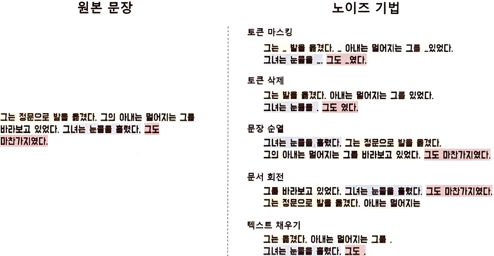

토큰 마스킹(Token Masking)은 BERT에서 사용한 MLM과 동일한 기법으로 입력 문장의 일부 토큰을 마스크 토큰으로 치환하는 방법입니다.

이 기법을 이용하면 문장 내에서 어떤 단어가 중요한 역하을 하는지 학습할 수 있습니다.

입력 문장의 문맥을 이해하고 문장 내에서 중요한 정보를 추출하는 능력이 향상됩니다.

토큰 삭제(Token Deletion)는 입력 문장의 일부 토큰을 치환하는 것이 아니라 삭제하는 방법입니다.

토큰 마스킹과 다르게 어떤 위치의 토큰이 삭제되었는지도 맞춰야합니다.

이 기법을 이용하면 입력 문장에서 불필요한 정보나 중요하지 않은 정보를 자동으로 필터링해 처리할 수 있게됩니다.

모델의 학습과 예측시간을 줄이고, 모델의 일반화 성능을 향상시킬 수 있습니다.

문장 순열(Sentence Permutation)은 마침표(.)를 기준으로 문장을 나눈 뒤, 문장의 순서를 섞는 방법입니다.

모델은 원래 문장 순서를 맞춰야 합니다.

이 기법은 문장 내에서 단어들이 어떻게 연결되어 있는지 더 잘 파악하게 되며 입력 문장이 다른 순서로 주어졌을 때에도 잘 처리할 수 있게 됩니다.

문서 회전(Document Rotation)은 임의의 토큰으로 문서가 시작하도록 합니다.

문장 순열과는 다르게 문장의 순서는 유지합니다.

모델은 문서의 원래 시작 토큰을 맞춰야합니다.

이 기법은 모델이 문서의 시작점을 인식할 수 있도록 합니다.

텍스트 채우기(Text Infilling)는 몇 개의 토큰을 하나의 구간(span)으로 묶고 일부 구간을 마스크 토큰으로 대체 합니다.

묶은 구간의 길이(개수)는 0부터 임의의 값까지 설정할 수 있습니다.

일반적으로 포아송 분포로 구간을 나누며 푸아송 분포(Poisson distribution)의 $\lambda$를 3으로 설정해 계산하빈다.

구간의 길이가 0인경우는 해당 위치에 변환된 토큰이 없음을 의미합니다.

모델은 연속된 마스크 토큰을 복구하되 실제로는 마스킹되지 않은 토큰도 구분해야 합니다.

이를 통해 모델이 누락된 단어를 예측하게 유도함으로써 더 많은 정보를 활용하여 입력 문장을 더 잘 이해할 수 있게 됩니다.

### 미세 조정 방법

BART는 인코더와 디코더를 모두 사용하는 구조를 가지고 있기 때문에 미세 조정 시 각 다운스트림 작업에 맞게 입력 문장을 구성해야 합니다.

즉 인코더와 디코더에 다른 문장 구조로 입력해야합니다.

다음 그림은 BART의 다운스크림 작업별 미세 조정 방법을 보여줍니다.

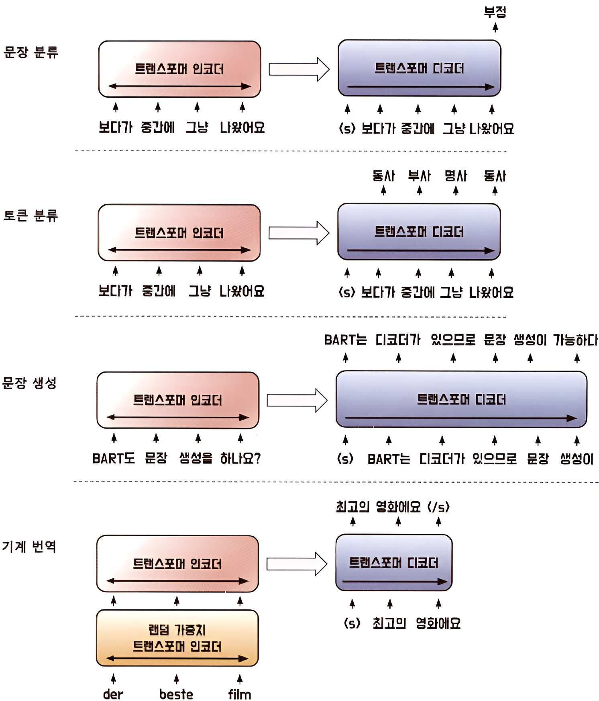

문장 분류 작업에서는 입력 문장을 인코더와 디코더에 동일하게 입력하고 디코더의 마지막 토큰 은닉 상태를 선형 분류기의 입력값으로 사용합니다.

이때 BERT의 CLS 토큰과 비슷하지만, BART는 전체 입력과 어텐션 연산이 적용된 은닉 상태를 사용합니다.

토큰 분류 작업에서도 BART는 입력 문장을 인코더와 디코더에 동일하게 입력합니다.

디코더의 각 시점별 마지감 은닉 상태를 토큰 분류기의 입력값으로 사용합니다. 전체 입력과 디코더의 각 시점별 은닉 상태와의 어텐션 연산을 수행합니다.

BART는 트랜스포머 디코더를 사용하기 때문에 BERT가 해결하지 못 했던 문장 생성 작업을 수행할 수 있습니다.

특히 입력값을 조작해 출력을 생성하는 추상적 질의응답(Abstractive Question Answering)과 문장 요약(Summarization)과 같은 작업에 적합합니다.

이러한 작업들은 BART의 사전 학습 방식과 유사하기 때문에 뛰어난 성능을 보입니다.

이러한 학습 방법으로 BART는 문장 의미를 파악하고 이를 기반으로 새로운 문장을 생성하는 능력을 갖게 됩니다.

    eg) 기게 번역 작업에서 BART는 사전 학습된 인코더에 기계 번역을 위한 인코더를 추가해 작읍을 수행할 수 있습니다.

이때 추가된 인코더는 기존의 단어 사전을 사용하지 않아도 되며 디코더는 사전학습된 가중치와 단어 사전을 사용합니다.

학습 단게에서는 두 단계로 학습이 이루어집니다.

첫 번째 단계에서는 새로 추가된 트랜스포머 인코더의 가중치와 위치 임베딩 그리고 첫 번째 인코더 층의 셀프 어텐션 입력 행렬 가중치만 학습합니다.

두 번째 단계에서는 모든 신경망의 가중치를 작은 반복으로 학습합니다.

BART는 문장 내부의 토큰 사이의 상관관계를 파악해 문장의 의미를 더욱 정확하게 이해할 수 있습니다.

입력 문장의 전체적인 의미를 고려하므로 BART가 자연어 생성 분야에서 매우 효과적인 모델임을 보여줍니다.

### 모델 실습

허깅 페이스 라이브러리의 BART 모델과 뉴스 요약 데이터세트를 활용해 문장 요약 모델을 미세 조정하겠습니다.

뉴스 요약 데이터세트는 미국의 인공지능 회사인 아르길라(Argilla)에서 공개한 데이터세트로 뉴스 본문의 요약 덱스트로 구성되어 있습니다.

허깅 페이스 데이터세트 라이브러리는 언어 이해, 기계 번역, 감성 분석 등 다양한 데이터세트를 제공하며, 학습, 검증 및 테스트용으로 구성되어 있습니다.

이 라이브러리는 모델 학습 및 평가에 필요한 데이터세트를 쉽게 가져올 수 있습니다.

다음 코드는 허깅 페이스 아르길라 뉴스 요약 데이터세트의 사용 방법입니다.

```python
import numpy as np
from datasets import load_dataset

news = load_dataset("argilla/news-summary", split = "test")
df = news.to_pandas().sample(5000, random_state = 42)[["text", "prediction"]]
df["prediction"] = df["prediction"].map(lambda x: x[0]["text"])
train, valid, test = np.split(df.sample(frac = 1, random_state = 42), [int(0.6 * len(df)), int(0.8 * len(df))])

print(f"Source News: {train.text.iloc[0][: 200]}")
print(f"Summarization: {train.prediction.iloc[0][: 50]}")
print(f"Training Data Size: {len(train)}")
print(f"Validation Data Size: {len(valid)}")
print(f"Testing Data Size: {len(test)}")
```

```python
# 결과

Source News: DANANG, Vietnam (Reuters) - Russian President Vladimir Putin said on Saturday he had a normal dialogue with U.S. leader Donald Trump at a summit in Vietnam, and described Trump as civil, well-educated
Summarization: Putin says had useful interaction with Trump at Vi
Training Data Size: 3000
Validation Data Size: 1000
Testing Data Size: 1000
```

뉴스 요약 데이터세트는 뉴스 본문과 이를 요약한 짧은 텍스트로 구성되어있습니다.

모델은 뉴스 본문을 입력으로 받아 요약된 텍스트를 출력해야 합니다.

문자 요약 작업은 문장 길이가 긴 텍스트를 다루기 때문에 리뷰 분류와 같이 상대적으로 짧은 텍스트를 다루는 작업에 비해 연산량이 많습니다.

그러므로 테스트 데이터세트를 5000개만 샘플링해 사용합니다.

샘플링한 데이터 세트를 6:2:2 비율로 학습, 검증 및 테스트 데이터로 분리해 사용하겠습니다.

분리된 데이터세트를 BART 토크나이저(BartTokenizer) 클래스로 모델 구조에 적합하게 전처리를 수행합니다.

다음 코드는 BART의 입력 텐서 생성코드 입니다.

```python
import torch
from transformers import BartTokenizer
from torch.utils.data import TensorDataset, DataLoader
from torch.utils.data import RandomSampler, SequentialSampler
from torch.nn.utils.rnn import pad_sequence

def make_dataset(data, tokenizer, device):
    tokenized = tokenizer(text = data.text.tolist(), padding = "longest", truncation = True, return_tensors = "pt", max_length = 1024)
    labels = []
    input_ids = tokenized["input_ids"].to(device)
    attention_mask = tokenized["attention_mask"].to(device)

    for target in data.prediction:
        labels.append(tokenizer.encode(target, return_tensors = "pt").squeeze())

    labels = pad_sequence(labels, batch_first = True, padding_value = -100).to(device)

    return TensorDataset(input_ids, attention_mask, labels)

def get_dataloader(dataset, sampler, batch_size):
    data_sampler = sampler(dataset)
    dataloader = DataLoader(dataset, sampler = data_sampler, batch_size = batch_size)

    return dataloader

epoch = 3
batch_size = 8
device = "cuda" if torch.cuda.is_available() else "cpu"
tokenizer = BartTokenizer.from_pretrained(pretrained_model_name_or_path = "facebook/bart-base")

train_dataset = make_dataset(train, tokenizer, device)
train_dataloader = get_dataloader(train_dataset, RandomSampler, batch_size)

valid_dataset = make_dataset(valid, tokenizer, device)
valid_dataloader = get_dataloader(valid_dataset, SequentialSampler, batch_size)

test_dataset = make_dataset(test, tokenizer, device)
test_dataloader = get_dataloader(test_dataset, SequentialSampler, batch_size)

print(train_dataset[0])
```

```python
# 결과

(tensor([   0,  495, 1889,  ...,    1,    1,    1], device='cuda:0'), tensor([1, 1, 1,  ..., 0, 0, 0], device='cuda:0'), tensor([    0, 35891,   161,    56,  5616, 10405,    19,   140,    23,  5490,
         3564,     2,  -100,  -100,  -100,  -100,  -100,  -100,  -100,  -100,
         -100,  -100,  -100,  -100,  -100,  -100,  -100,  -100,  -100,  -100],
       device='cuda:0'))
```

BART 토크나이저도 BERT 토크나이저 클래스와 동일하게 사전 학습된 토크나이저를 불러와 전처리를 수행합니다.

사전 학습된 모델은 facebook/bart-base로 BART 모델의 기본 버전을 의미합니다.

요약 작업은 입력값과 출력값이 모두 텍스트 데이터로 구성됩니다.

문장의 길이는 각각 다르기 때문에 길이를 맞춰주기 위해 패딩을 적용합니다.

패딩값은 -100을 사용합니다.

이는 교차 엔트로피와 같은 손실 함수에서 패딩된 토큰을 무시하게 하기 위해 사용됩니다.

패딩된 토큰은 모델의 출력과 비교하지 않고 실제 레이블을 가진 토큰만 손실을 계산하는데 사용합니다.

데이터로더로는 요약하려는 본문 텍스트의 정수 인코딩 값, 어텐션 마스크, 요약 문자으이 정수 인코딩 값을 반환합니다.

데이터로더까지 적용했다면 모델과 최적화 함수를 선언합니다.

다음 코드는 BART 모델 설정 방법에 대한 코드입니다.

```python
from torch import optim
from transformers import BartForConditionalGeneration

model = BartForConditionalGeneration.from_pretrained(pretrained_model_name_or_path = "facebook/bart-base").to(device)
optimizer = optim.AdamW(model.parameters(), lr = 5e-5, eps = 1e-8)
```

BART 조건부 생성(BartForConditionalGeneration) 클래스는 BART 모델의 변형 중 하나로 조건부 생성 작업에 특화된 모델입니다.

이 모델은 입력 시퀀스로부터 출력 시퀀스를 생성하는데 사용됩니다.

    eg) 문장 요약, 기계 번역, 질의응답 등과 같은 작업에 사용될 수 있습니다.

빠른 학습을 위해 12개의 인코더/디코더 계층이 아닌 6개의 계층을 사용하는 facebook/bart-base 모델을 사용합니다.

12개의 계층을 사용하는 모델은 facebook/bart-large로 불러올 수 있습니다.

최적화 함수는 BERT 모델 학습 시 사용했던 AdamW를 사용하고 학습률은 0.00005를 사용합니다.

학습에 필요한 설정을 완료했다면 모델 구조를 확인해볼 수 있습니다.

다음 코드는 BART의 모델 구조 출력 과정/결과 코드입니다.

```python
for main_name, main_module in model.named_children():
    print(main_name)
    for sub_name, sub_module in main_module.named_children():
        print("└", sub_name)
        for ssub_name, ssub_module in sub_module.named_children():
            print("│  └", ssub_name)
            for sssub_name, sssub_module in ssub_module.named_children():
                print("│  │  └", sssub_name)
```

```python
# 결과

model
└ shared
└ encoder
│  └ embed_tokens
│  └ embed_positions
│  └ layers
│  │  └ 0
│  │  └ 1
│  │  └ 2
│  │  └ 3
│  │  └ 4
│  │  └ 5
│  └ layernorm_embedding
└ decoder
│  └ embed_tokens
│  └ embed_positions
│  └ layers
│  │  └ 0
│  │  └ 1
│  │  └ 2
│  │  └ 3
│  │  └ 4
│  │  └ 5
│  └ layernorm_embedding
lm_head
```

BART는 인코더와 디코더가 동일한 임베딩 계층을 사용합니다.

shared 계층은 인코더와 디코더가 공유하는 임베딩 계층을 의미하며 이러한 공유로 인코더와 디코더 간의 연결을 강화시킵니다.

BART는 6개의 인코더와 디코더 계층으로 구성되어 있습니다.

마지막 연산에서는 layernorm_embedding 계층을 통과합니다.

layernorm_embedding 계층은 인코더와 디코더에서 각 토큰의 임베딩에 적용되는 계층 정규화로 임베딩 벡터의 마지막 차원에 대해 정규화를 수행해 학습을 안정화 시킵니다.

인코더는 마지막 계층의 출력값은 디코더의 모든 계층과 어텐션 연산을 수행합니다.

마지막 디코더 계층의 출력값은 출력 크기가 단어 사전의 크기인 완전 연결 계층을 통과해 언어 모델을 형성합니다.

이제 BART 모델을 학습하고 평가해 보겠습니다.

모델 평가 방법은 문장 생성 기법에서 자주 사용되는 루지(Recall-Oriented Understudy for Gisting Evaluation, ROUGE) 점수를 사용합니다.

루지 점수는 생성된 요약문과 정답 요약문이 얼마나 유사한지를 평가하기 위해 토큰의 N-gram 정밀도와 재현율을 이용해 평가하는 지표입니다.

    eg) 유니그램을 사용하는 점수는 ROUGE-1, 바이그램을 사용하는 점수는 ROUGE-2, N-gram을 사용하면 ROUGE-N이라고 합니다.

다음 그림은 루지 점수 계산 방법을 보여줍니다.

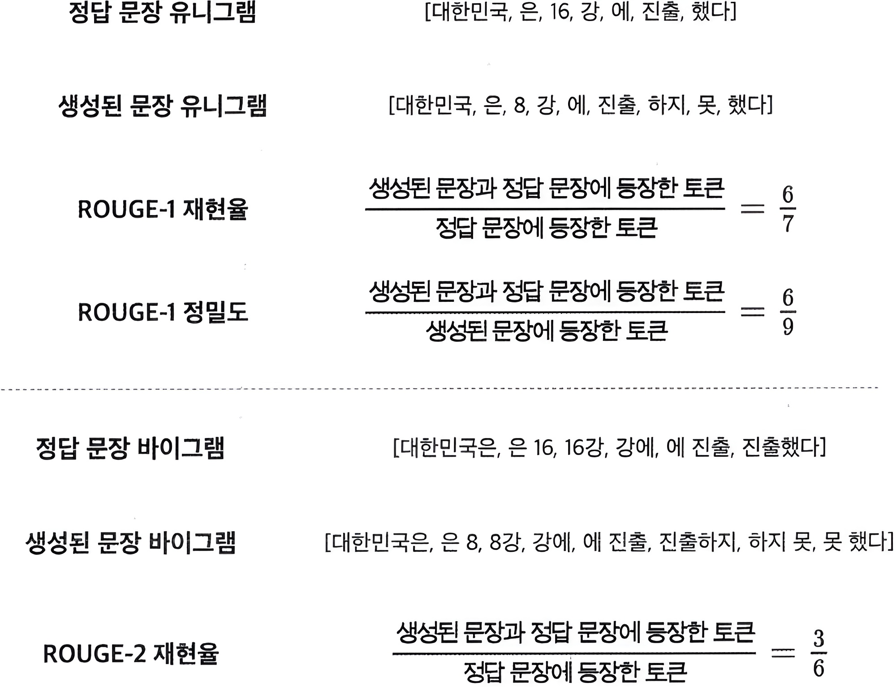

루지 점수는 ROUGE-N 이외에도 ROUGE-L, ROUGE-LSUM, ROUGE-W 등이 있습니다.

ROUGE-L은 생성된 요약문과 정답 요약문 사이에 최장 고통부분 수열(Longest Common Supsequence, LCS) 기반의 통계방식입니다.

LCS는 두 문장 사이에 공통으로 존재하는 가장 긴 부분 문자열을 찾는 문제로, 문장의 구조적 유사성을 고려하고 가장 길게 연속되느 N-gram을 식별합니다.

이 방법은 요약 문장이 입력 문장의 의미를 잘 던잘하는지를 평가하는데 유용합니다.

ROUGE-LSUM은 ROUGE-L의 변형으로 텍스트 내의 개행 문자를 문장 경계로 인식하고, 각 문장 쌍에 대해 LCS를 계산한 후 union-LCS라는 값을 계산합니다.

ROUGE-LSUM은 텍스트 생성 작업에서 요약의 정확성과 완정성을 모두 반영할 수 있는 지표로 사용됩니다.

ROUGE-W는 가중치가 적용된 LCS(Weigted LCS-based) 방법으로 연속된 LCS에 가중치를 부여해 계산합니다.

이 방법은 공통부분 문자열의 길이뿐만 아니라 해당 부분 문자열 내의 단어에 가중치를 부여해 평가하는 방식입니다.

이 방법은 단어 간 유사도를 고려해 요약 문장이 입력 문장의 의미를 더욱 잘 전달하는지 평가하는데 유용합니다.

허깅 페이스의 평가(evaluate) 라이브러리로 쉽게 루지 점수를 계산할 수 있습니다.

평가 라이브러리로 루지 점수를 계산하려면 루지 점수(rouge_score) 라이브러리와 Abseil 파있너 공통 라이브러리(absl-py)도 설치해야 합니다.

모델 학습에 대한 코드입니다.

```python
import numpy as np
import evaluate

def calc_rouge(preds, labels):
    preds = preds.argmax(axis = -1)
    labels = np.where(labels != -100, labels, tokenizer.pad_token_id)

    decoded_preds = tokenizer.batch_decode(preds, skip_specaial_tokens = True)
    decoded_labels = tokenizer.batch_decode(labels, skip_special_tokens = True)

    rouge2 = rouge_score.compute(predictions = decoded_preds, references = decoded_labels)

    return rouge2["rouge2"]

def train(model, optimizer, dataloader):
    model.train()
    train_loss = 0.0

    for input_ids, attention_mask, labels in dataloader:
        outputs = model(input_ids = input_ids, attention_mask = attention_mask, labels = labels)

        loss = outputs.loss
        train_loss += loss.item()
        
        optimizer.zero_grad()
        loss.backward()
        optimizer.step()

    train_loss = train_loss / len(dataloader)

    return train_loss

def evaluation(model, dataloader):
    with torch.no_grad():
        model.eval()
        val_loss, val_rouge = 0.0, 0.0

        for input_ids, attention_mask, labels in dataloader:
            outputs = model(input_ids = input_ids, attention_mask = attention_mask, labels = labels)
            logits = outputs.logits
            loss = outputs.loss

            logits = logits.detach().cpu().numpy()
            label_ids = labels.to("cpu").numpy()
            rouge = calc_rouge(logits, label_ids)
            
            val_loss += loss
            val_rouge += rouge

    val_loss = val_loss / len(dataloader)
    val_rouge = val_rouge / len(dataloader)

    return val_loss, val_rouge

rouge_score = evaluate.load("rouge", tokenizer=tokenizer)
best_loss = 10000

for epoch in range(epochs):
    train_loss = train(model, optimizer, train_dataloader)
    val_loss, val_accuracy = evaluation(model, valid_dataloader)
    print(f"Epoch {epoch + 1}: Train Loss: {train_loss:.4f} Val Loss: {val_loss:.4f} Val Rouge {val_accuracy:.4f}")

    if val_loss < best_loss:
        best_loss = val_loss
        torch.save(model.state_dict(), "models/BartForConditionalGeneration.pt")
        print("Saved the model weights")
```

```python
# 결과

Epoch 1: Train Loss: 2.1713 Val Loss: 1.8488 Val Rouge 0.1554
Saved the model weights
Epoch 2: Train Loss: 1.6219 Val Loss: 1.8568 Val Rouge 0.1617
Epoch 3: Train Loss: 1.2467 Val Loss: 1.9976 Val Rouge 0.1528
Epoch 4: Train Loss: 0.9822 Val Loss: 2.1120 Val Rouge 0.1514
Epoch 5: Train Loss: 0.7344 Val Loss: 2.2429 Val Rouge 0.1501
```

cala_rouge 함수는 텍스트 요약 작업에서 모델이 예측한 요약문과 정답 요약문 사이의 루지 점수를 계산하는 함수입니다.

preds는 모델이 예측한 요약의 토큰 인덱스를 담은 2차원 배열이므로 argmax 메서드를 통해 각 토큰에 대해 가장 높은 확률을 가진 인덱스를 선택하여 1차원 배열로 변경합니다.

labels는 정답 요약문으로, 레이블이 -100인 값들을 패딩 토큰의 인덱스로 변경합니다.

토크나이저의 batch_decode 메서드로 특수 토큰을 제외하고 토큰 인덱스를 실제 텍스트로 변환합니다.

이 값을 이용해 루지(rouge_score) 인스턴스의 컴퓨팅(compute) 메서드로 루지 점수를 계산합니다.

rouge2 변수는 다음과 같은 형태로 반환합니다.

```python
{
	'rouge1': 0.44116997177658945,
	'rouge2': 0.2,
	'rougeL': 0.4275670306001189,
	'rougeLsum': 0.4243807560903149
}
```

학습이 완료되고 가장 우수한 모델이 선정됐다면 해당 모델로 문장 요약을 평가합니다.

다음 코드는 모델 평가 코드입니다.

```python
model = BartForConditionalGeneration.from_pretrained(pretrained_model_name_or_path = "facebook/bart-base").to(device)
model.load_state_dict(torch.load("models/BartForConditionalGeneration.pt"))

test_loss, test_rouge_score = evaluation(model, test_dataloader)

print(f"Test Loss : {test_loss:.4f}")
print(f"Test ROUGE-2 Score : {test_rouge_score:.4f}")
```

```python
# 결과

Test Loss : 1.8027
Test ROUGE-2 Score : 0.1653
```

ROUGE-2는 0에서 1 사이의 값을 가지며, 1에 가까울수록 높은 성능을 의미합니다.

모델 학습 시 매우 작은 크기의 데이터로 샘플링해 학습을 수행했음을 고려한다면 중간 수준의 성능을 보인다고 할 수 있습니다.

문장요약 작업에서는 수치화된 평가 지표로만으로는 어느 정도로 잘 요약했는지 판단하기가 어렵습니다.

‘GPT-2’에서 사용한 파이프라인 함수를 활용해 문장을 요약한 후 예측된 요약문과 정답 요약문을 비교해 보겠습니다.

이를 통해 요약문이 입력 문장과 얼마나 유사하게 요약됐는지 직접 확인할 수 있습니다.

다음 코드는 문장 요약문 비교 코드입니다.

```python
from transformers import pipeline

summarizer = pipeline(task = "summarization", model = model, tokenizer = tokenizer, max_length = 54, device = "cpu")

for index in range(5):
    news_text = test.text.iloc[index]
    summarization = test.prediction.iloc[index]
    predicted_summarization = summarizer(news_text)[0]["summary_text"]

    print(f"정답 요약문: {summarization}")
    print(f"모델 요약문: {predicted_summarization} \n")
```

```python
# 결과

정답 요약문: Clinton leads Trump by 4 points in Washington Post: ABC News poll
모델 요약문: Clinton leads Trump by 4 points in Washington Post-ABC News poll 

정답 요약문: Democrats question independence of Trump Supreme Court nominee
모델 요약문: U.S. senators question Gorsuch's independence as Supreme Court nominee 

정답 요약문: In push for Yemen aid, U.S. warned Saudis of threats in Congress
모델 요약문: U.S. warns Saudi Arabia over humanitarian situation in Yemen 

정답 요약문: Romanian ruling party leader investigated over 'criminal group'
모델 요약문: Romanian anti-graft prosecutors probe leader on suspicion of 'criminal group' 

정답 요약문: Billionaire environmental activist Tom Steyer endorses Clinton
모델 요약문: Environmental activist Steyer backs Clinton for U.S. president 
```

BART는 BERT의 한계를 극복하기 위해 인코더와 디코더 구조를 아용하여 문장 생성 작업에서 높은 성능을 발휘합니다.

BART 는 문장 요약과 같은 다양한 작업에서 뛰어난 성능을 보입니다.

그리고 이를 가능케 하는 여러가지 노이즈 기법을 사용합니다.

    eg) BART는 마스킹된 언어 모델을 비롯하여 문장 내 단어의 순서를 섞는 등의 방법을 사용하여 사전 학습합니다.

이러한 다양한 방법을 통해 BART는 다양한 자연어 처리 작업에서 탁월한 성능을 보입니다.

## ELECTRA

ELECTRA(Efficiently Learning an Encoder that Classifies Token Replacements Accurately)는 2020년 구글에서 발표한 트랜스포머 기반 모델이빈다.

BERT를 비롯해 많은 자연어 처리 모델은 마스킹된 언어 모델링(MLM) 방식을 사용하거나 일부 터큰을 [MASK]로 대체하여 입력을 손상시키고 원래 토큰을 복원하는 모델을 학습합니다.

하지만 ELECTRA는 입력을 마스킹하는 대신 생성자(Generator)와 판별자(Discriminator)를 사용해 사전 학습을 수행합니다.

ELECTRA의 사전 학습 접근 변환기 모델인 생성자와 판별자를 학습하므로 생성적 적대 신경망(GAN)과 유사한 방법으로 학습이 수행됩니다.

생성 모델은 실제 데이터와 비슷하게 토큰을 생성해 다른 토큰으로 대체하고 판별 모델이 생성 모델이 만든 데이터와 실제 데이터를 입력받아 어떤 데이터가 실제 데이터인지 아니면 생성된 데이터인지 구분합니다.

ELECTRA는 GAN을 사용해 학습하므로 이전 언어 모데로가 비교하여 더 효율적인 학습이 가능합니다.

덕분에 대규모 데이터세트에서 모델을 더 빠르게 학습할 수 있습니다.

생성 모델을 통해 토큰을 생성하므로 다양한 자연어 생성 작업에서 보다 자연스러운 문장을 생성하게 됩니다.

또한 BERT와 같은 모델과 비교한다면 모델의 매개변수 수가 더 적습니다.

그로 인해 모델의 크기가 줄어들어 모델을 더 빠르게 실행할 수 있고 더 적은 메모리를 사용합니다.

### 사전 학습 방법

ELECTRA의 생성자 모델과 판별자 모델은 모두 트랜스포머 인코더 구조를 따릅니다.

생성자 모델은 입력 문장의 일부 토큰을 마스크 처리하고 마스크 처리된 토큰이 원래 어떤 토큰이었는지 예측하며 학습합니다.

반면에 판별자 모델은 각 입력 토큰이 원본 문장의 토큰인지 생성자 모델로 인해 바뀐 토큰인지 맞히며 학습합니다.

이러한 학습 방법을 RTD(Replaced Token Detection)라고 합니다.

다음 그림은 ELECTRA의 모델 학습 방법을 보여줍니다.

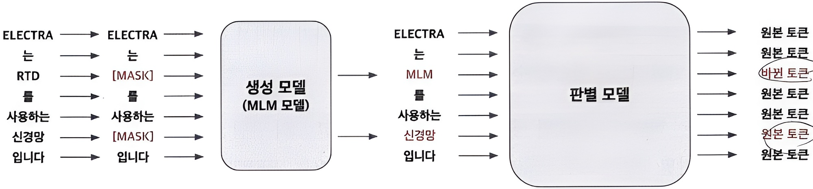

생성자 모델은 BERT의 마스킹된 언어 모델과 동일합니다.

입력 문장의 15%를 마스크 처리해 마스크 처리된 토큰이 원래 어떤 토큰이었는지를 맞히며 학습합니다.

판별자 모델은 새성자 모델이 복원한 결괏값을 입력 받아 각 토큰이 원본 토큰인지 바뀐 토큰인지를 반펼합니다.

이 과정은 생성자와 판별자로 구성된 생성적 적대 신경망(GAN)과 유사합니다.

하지만 몇 가지 차이점이 존재합니다.

생성자 모델이 원래 토큰을 정확히 예측한 경우 이 토큰은 생성된 토큰이 아닌 원본 토큰으로 인식됩니다.

위 그림을 보면 새성 모델이 두 번째 마스크 토큰을  ‘신경망’으로 원본과 동일하게 생성했습니다.

이 경우 GAN에서는 원본이 아닌 생성된 것으로 간주하지만 ELECTRA는 원본 토큰으로 간주 합니다.

GAN은 생성 모델과 판별 모델을 적대적으로 학습합니다.

생성 모델은 판별 모델이 실제 데이터와 구분하기 어렵게 학습하고 판별 모델은 실제 데이터와 생성된 데이터를 더욱 잘 구분하게 학습합니다.

하지만 ELECTRA의 생성 모델은 마스킹된 언어 모델을 통해 학습됩니다.

판별 모델은 각 토큰이 바뀐 토큰인지 아니면 원본 토큰인지를 구분하도록 학습합니다.

마지막으로 GAN은 완전한 노이즈 벡터를 입력받아 생성합니다.

하지만 ELECTRA의 생성 모델은 일부 토큰이 마스크 처리된 텍스트를 입력으로 받습니다.

생성 모델과 판별 모델은 모두 트랜스포머 인코더 구조를 따릅니다.

따라서 두 모델이 같은 개수의 계층으로 구성돼 있다면 가중치를 공유할 수 있어 더 빠르게 학습할 수 있습니다.

그러나 두 모델이 가중치를 완전히 공유하면 생성 모델의 성능이 높아져서 판별 모델이 학습할 수 없게 됩니다.

그러므로 ELECTRA는 생성 모델을 판별 모델의 크기를 1/2에서 1/4크기로 바꿔 설정하고 모든 가중치를 공유하는 대신 임베딩 계층의 가중치만 공유합니다.

이를 통해 판별 모델이 학습하기 적합한 생성 모델을 유지하면서도 가중치를 공유하여 효율적으로 학습할 수 있습니다.

ELECTRA는 사전 학습이 완료되면 생성 모델을 사용하지 않고 오직 판별 모델만 사용해 다운스트림 작업을 수행합니다.

판별 모델은 트랜스포머 인코더로 구성되어 있습니다.

BERT와 동일한 구조를 갖고있씁니다.

다운스트림 작업은 BERT와 동일한 방식으로 미세 조정합니다.

### 모델 실습

허깅 페이스 라이브러리의 ELECTRA 모델과 네이버 영화 리뷰 감정 분석 데이터세트로 분류 모델을 학습합니다.

이 데이터세트는 BERT 모델을 학습할 때 사용했단 데이터세트이므로 두 모델의 성능을 비교해보겠습니다.

다음 코드는 데이터를 불러오는 코드입니다.

```python
import numpy as np
import pandas as pd
from Korpora import Korpora

corpus = Korpora.load("nsmc")
df = pd.DataFrame(corpus.test).sample(20000, random_state = 42)
train, valid, test = np.split(df.sample(frac = 1, random_state = 42), [int(0.6 * len(df)), int(0.8 * len(df))])

print(train.head(5).to_markdown())
print(f"Training Data Size : {len(train)}")
print(f"Validation Data Size : {len(valid)}")
print(f"Testing Data Size : {len(test)}")
```

```python
# 결과

    Korpora 는 다른 분들이 연구 목적으로 공유해주신 말뭉치들을
    손쉽게 다운로드, 사용할 수 있는 기능만을 제공합니다.

    말뭉치들을 공유해 주신 분들에게 감사드리며, 각 말뭉치 별 설명과 라이센스를 공유 드립니다.
    해당 말뭉치에 대해 자세히 알고 싶으신 분은 아래의 description 을 참고,
    해당 말뭉치를 연구/상용의 목적으로 이용하실 때에는 아래의 라이센스를 참고해 주시기 바랍니다.

    # Description
    Author : e9t@github
    Repository : https://github.com/e9t/nsmc
    References : www.lucypark.kr/docs/2015-pyconkr/#39

    Naver sentiment movie corpus v1.0
    This is a movie review dataset in the Korean language.
    Reviews were scraped from Naver Movies.

    The dataset construction is based on the method noted in
    [Large movie review dataset][^1] from Maas et al., 2011.

    [^1]: http://ai.stanford.edu/~amaas/data/sentiment/

    # License
    CC0 1.0 Universal (CC0 1.0) Public Domain Dedication
    Details in https://creativecommons.org/publicdomain/zero/1.0/
...
| 18010 | 징키스칸이란 소재를 가지고 이것밖에 못만드냐             |       0 |
Training Data Size : 12000
Validation Data Size : 4000
Testing Data Size : 4000
Output is truncated. View as a scrollable element or open in a text editor. Adjust cell output settings...
```

이렇게 데이터세트를 불러오고 ELECTRA 토크나이저(ElectraTokenizer) 클래스로 토크나이저를 불러옵니다.

토크나이저를 불러오고 데이터를 전처리하는 방식에 대한걸 알아 보겠습니다.

다음 코드는 네이버 영화 리뷰 데이터세트 전처리 코드입니다.

```python
import torch
from transformers import ElectraTokenizer
from torch.utils.data import TensorDataset, DataLoader
from torch.utils.data import RandomSampler, SequentialSampler

def make_dataset(data, tokenizer, device):
    tokenized = tokenizer(text = data.text.tolist(), padding = "longest", truncation = True, return_tensors = "pt")
    input_ids = tokenized["input_ids"].to(device)
    attention_mask = tokenized["attention_mask"].to(device)
    labels = torch.tensor(data.label.values, dtype = torch.long).to(device)

    return TensorDataset(input_ids, attention_mask, labels)

def get_datalodader(dataset, sampler, batch_size):
    data_sampler = sampler(dataset)
    dataloader = DataLoader(dataset, sampler=data_sampler, batch_size=batch_size)

    return dataloader

epochs = 5
batch_size = 32
device = "cuda" if torch.cuda.is_available() else "cpu"
tokenizer = ElectraTokenizer.from_pretrained(pretrained_model_name_or_path = "monologg/koelectra-base-v3-discriminator", do_lower_case = False,)

train_dataset = make_dataset(train, tokenizer, device)
train_dataloader = get_datalodader(train_dataset, RandomSampler, batch_size)

valid_dataset = make_dataset(valid, tokenizer, device)
valid_dataloader = get_datalodader(valid_dataset, SequentialSampler, batch_size)

test_dataset = make_dataset(test, tokenizer, device)
test_dataloader = get_datalodader(test_dataset, SequentialSampler, batch_size)

print(train_dataset[0])
```

```python
# 결과

(tensor([    2,  6511, 14347,  4087,  4665,  4112,  2924,  4806,    16,  3809,
         4309,  4275,    16,  3201,  4376,  2891,  4139,  4212,  4007,  6557,
         4200,     5,     5,     3,     0,     0,     0,     0,     0,     0,
            0,     0,     0,     0,     0,     0,     0,     0,     0,     0,
            0,     0,     0,     0,     0,     0,     0,     0,     0,     0,
            0,     0,     0,     0,     0,     0,     0,     0,     0,     0,
            0,     0,     0,     0,     0,     0,     0,     0,     0,     0,
            0,     0,     0,     0,     0,     0,     0,     0,     0,     0,
            0,     0,     0,     0,     0,     0,     0,     0,     0,     0,
            0,     0,     0,     0,     0,     0,     0,     0,     0,     0,
            0,     0,     0,     0,     0,     0,     0,     0,     0,     0,
            0,     0,     0,     0,     0,     0,     0,     0,     0,     0,
            0], device='cuda:0'), tensor([1, 1, 1, 1, 1, 1, 1, 1, 1, 1, 1, 1, 1, 1, 1, 1, 1, 1, 1, 1, 1, 1, 1, 1,
        0, 0, 0, 0, 0, 0, 0, 0, 0, 0, 0, 0, 0, 0, 0, 0, 0, 0, 0, 0, 0, 0, 0, 0,
        0, 0, 0, 0, 0, 0, 0, 0, 0, 0, 0, 0, 0, 0, 0, 0, 0, 0, 0, 0, 0, 0, 0, 0,
        0, 0, 0, 0, 0, 0, 0, 0, 0, 0, 0, 0, 0, 0, 0, 0, 0, 0, 0, 0, 0, 0, 0, 0,
        0, 0, 0, 0, 0, 0, 0, 0, 0, 0, 0, 0, 0, 0, 0, 0, 0, 0, 0, 0, 0, 0, 0, 0,
        0], device='cuda:0'), tensor(1, device='cuda:0'))
```

ELECTRA는 허깅 페이스에서 다양한 모델이 제공됩니다.

영어 텍스트 분류를 위해 만들어진 ELECTRA 모델과 한국어 텍스트 분류를 위해 만들어진 KoELECTRA가 제공됩니다.

영어 텍스트 분류는 google/electra-small(14M 가중치), google/electra-base(110M 가중치), google/electra-large(330M 가중치)로 적용할 수 있으며, 한국어 텍스트 분류는 monologg/koelectra-small-vs(14M 가중치), monologg/koelectra-base-V3(110M 가중치)로 적용할 수 있습니다.

이번 코드에서는 위에 사용했던 BERT에서 사용한 모델과 동일한 가중치 개수를 가진 koelectra-base 모델을 사용하겠습니다.

ELECTRA는 판별 모델만을 이용해 다운스트림 작업을 수행합니다.

그러므로 koelectra-base 모델의 판별 모델을 의미하는 monologg/koelectra-base-discriminator 모델을 불러옵니다.

생성 모델을 불러와야 하는 경우 monologg/koelectra-base-generator로 불러올 수 있습니다.

데이터로더가 정의되면 모델과 최적화 함수를 선언합니다.

다음 코드는 KoELECTRA 모델과 최적화 함수 설정 코드입니다.

```python
from torch import optim
from transformers import ElectraForSequenceClassification

model = ElectraForSequenceClassification.from_pretrained(pretrained_model_name_or_path = "monologg/koelectra-base-v3-discriminator", num_labels = 2).to(device)
optimizer = optim.AdamW(model.parameters(), lr = 1e-5, eps = 1e-8)
```

문장 분류를 위한 KoELECTRA 모델은 ELECTRA 문장 분류 모델(ElectraForSequenceClassification) 클래스로 불러올 수 있습니다.

BERT 모델과 비교하기 위해 동일한 최적화 함수와 매개변수를 사용했습니다.

학습에 필요한 설정을 완료했다면 모델 구조를 확인해 보겠습니다.

다음 코드는 모델 구조 출력 코드입니다.

```python
for main_name, main_module in model.named_children():
    print(main_name)

    for sub_name, sub_module in main_module.named_children():
        print("└", sub_name)

        for ssub_name, ssub_module in sub_module.named_children():
            print("│  └", ssub_name)
            
            for sssub_name, sssub_module in ssub_module.named_children():
                print("│  │  └", sssub_name)
```

```python
# 결과

Some weights of ElectraForSequenceClassification were not initialized from the model checkpoint at monologg/koelectra-base-v3-discriminator and are newly initialized: ['classifier.dense.bias', 'classifier.dense.weight', 'classifier.out_proj.bias', 'classifier.out_proj.weight']
You should probably TRAIN this model on a down-stream task to be able to use it for predictions and inference.
electra
└ embeddings
│  └ word_embeddings
│  └ position_embeddings
│  └ token_type_embeddings
│  └ LayerNorm
│  └ dropout
└ encoder
│  └ layer
│  │  └ 0
│  │  └ 1
│  │  └ 2
│  │  └ 3
│  │  └ 4
│  │  └ 5
│  │  └ 6
│  │  └ 7
│  │  └ 8
│  │  └ 9
│  │  └ 10
│  │  └ 11
classifier
└ dense
└ activation
└ dropout
└ out_proj
```

KoELECTRA의 입력 임베딩은 BERT와 비슷하게 워드 임베딩, 위치 임베딩, 문장 구분 임베딩으로 구성됩니다.

이 임베딩들을 결합한 후 계층 정규화와 드롭아웃을 통과하는 것 역시 동일합니다.

BERT와 마찬가지로  KoELECTRA는 12개의 인코더 계층을 통화해 입력 텍스트의 상태 값을 반환합니다.

분류기 계층은 문장 분류를 위한 계층으로 [CLS] 토큰의 벡터를 이용해 입력 텍스트에 대한 분류를 수행합니다.

다음 코드는 모델 학습코드입니다.

```python
import numpy as np
from torch import nn

def calc_accuracy(preds, labels):
    pred_flat = np.argmax(preds, axis = 1).flatten()
    labels_flat = labels.flatten()

    return np.sum(pred_flat == labels_flat) / len(labels_flat)

def train(model, optimizer, dataloader):
    model.train()
    train_loss = 0.0

    for input_ids, attention_mask, labels in dataloader:
        outputs = model(input_ids = input_ids, attention_mask = attention_mask, labels = labels)

        loss = outputs.loss
        train_loss += loss.item()
        
        optimizer.zero_grad()
        loss.backward()
        optimizer.step()

    train_loss = train_loss / len(dataloader)

    return train_loss

def evaluation(model, dataloader):
    with torch.no_grad():
        model.eval()
        criterion = nn.CrossEntropyLoss()
        val_loss, val_accuracy = 0.0, 0.0
        
        for input_ids, attention_mask, labels in dataloader:
            outputs = model(input_ids = input_ids, attention_mask = attention_mask, labels = labels)
            logits = outputs.logits

            loss = criterion(logits, labels)
            logits = logits.detach().cpu().numpy()
            label_ids = labels.to("cpu").numpy()
            accuracy = calc_accuracy(logits, label_ids)
            
            val_loss += loss
            val_accuracy += accuracy
    
    val_loss = val_loss / len(dataloader)
    val_accuracy = val_accuracy / len(dataloader)
    
    return val_loss, val_accuracy

best_loss = 10000
for epoch in range(epochs):
    train_loss = train(model, optimizer, train_dataloader)
    val_loss, val_accuracy = evaluation(model, valid_dataloader)

    print(f"Epoch {epoch + 1}: Train Loss: {train_loss: .4f} Val Loss: {val_loss: .4f} Val Accuracy {val_accuracy: .4f}")

    if val_loss < best_loss:
        best_loss = val_loss
        torch.save(model.state_dict(), "models/ElectraForSequenceClassification.pt")

        print("Saved the model weights")
```

```python
# 결과

Epoch 1: Train Loss:  0.4435 Val Loss:  0.3263 Val Accuracy  0.8675
Saved the model weights
Epoch 2: Train Loss:  0.2883 Val Loss:  0.3065 Val Accuracy  0.8765
Saved the model weights
Epoch 3: Train Loss:  0.2164 Val Loss:  0.3206 Val Accuracy  0.8798
Epoch 4: Train Loss:  0.1655 Val Loss:  0.3483 Val Accuracy  0.8778
Epoch 5: Train Loss:  0.1181 Val Loss:  0.3809 Val Accuracy  0.8800
```

모델 평가 결과 코드입니다.

```python
model = ElectraForSequenceClassification.from_pretrained(pretrained_model_name_or_path = "monologg/koelectra-base-v3-discriminator", num_labels = 2).to(device)
model.load_state_dict(torch.load("models/ElectraForSequenceClassification.pt"))

test_loss, test_accuracy = evaluation(model, test_dataloader)

print(f"Test Loss : {test_loss: .4f}")
print(f"Test Accuracy : {test_accuracy: .4f}")
```

```python
# 결과

Test Loss :  0.3239
Test Accuracy :  0.8740
```

모델 평가 결과 정확도는 87.40%로 BERT의 정확도인 81.35%에 비해 약 6.05% 높은 것을 확인할 수 있습니다.

자연어 처리 분야에서 모델을 평가할 때 가장 보편적인 방법은 GLUE(General Language Understanding Evaluation) 벤치마크(Benchmark) 데잍터 세트를 사용하는 것입니다.

GLUE는 문장 수준 또는 문서 수준의 이해력을 평가하는 데이터세트로, 문장 분류, 문장 유사도 계산, 자연어 추론, 질의 응답 등 11가지 과제를 통해 모델의 성능을 평가합니다.

ELECTRA는 GLUE평가에서 높은 점수를 기록했습니다.

electra-small과 bert-small은 동일한 구조와 가중치 개수를 가집니다.

electra-small과 bert-small보다 5%높은 점수를 기록했스빈다.

비슷한 방식으로 electra-base와 bert-base는 약 3%차이 electra-large와 bert-large는 약 2%차이로 ELECTRA 모델이 더 좋은 점수를 기록했습니다.

12시간 학습한 electra-small 모델은 bert-small 모델이 4일 학습 결과보다 더 좋은 GLUE 점수를 기록했습니다.

이는 ELECTRA가 더 효율적으로 학습되어 더 높은 성능을 보인다는 것을 의미합니다.

## T5

T5(Text-to-Text Transfer Transformer)는 2019년 구글에서 발표한 자연어 처리 분야의 딥러닝 모델로 트랜스포머 구조를 기반으로 합니다.

T5는 인코더-디코더 모델 구조를 바탕으로 GLUE, SuperGLUE, CNN/DM(Cable News Network/Daily Mail) 등의 데이터세트에서 SOTA(State-of-the-art)를 달성했으며 다양한 자연어 처리 작업에서 높은 성능을 보이는 모델입니다.

기존의 자연어 처리 모델은 대부분 입력 문장을 벡터나 행렬로 변환한 뒤 이를 이용해 출력 문장을 생성하는 방식이거나 출력값이 클래스 또는 입력값의 일부를 반환하는 형식으로 동작했습니다.

이와 달리 T5는 입력과 출력을 모두 토큰 시퀀스로 처리하는 텍스트-텍스트(Text-to-Text) 구조입니다.

따라서 입력과 출력의 형태를 자유롭게 다룰 수 있으며 모델 구조상 유연서오가 확장성이 뛰어나기 때문에 새로운 자연어 처리 작업에서도 쉽게 적용할 수 있습니다.

이러한 특징 덕분에 T5는 자연어 처리 분야에서 다양한 작업에 사용할 수 있습니다.

대표적인 학습 작업으로는 문장 번역, 요약, 질의응답, 텍스트 분류 등이 있습니다.

다음 그림은 T5 모델 학습에 사용한 작업들을 보여줍니다.

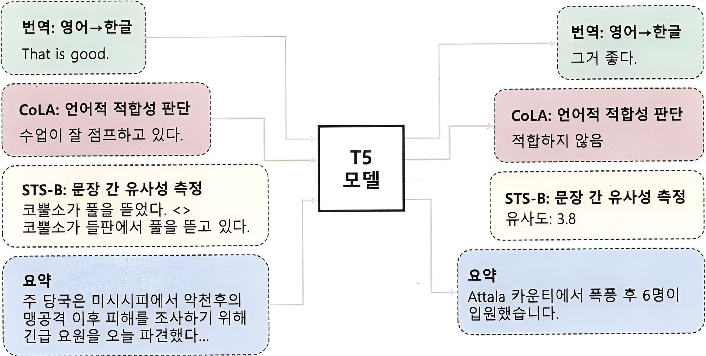

T5는 입력과 출력이 모드 토큰(텍스트) 시퀀스이기 때문에 입력과 출력 간의 관계를 더욱 세밀하게 다룰 수 있습니다.

T5는 사전 학습 후 미세 조정 단계에서 해당 작업의 데이터를 이용해 모델을 조정해 최적의 성능을 얻을 수 있습니다.

CoLA 데이터세트를 사용하면 문법적으로 허용 가능한 문장과 그렇지 않은 문장을 구분할 수 있게 되며 STS-B(The Semantic Textual Similarity Benchmark) 데이터세트르 사용하면 문장 간 의미적 유사성을 측정할 수 있게 됩니다.

T5는 입력과 출력을 모두 텍스트 시퀀스로 처리하는 텍스트-텍스트 모델이므로 학습을 위한 데이터세트는 원본 문장과 대상 문장을 사용합니다.

T5는 C4(Colossal Clean Crawled Corpus) 데이터세트를 활용해 다양한 자연어 처리 작업을 수행할 수 있게 사전 학습됐습니다.

사전 학습 방식은 비지도 학습 방식으로 입력 문장의 일부 구간을 마스킹해 입력 시퀀스를 처리하며 출력 시퀀스는 실제 마스킹된 토큰과 마스크 토큰의 연결로 구성됩니다.

이떄 문장마다 유일한 마스크 토큰을 의미하는 센티널 토큰(Sentinel Token)이 사용됩니다.

센티널 토큰은 ‘<extra_id_0>’, ‘<extra_id_1>’과 같이 0부터 99까지 100개의 기본값을 사용합니다.

    eg) ‘인코더-디코더 모델 구조’라는 문장에서 ‘인코더’와 ‘디코더’를 마스킹해 처리할 경우 입력 토큰의 센티널 토큰은 [<extra_id_0>, -, <extra_id_1>, 모델 구조]로 생성되며, 출력 토큰은 [인코더, <extra_id_0>, 디코더, <extra_id_1>]로 정의 됩니다.

T5의 미세 조정은 지도 학습 방식으로 학습됩니다.

번역, 언어 수용성, 문장 유사도, 문서 요약 등 다양한 작업에 활용할 수 있습니다.

T5 모델의 입력과 출력은 텍스트 시퀀스 토큰들로 이뤄져 있으며 인코더-디코더 T5 모델에 입력됩니다.

이러한 방식은 작업 토큰도 함께 학습해 다양한 자연어 처리 작업에서 높은 성능을 발휘할 수 있게 됩니다.

### 모델 실습

허깅 페이스에서 제공하는 T5의 인코더-디코더 모델을 학습해 문장 요약 작업을 수행해 보겠습니다.

‘BART’에서 사용했던 허깅 페이스 아르길라 뉴스 요약 데이터를 사용하겠습니다.

다음 코드는 뉴스 요약 데이터를 받아오는 코드입니다.

```python
import numpy as np
from datasets import load_dataset

news = load_dataset("argilla/news-summary", split = "test")
df = news.to_pandas().sample(5000, random_state = 42)[["text", "prediction"]]
df["text"] = "summarize: " + df["text"]
df["prediction"] = df["prediction"].map(lambda x: x[0]["text"])
train, valid, test = np.split(df.sample(frac = 1, random_state = 42), [int(0.6 * len(df)), int(0.8 * len(df))])

print(f"Source News: {train.text.iloc[0][: 200]}")
print(f"Summarization: {train.prediction.iloc[0][: 50]}")
print(f"Training Data Size: {len(train)}")
print(f"Validation Data Size: {len(valid)}")
print(f"Testing Data Size: {len(test)}")
```

```python
# 결과

Source News: summarize: DANANG, Vietnam (Reuters) - Russian President Vladimir Putin said on Saturday he had a normal dialogue with U.S. leader Donald Trump at a summit in Vietnam, and described Trump as civil, we
Summarization: Putin says had useful interaction with Trump at Vi
Training Data Size: 3000
Validation Data Size: 1000
Testing Data Size: 1000
```

데이터 세트의 text는 뉴스 본문을 의미하며 prediction은 요약된 뉴스를 의미합니다.

본문 앞에 ‘summerize: ‘를 붙여 요약 작업이라는 정보를 모델에 전달합니다.

다음 코드는 뉴스 요약 데이터 세트 전처리 코드입니다.

```python
import torch
from transformers import T5Tokenizer
from torch.utils.data import TensorDataset, DataLoader
from torch.utils.data import RandomSampler, SequentialSampler
from torch.nn.utils.rnn import pad_sequence

def make_dataset(data, tokenizer, device):
    source = tokenizer(text = data.text.tolist(), padding = "max_length", max_length = 128, pad_to_max_length = True, truncation = True, return_tensors = "pt")
    target = tokenizer(text = data.prediction.tolist(), padding = "max_length", max_length = 128, pad_to_max_length = True, truncation = True, return_tensors = "pt")

    source_ids = source["input_ids"].squeeze().to(device)
    source_mask = source["attention_mask"].squeeze().to(device)
    target_ids = target["input_ids"].squeeze().to(device)
    target_mask = target["attention_mask"].squeeze().to(device)

    return TensorDataset(source_ids, source_mask, target_ids, target_mask)

def get_datalodader(dataset, sampler, batch_size):
    data_sampler = sampler(dataset)
    dataloader = DataLoader(dataset, sampler = data_sampler, batch_size = batch_size)
    return dataloader

epochs = 5
batch_size = 8
device = "cuda" if torch.cuda.is_available() else "cpu"
tokenizer = T5Tokenizer.from_pretrained(pretrained_model_name_or_path = "t5-small")

train_dataset = make_dataset(train, tokenizer, device)
train_dataloader = get_datalodader(train_dataset, RandomSampler, batch_size)

valid_dataset = make_dataset(valid, tokenizer, device)
valid_dataloader = get_datalodader(valid_dataset, SequentialSampler, batch_size)

test_dataset = make_dataset(test, tokenizer, device)
test_dataloader = get_datalodader(test_dataset, SequentialSampler, batch_size)

print(next(iter(train_dataloader)))
print(tokenizer.convert_ids_to_tokens(21603))
print(tokenizer.convert_ids_to_tokens(10))
```

```python
# 결과

You are using the default legacy behaviour of the <class 'transformers.models.t5.tokenization_t5.T5Tokenizer'>. This is expected, and simply means that the `legacy` (previous) behavior will be used so nothing changes for you. If you want to use the new behaviour, set `legacy=False`. This should only be set if you understand what it means, and thoroughly read the reason why this was added as explained in https://github.com/huggingface/transformers/pull/24565
[tensor([[21603,    10,    41,  ...,    30,     3,     1],
        [21603,    10,  7896,  ...,    11,   186,     1],
        [21603,    10,    41,  ..., 14536,   371,     1],
        ...,
        [21603,    10,   549,  ...,   224,    97,     1],
        [21603,    10,   549,  ...,    12,  5124,     1],
        [21603,    10,   549,  ...,     0,     0,     0]], device='cuda:0'), tensor([[1, 1, 1,  ..., 1, 1, 1],
        [1, 1, 1,  ..., 1, 1, 1],
        [1, 1, 1,  ..., 1, 1, 1],
        ...,
        [1, 1, 1,  ..., 1, 1, 1],
        [1, 1, 1,  ..., 1, 1, 1],
        [1, 1, 1,  ..., 0, 0, 0]], device='cuda:0'), tensor([[ 3434,    31,     7,  ...,     0,     0,     0],
        [14354,    31,     7,  ...,     0,     0,     0],
        [11543,  2689,    10,  ...,     0,     0,     0],
        ...,
        [ 2523, 10657,     3,  ...,     0,     0,     0],
        [14179,    42,     3,  ...,     0,     0,     0],
        [ 3152,    17,    15,  ...,     0,     0,     0]], device='cuda:0'), tensor([[1, 1, 1,  ..., 0, 0, 0],
        [1, 1, 1,  ..., 0, 0, 0],
        [1, 1, 1,  ..., 0, 0, 0],
        ...,
        [1, 1, 1,  ..., 0, 0, 0],
        [1, 1, 1,  ..., 0, 0, 0],
        [1, 1, 1,  ..., 0, 0, 0]], device='cuda:0')]
▁summarize
:
```

T5 토크나이저(T5Tokenizer) 클래스도 BERT 토크나이저 클래스와 동일하게 사전 학습된 토크나이저를 불러와 전처리를 수행합니다.

사전 학습된 모델은 t5-small로 T5 모델의 기본 버전을 의미합니다.

이번 코드의 패딩 방식은 pad_to_max_length 매개변수로 최대 길이(max_length)보다 짧으면 패딩을 수행하고 길면 문장을 자릅니다.

128길이보다 긴 경우 128로 맞춰지고 길이가 128보다 작은 경우 패딩이 수행됩니다.

뉴스 본문과 요약된 뉴스에 토큰 인덱스(input_ids)와 어텐션 마스크(attention_mask)를 반환하고 토큰화 결과를 출력합니다.

토큰 인덱스앞에 반복되는 21603과 10은 뉴스 본문 앞에 붙인 ‘summerize: ;를 의미합니다.

토크나이저의 convert_ids_to_tokens 메서드로 토큰의 출력값을 확인할 수 있습니다.

다음 코드는 T5 모델 설정 코드입니다.

```python
from torch import optim
from transformers import T5ForConditionalGeneration

model = T5ForConditionalGeneration.from_pretrained(pretrained_model_name_or_path = "t5-small").to(device)
optimizer = optim.AdamW(model.parameters(), lr = 1e-5, eps = 1e-8)
```

T5 조건부 생성(T5ForConditionalGeneration) 클래스는 T5 모델의 미세 조정을 위한 클래스입니다.

t5-small은 T5 모델 중 가장 작은 크기로 트랜스포머와 동일한 구조를 갖습니다.

다음 코드는 T5 모델 구조 출력 코드입니다.

```python
for main_name, main_module in model.named_children():
    print(main_name)

    for sub_name, sub_module in main_module.named_children():
        print("└", sub_name)

        for ssub_name, ssub_module in sub_module.named_children():
            print("│  └", ssub_name)
            
            for sssub_name, sssub_module in ssub_module.named_children():
                print("│  │  └", sssub_name)
```

```python
# 결과

shared
encoder
└ embed_tokens
└ block
│  └ 0
│  │  └ layer
│  └ 1
│  │  └ layer
│  └ 2
│  │  └ layer
│  └ 3
│  │  └ layer
│  └ 4
│  │  └ layer
│  └ 5
│  │  └ layer
└ final_layer_norm
└ dropout
decoder
└ embed_tokens
└ block
│  └ 0
│  │  └ layer
│  └ 1
│  │  └ layer
...
│  │  └ layer
└ final_layer_norm
└ dropout
lm_head
Output is truncated. View as a scrollable element or open in a text editor. Adjust cell output settings...
```

T5 모델의 shared 임베딩 함수는 인코더와 디코더 함수에 사용되는 토큰 임베딩으로 서로 공유되게 설정됩니다.

인코더와 디코더의 각 계층에서 동일한 가중치가 사용되어 모델의 매개변수 수를 줄이고 일반화 성능을 향상시킵니다.

모델을 성넝했다면 모델을 학습하고 평가해 볼 수 있습니다.

모델 학습에 대한 코드입니다.

```python
import numpy as np
from torch import nn

def calc_accuracy(preds, labels):
    pred_flat = np.argmax(preds, axis = 1).flatten()
    labels_flat = labels.flatten()

    return np.sum(pred_flat == labels_flat) / len(labels_flat)

def train(model, optimizer, dataloader):
    model.train()
    train_loss = 0.0

    for source_ids, source_mask, target_ids, target_mask in dataloader:
        decoder_input_ids = target_ids[:, : -1].contiguous()
        labels = target_ids[:, 1 :].clone().detach()
        labels[target_ids[:, 1 :] == tokenizer.pad_token_id] = -100

        outputs = model(input_ids = source_ids, attention_mask = source_mask, decoder_input_ids = decoder_input_ids, labels = labels)

        loss = outputs.loss
        train_loss += loss.item()

        optimizer.zero_grad()
        loss.backward()
        optimizer.step()

    train_loss = train_loss / len(dataloader)

    return train_loss

def evaluation(model, dataloader):
    with torch.no_grad():
        model.eval()
        val_loss = 0.0

        for source_ids, source_mask, target_ids, target_mask in dataloader:
            decoder_input_ids = target_ids[:, : -1].contiguous()
            labels = target_ids[:, 1 : ].clone().detach()
            labels[target_ids[: , 1 : ] == tokenizer.pad_token_id] = -100

            outputs = model(input_ids = source_ids, attention_mask = source_mask, decoder_input_ids = decoder_input_ids, labels = labels)

            loss = outputs.loss
            val_loss += loss

    val_loss = val_loss / len(dataloader)

    return val_loss

best_loss = 10000

for epochs in range(epochs):
    train_loss = train(model, optimizer, train_dataloader)
    val_loss = evaluation(model, valid_dataloader)

    print(f"Epoch {epochs + 1}: Train Loss: {train_loss: .4f} Val Loss: {val_loss: .4f}")

    if val_loss < best_loss:
        best_loss = val_loss
        torch.save(model.state_dict(), "models/T5ForConditionalGeneration.pt")

        print("Save the model weights")
```

```python
# 결과

Epoch 1: Train Loss:  4.3516 Val Loss:  3.3436
Save the model weights
Epoch 2: Train Loss:  3.4385 Val Loss:  2.9290
Save the model weights
Epoch 3: Train Loss:  3.1406 Val Loss:  2.7744
Save the model weights
Epoch 4: Train Loss:  3.0048 Val Loss:  2.6814
Save the model weights
Epoch 5: Train Loss:  2.9075 Val Loss:  2.6207
Save the model weights
```

T5 모델은 토큰  인덱스(input_ids), 어텐션 마스크(attention_mask), 디코더 토큰 인덱스(decoder_input_ids), 라벨(labels)로 모델을 학습합니다.

decoder_input_ids은 디코더에 입력된 시퀀스를 인코딩한 텐서로 마지막 토큰을 제외한 나머지 토큰을 사용하고 labels는 deocder_inputs_ids 보다 다음 시점을 예측하도록 target_ids[ : , 1 :]로 절서정합니다.

이때 pad_token_id 토큰에 대해서는 -100으로 설정해 손실값 계산시 무시되게 설정합니다.

deocder_input_ids 변수에 적용된 contiguous 메서드는 텐서를 메모리상에 연속된 블록으로 저장하는 역할을 합니다.

이를 통해 메모리상에 인접한 위치에 저장된 데이터를 빠르게 연산할 수 있습니다.

출력 결과를 보면 매우 작은 데이터로 모델을 학습했음에도 불구하고 학습 손실과 검증 손실이 점차 감소하는 것을 확인할 수 있습니다.

모델 평가에 대한 코드입니다.

```python
model.eval()

with torch.no_grad():
    for source_ids, source_mask, target_ids, target_mask in test_dataloader:
        generate_ids = model.generate(input_ids = source_ids, attention_mask = source_mask, max_length = 128, num_beams = 3, repetition_penalty = 2.5, length_penalty = 1.0, early_stopping = True)

        for generated, target in zip(generate_ids, target_ids):
            pred = tokenizer.decode(generated, skip_special_tokens = True, clean_up_tokenization_spaces = True)
            actual = tokenizer.decode(target, skip_special_tokens = True, clean_up_tokenization_spaces = True)

            print("Generated Headlin Text: ", pred)
            print("Actual Headline Text: ", actual)

        break
```

```python
# 결과

Generated Headlin Text:  Clinton leads Trump by 4 percentage points in four-war race for Nov. 8 election
Actual Headline Text:  Clinton leads Trump by 4 points in Washington Post: ABC News poll
Generated Headlin Text:  U.S. senators sharpen line of attack against Gorsuch's nomination to Supreme Court
Actual Headline Text:  Democrats question independence of Trump Supreme Court nominee
Generated Headlin Text:  U.S. warns Saudi Arabia over humanitarian situation in Yemen could constrain U.S. aid.
Actual Headline Text:  In push for Yemen aid, U.S. warned Saudis of threats in Congress
Generated Headlin Text:  Romanian anti-corruption prosecutors open investigation into Liviu Dragnea on suspicion of forming criminal group to siphon off cash from state projects
Actual Headline Text:  Romanian ruling party leader investigated over 'criminal group'
Generated Headlin Text:  environmental activist endorsed Hillary Clinton for U.S. president
Actual Headline Text:  Billionaire environmental activist Tom Steyer endorses Clinton
Generated Headlin Text:  the 74-year-old grandmother delivers news of Pyongyang nuclear test with her usual gusto.
Actual Headline Text:  Voice of triumph or doom: North Korean presenter back in limelight for nuclear test
Generated Headlin Text:  Delson Guarate and Yon Goicoechea among nearly 400 jailed anti-Maduro activists.
Actual Headline Text:  Venezuela frees two anti-Maduro activists; scores still jailed
Generated Headlin Text:  House Majority Leader says he still troubled by Clinton email server
Actual Headline Text:  House No. 2 Republican says still questions Clinton's judgment in email matter
```

생성(generate) 메서드는 입력 문장(입력 시퀀스)에 대한 요약문(출력 시퀀스)을 생성합니다.

토큰 인덱스(input_ids)와 어텐션 마스크(attention_mask)는 입력 문장의 인코딩과 마스킹 정보를 나타내며 최대 길이(max_length)는 생성될 요약문의 최대 길이를 의미합니다.

빔 개수(num_beams)는 빔 서치(Beam Search)알고리즘의 빔 크기를 의미합니다.

빔 서치 알고리즘은 디코더 모델이 생성한 다수의 후보 단어 시퀀스 중에서 가장 높은 확률을 가진 시퀀스를 선택해 출력합니다.

디코더 모델은 다음 단어를 예측하는 과정에서 다수의 후보 단어를 생성합니다.

이때 빔서치 알고리즘은 미리 지정한 빔 크기만큼의 후보 단어 시퀀스만을 유지하고 나머지 후보 시퀀스들은 삭제합니다.

이후 다음 단어를 예측하면서 빔 크기에 맞게 후보 시퀀스들을 업데이트하며 최정적으로 가장 높은 확률을 가진 시퀀스를 선택합니다.

    eg) 빔크기가 3이라면, 디코더 모델이 생성한 후보 시퀀스 중에서 가장 높은 확률을 가진 상위 3개의 시퀀스를 선택하고 이후에는 이 3개의 시퀀스만을 유지하면서 다음 단어를 예측합니다.

이를 반복해 빔 크기에 맞게 선택된 후보 시퀀스 중에서 가장 높은 확률을 가진 시퀀스를 출력으로 사용합니다.

반복 페널티(repetition_penalty)는 중복 토큰 생성을 제어하는 값입니다.

이 값이 높을수록 중복 토큰 생성이 억제됩니다.

길이 페널티(length_penalty)는 생성된 시퀀스 길이에 대한 보상을 제어합니다.

이 값이 높을수록 더욱 긴 시퀀스가 생성됩니다.

조기 중단(early_stopping)은 최대 길이에 도달하기 전 EOS 토큰이 생성되는 경우 중단합니다.

생성된 메서드로 입력 시퀀스에 대한 출력 시퀀스를 생성할 수 있으며 생성된 토큰 시퀀스를 토크나이저의 디코딩(decode) 메서드로 디코딩할 수 있습니다.

skip_special_tokens와 clean_up_tokenization_spaces 매개변수는 디코딩된 텍스트에서 특수 토큰과 불필요한 공백을 제거합니다.

출력 결과를 보면 T5 모델이 생성한 요약 결과와 요약 결과가 비슷한 내용을 전달하고 있음을 알 수 있습니다.

하지만 요약 내용이 완전히 일지하지는 않습니다.

더 정확한 요약을 위해서 더 많은 학습 데이터와 하이퍼파라미터 튜닝으로 모델 성능을 개선할 수 있습니다.
